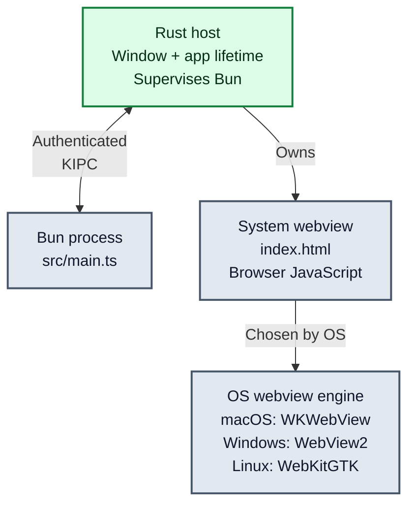
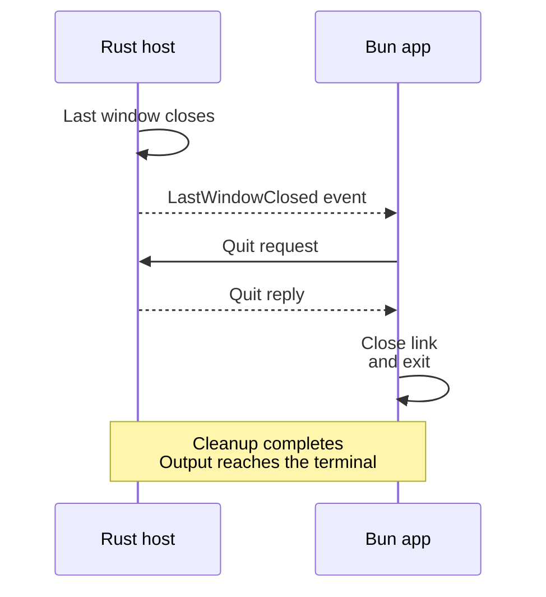

# KELD

**Keep your JavaScript. Change the desktop foundation.**

KELD is an open-source desktop framework for JavaScript and TypeScript.
Your app logic runs in **Bun**. A **Rust host** manages the native window and
application lifetime. Your interface runs in the platform's **system webview**,
without bundling a separate Chromium engine.

The goal is a path beyond Electron **without rewriting your application's core
in another language**.

> **Pre-alpha.** Start with the source-built demo below. KELD is not yet a
> drop-in Electron replacement or a production-ready distribution toolchain.

[Run the demo](#run-the-demo) · [How it works](#how-it-works) ·
[Coming from Electron](#coming-from-electron) · [Benchmarks](#early-benchmarks) ·
[Docs](docs/onboarding/README.md) · [Audits](docs/audits/README.md) · [Roadmap](ROADMAP.md)

## Early benchmark snapshot

KELD is still **pre-alpha**, so these are **initial benchmarks**, not a claim
that KELD wins every workload. The useful question is simpler: **what is the
architecture already buying us today?**

### The clearest signals so far

| What we measured | KELD | Comparison | What that means in plain English |
|---|---:|---:|---|
| **Windows host working set** · 30 paired rounds | **22,788 KiB** | Tauri **26,856 KiB** | **~15.2% less resident memory in KELD's native host.** Host scope only: this excludes KELD's supervised Bun child and is **not total application memory**. This is the strongest paired KELD-vs-Tauri memory result so far; CI95 for the paired ratio is **[0.846864, 0.849548]**. |
| **Windows main-process RSS** · same direct-COM benchmark session | **19,552 KB** | Electron **89,140 KB** | **~78% less main-process RSS.** Electron's main process used about **4.6× as much** as KELD's in this session. This is **not total application memory**. |
| **Windows host executable** | **484,864 B** | Tauri **8,634,880 B** | **~94.4% smaller by bytes.** Tauri's recorded host executable is about **17.8× as large** as KELD's current direct-COM host. This is **not installer-to-installer** because KELD packaging is not shipped yet. |
| **Windows first paint** · host-only `keld-host --hello` diagnostic | **469 ms** | Tauri **479 ms** · Electron **275 ms** | Host-only diagnostic; the full product-boot arm remains unmeasured. KELD and Tauri were close in this session; the KELD/Tauri margin is too small to call a speed win. Electron was faster here. |

**Why these matter:** lower host memory leaves more RAM for the application;
a smaller host binary reduces the native framework footprint; and the first-paint
benchmark records a double-rAF **paint-opportunity proxy**, not compositor completion
or display scanout. They answer different
questions, so we do not combine them into one "overall winner" score.

[See the reproducible benchmark repository](https://github.com/gyldlab/keld-benches) ·
[Full engineering scoreboard](docs/engineering/budget-scoreboard.md) ·
[Paired KELD vs Tauri memory result](https://github.com/gyldlab/keld-benches/blob/main/windows/bench/results/mem-idle/2026-08-25.kel25-windows-keld-vs-tauri-canonical-30.fresh-process.json)

> **Read the scope, not just the headline.** KELD does not currently lead every
> metric. Electron had lower **total process-tree RSS** and faster first paint in
> the cited Windows sessions. Current Linux KELD-vs-Tauri paint intervals cross
> 1.0, so they do not support a directional speed claim. We publish those
> non-wins too.

<details>
<summary><strong>Inside KELD: IPC latency</strong></summary>

On macOS, the authenticated Rust-to-Rust KIPC library path recorded p99 round
trips of **9.375 µs** for a 6-byte payload and **10.25 µs** for a 1,024-byte
payload on an Apple M4 Mac mini.

| Message payload | Recorded p99 round trip |
|---|---:|
| **6 bytes** | **9.375 µs** |
| **1,024 bytes** | **10.25 µs** |

These September 10, 2026 measurements use two separate **Rust processes** over
an authenticated Unix socket. They measure the KIPC library, **not** Bun-to-host
latency, app startup, or a complete KELD application. Each payload tier uses
**20 independent sessions × 100,000 calls**. Each session performs the
handshake first, then records **99,999 post-handshake CALL→REPLY round trips**.
The handshake is excluded from the reported p99. **p99 (99th percentile)** is
the round-trip time at or below which 99% of those timed calls fall.

[Fixture and reproduction steps](https://github.com/gyldlab/keld-benches/tree/43ec7358fe6a5baeb7b183be17f07708198982ba/macos/keld/kipc-rust-echo) ·
[Raw sessions](https://github.com/gyldlab/keld-benches/tree/43ec7358fe6a5baeb7b183be17f07708198982ba/macos/bench/results/ipc-rtt)

Reported session-block bootstrap 95% intervals for those p99 values are
**9.25–9.625 µs** and **10.083–10.459 µs**, respectively. KELD source:
`4fbf94bbb755854058067b986877177f00b25a39`.

</details>

## Run the demo

You need **Git**, **Rust through rustup**, and **Bun on `PATH`**, plus the
prerequisites for your platform. The repository selects its Rust toolchain.

| Platform | Before you build |
|---|---|
| **macOS** | Apple command-line developer tools. WKWebView comes with macOS. |
| **Windows** | Rust's MSVC build tools and the WebView2 runtime. Use an interactive PowerShell session. |
| **Linux** | The current source-built product path is qualified on Ubuntu 26.04.1 x86_64 with GNOME Wayland. Install GTK3/WebKitGTK 4.1 development libraries, a C compiler, `pkg-config`, and `bwrap`; use an owner-controlled checkout and a host that supports the required containment. Bounded shipping-product evidence also exists for X11 through the same host's Mutter Xwayland server, but the canonical product-status ledger still leaves X11/native Xorg qualification open. Fedora 43 and Arch package/build portability have separate bounded evidence; see the platform setup guide for what that does **not** qualify. |

[Platform setup and troubleshooting](docs/onboarding/README.md#prerequisites).
Contributors running the full `just ci` suite need **Bun 1.4.2**.

### Build KELD

```sh
git clone https://github.com/gyldlab/keld.git
cd keld
cargo build --locked -p keld-cli -p keld-host
```

Build **both** crates: the development command needs the host beside the CLI.
On Linux this also builds the required role launcher. No npm wrapper or prebuilt
release is available yet.

### Create and launch an app

**macOS / qualified Linux environment:**

```sh
./target/debug/keld create hello-keld
cd hello-keld
../target/debug/keld doctor
../target/debug/keld dev
```

**Windows PowerShell:**

```powershell
.\target\debug\keld.exe create hello-keld
Set-Location hello-keld
..\target\debug\keld.exe doctor
..\target\debug\keld.exe dev
```

You should see a native window titled **hello-keld**. Behind it, the demo starts
a Bun application process and exchanges an authenticated echo with the Rust host.
Captured Bun output appears **when the session shuts down**, not while you wait
at the open window:

```text
ipc-echo ok: message="keld" count=1
hello-keld: main process ready (IPC echo ok)
```

A successful `doctor` checks setup; the window, echo, clean exit, and successful
relaunch are separate checks. The [run guide](docs/onboarding/README.md#run-the-current-demo)
explains normal close, interrupt shutdown, and platform-specific diagnostics.

### Make your first change

Open `hello-keld/index.html`, change the visible text or styles, then stop and
restart `keld dev`. **Live reload is not implemented yet.**

| File in your generated app | What it controls |
|---|---|
| `index.html` | The interface rendered in the native window. |
| `src/main.ts` | The Bun-side app logic, including the demo's echo and shutdown handling. |
| `src/echo.generated.ts` | Rust-derived compile-time declarations for the demo's echo payloads. |
| `keld.config.ts` | The app's configuration, including its name and entry paths. |

The scaffold also includes its KIPC transport; there are no package dependencies
to install for this demo. Start it through `keld dev`, not `bun src/main.ts`:
the host supplies the authenticated application link.

## How it works

**Your interface and your main process are different things.** Browser-side
JavaScript runs in the webview. Application-side JavaScript or TypeScript runs
in Bun. Rust owns the native window, starts and supervises Bun, and coordinates
the application session.

KIPC is KELD's inter-process communication protocol. It carries authenticated
messages between Bun and the Rust host; it is not another JavaScript runtime.



This is the current demo's runtime layout, not a diagram of every planned API.
The general **renderer-to-host bridge is still incomplete**. See the
[implementation status](docs/engineering/product-status.md) and
[architecture overview](docs/architecture/01-overview.md) for the detailed boundaries.

### Closing the window closes the session

The stock demo does more than display a page. When its last window closes, the
host sends `LastWindowClosed` to the Bun app. The app requests an orderly quit over
the same KIPC link,
then exits after the host replies.



[Template implementation](crates/keld-cli/templates/hello/src/main-body.ts).
Native Close → cleanup → relaunch has recorded device evidence on
[Windows 11 x64](docs/onboarding/README.md#qualified-windows-native-close-evidence)
and [Ubuntu 26.04.1 / GNOME Wayland](docs/onboarding/README.md#qualified-linux-native-close-evidence).
Those records qualify their captured revisions and environments; macOS native
Close is not qualified by those captures.

## Coming from Electron

The destination is familiar JavaScript and TypeScript, with fewer changes to your
application. **Today, begin with the demo rather than migrating a production app.**
The current `@keld/electron` module implements a small lifecycle surface, not the
full Electron API.

| Surface | What to expect today |
|---|---|
| `app.whenReady()` and lifecycle events | Implemented in the current compatibility module. |
| `window-all-closed` | With no listener, the default is to quit. With a listener, the application decides. |
| `app.quit()` | Returns `Promise<void>` so callers can await the host's reply. Electron returns `void`. |
| Event-listener errors | Listeners are isolated: one throwing listener does not abort the KIPC reader. This differs from Electron's EventEmitter behavior. |
| `BrowserWindow`, `ipcMain`, broader Electron modules | Not implemented by the current compatibility module. |
| Native addons and automatic migration | No general native-addon compatibility guarantee; `keld migrate` is not implemented yet. |

[Compatibility details and tests](docs/engineering/compat-scoreboard.md) ·
[Current module exports](packages/@keld/electron/src/index.ts)

### What changes with system webviews?

KELD uses the platform's webview instead of including its own Chromium engine.
That changes the rendering environment: macOS and Linux use WebKit-based
backends; Windows uses WebView2. **Identical browser behavior across all three
platforms is not guaranteed.** Test the web APIs, CSS, media, and rendering your
app actually uses on each intended platform.

The [webview architecture](docs/architecture/05-webview-and-native.md) describes
the design; [current implementation status](docs/engineering/product-status.md)
distinguishes it from available functionality. The qualified Linux product path covers native GNOME Wayland on Ubuntu. Separate
bounded shipping-product runs exercise X11 through the same host's Mutter Xwayland
server, but the canonical product-status ledger still leaves X11/native Xorg
qualification open. Fedora 43 userland/X11-control and Arch build-portability evidence
are narrower: a bare-metal non-Debian desktop and other architectures remain separately
unverified.

## What is ready, and what is next?

The source-built window, supervised Bun process, authenticated application link,
and limited lifecycle compatibility are implemented. KELD is ready for
**evaluation and contributions**, not production adoption yet.

| Area | Current boundary |
|---|---|
| Permissions | Manifest parsing and guard-before-handler checks exist. The scoped filesystem broker is wire-tested but not connected to the production host; the broader native-service surface is unfinished. |
| Process isolation | Linux strict launch is implemented for the current primary process. Full strict-profile admission across platforms remains incomplete; authenticated IPC alone is not a complete sandbox. |
| Building and shipping apps | `keld build`, packaged releases, installers, signing, and signed updates are not available yet. |

The [product-status ledger](docs/engineering/product-status.md) tracks the
implementation; the [roadmap](ROADMAP.md) describes the destination.

## Explore and contribute

Built by [GYLDLAB](https://github.com/gyldlab), in the open.

| Your next step | Start here |
|---|---|
| Run or troubleshoot an app | [Onboarding](docs/onboarding/README.md) · [Error reference](docs/engineering/keld-error-codes.md) |
| Understand the runtime | [Architecture overview](docs/architecture/01-overview.md) |
| Explore performance | [KELD Benches](https://github.com/gyldlab/keld-benches) |
| Review technical audits | [Public audit registry](docs/audits/README.md) |
| Work with a coding agent | [llms.txt](llms.txt) · [Local read-only MCP server setup](docs/onboarding/07-mcp-server.md) |
| Make a contribution | [Contributing](CONTRIBUTING.md) · [Open issues](https://github.com/gyldlab/keld/issues) |

A useful first contribution is a real run report: OS, source revision, Bun
version, commands, and what worked or failed. Public code, docs, and issues are
sufficient; private research access is not required.

Report vulnerabilities through [SECURITY.md](SECURITY.md), not a public issue.

## License

**MIT OR Apache-2.0** · [MIT](LICENSE-MIT) · [Apache-2.0](LICENSE-APACHE)
