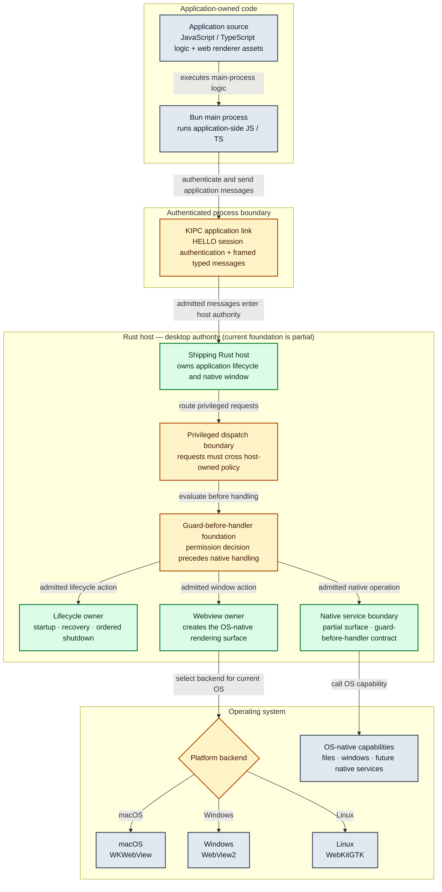
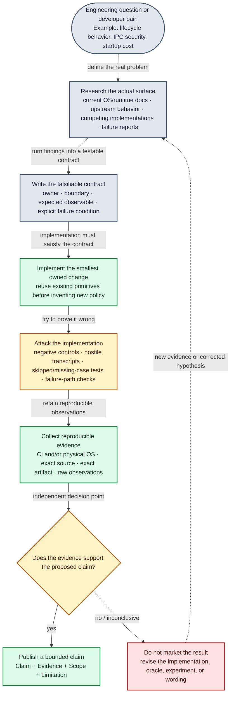

# KELD

**Keep your JavaScript. Change the desktop foundation.**

KELD is a pre-alpha desktop framework being built for JavaScript and TypeScript teams that want a path beyond Electron without turning migration into a backend rewrite.

**Rust host · Bun main process · system webviews · authenticated KIPC**

Open source by [GYLDLAB](https://github.com/gyldlab).

> **Pre-alpha · source build only.** The current KELD slice is runnable today, but packaged releases, broad Electron compatibility, `keld build`, `keld migrate`, installers, and signed updates are not available yet.

[Quick start](#quick-start) · [Why KELD](#why-keld-exists) · [Evidence](#evidence-snapshot) · [Benchmarks](https://github.com/gyldlab/keld-benches) · [Roadmap](ROADMAP.md) · [Contributing](CONTRIBUTING.md)

---

## Quick start

You need **Git**, **Rust via rustup**, and **Bun on `PATH`**. macOS requires Apple command-line developer tools; Windows and Linux have additional platform prerequisites. Use **Bun 1.4.2** for `just ci` and the full workspace gate. The [source-build guide](docs/onboarding/README.md) records the exact requirements and troubleshooting path.

### macOS / qualified Ubuntu/Debian Wayland

```bash
git clone https://github.com/gyldlab/keld.git
cd keld

cargo build --locked -p keld-cli -p keld-host

./target/debug/keld create hello-keld
cd hello-keld

../target/debug/keld doctor
../target/debug/keld dev
```

### Windows PowerShell

```powershell
git clone https://github.com/gyldlab/keld.git
Set-Location keld

cargo build --locked -p keld-cli -p keld-host

.\target\debug\keld.exe create hello-keld
Set-Location hello-keld

..\target\debug\keld.exe doctor
..\target\debug\keld.exe dev
```

**Expected result:** a native window titled `hello-keld`.

The current demo also starts a supervised Bun application process and establishes an authenticated KIPC application link. When the session shuts down, captured Bun output includes the echo round-trip:

```text
ipc-echo ok: message="keld" count=1
hello-keld: main process ready (IPC echo ok)
```

### What happens when you run KELD?

```mermaid
flowchart TB
    accTitle: From source to a running KELD desktop app
    accDescr: A developer builds KELD, scaffolds and validates an app, starts a supervised Rust and Bun session, authenticates KIPC, selects the current operating-system webview, and observes a native hello-keld window plus shutdown output.
    START(["Developer starts with the KELD source tree"])

    subgraph BUILD["Build and scaffold"]
        BUILDCLI["Build keld-cli + keld-host<br/>cargo build --locked"]
        CREATE["Create a project<br/>keld create hello-keld"]
        PROJECT["Generated project<br/>keld.config.ts · index.html · src/main.ts"]
    end

    subgraph VALIDATE["Environment and project admission"]
        DOCTOR["Validate the environment<br/>keld doctor"]
        DEV["Start the development session<br/>keld dev"]
    end

    subgraph SESSION["KELD application session"]
        HOST["Rust host owns the session<br/>native window · lifecycle · privileged boundaries"]
        BUN["Supervised Bun main process<br/>runs application-side JavaScript / TypeScript"]
        KIPC["Authenticated KIPC app link<br/>HELLO proves the session token before framed messages"]
        ADMITTED["Authenticated application session<br/>host and Bun can exchange admitted messages"]
    end

    subgraph PLATFORM["Operating-system rendering"]
        SELECT{"Host selects the current OS backend"}
        MAC["macOS<br/>WKWebView"]
        WINDOWS["Windows<br/>WebView2"]
        LINUX["Linux<br/>WebKitGTK"]
    end

    RESULT(["Observable result<br/>native hello-keld window + supervised shutdown output"])

    START -->|"build"| BUILDCLI
    BUILDCLI -->|"scaffold"| CREATE
    CREATE -->|"writes"| PROJECT
    PROJECT -->|"inspect prerequisites"| DOCTOR
    DOCTOR -->|"admit project"| DEV
    DEV -->|"launch shipping session"| HOST
    HOST -->|"spawn and supervise"| BUN
    BUN -->|"HELLO authenticates"| KIPC
    KIPC -->|"establish app link"| ADMITTED
    ADMITTED -->|"host creates native webview"| SELECT
    SELECT -->|"on macOS"| MAC
    SELECT -->|"on Windows"| WINDOWS
    SELECT -->|"on Linux"| LINUX
    MAC -->|"renders"| RESULT
    WINDOWS -->|"renders"| RESULT
    LINUX -->|"renders"| RESULT

    classDef current fill:#dcfce7,stroke:#15803d,color:#052e16,stroke-width:2px
    classDef gate fill:#fef3c7,stroke:#b45309,color:#451a03,stroke-width:2px
    classDef external fill:#e2e8f0,stroke:#475569,color:#0f172a,stroke-width:2px

    class BUILDCLI,CREATE,PROJECT,DOCTOR,DEV,HOST,BUN,ADMITTED,RESULT current;
    class KIPC,SELECT gate;
    class START,MAC,WINDOWS,LINUX external;
```



That is the current source-built development path. It is not yet an npm-installed or packaged application workflow.

---

## Why KELD exists

Electron is widely used for good reasons: JavaScript/TypeScript productivity, a mature ecosystem, and predictable Chromium behavior. KELD is not built on the assumption that those reasons are mistakes.

It is built around a different question:

> **How much of the Electron development model can we preserve while moving desktop authority, lifecycle, IPC, and native boundaries into a KELD-controlled host—and making the migration risk measurable?**

| Developer pain | KELD response |
|---|---|
| **A framework switch becomes a backend rewrite** | Keep application-side JavaScript/TypeScript in a supervised Bun main process while Rust owns the desktop foundation. |
| **Compatibility failures appear late in migration** | Record behavior against explicit oracles, keep divergences visible, and avoid a universal compatibility percentage that hides unknowns. |
| **System webviews differ by platform** | Treat WKWebView, WebView2, and WebKitGTK as platform-qualified surfaces rather than pretending one successful OS proves another. |
| **Privileged native access is difficult to reason about** | Put the authority boundary in the Rust host, authenticate the app link, and build guard-before-handler enforcement around native operations. |
| **Framework benchmarks become marketing screenshots** | Keep benchmark methodology, raw evidence, machine identity, source revisions, and limitations in the public [`keld-benches`](https://github.com/gyldlab/keld-benches) repository. |

---

## How KELD draws the authority boundary



The diagram describes the intended ownership model, while the [Current / Target / Evidence ledger](docs/engineering/product-status.md) records how much of each surface is implemented today.

---

## Evidence snapshot

KELD is pre-alpha. The entries below are deliberately **bounded proof points**, not framework-wide performance, security, compatibility, or production-readiness claims.

| Surface | Public evidence | Boundary |
|---|---|---|
| **Windows app-link security** | The shipping Windows app-link uses a current-user-protected named pipe plus HELLO authentication. The evidence covers a different-user denial and an authorized same-user successor path. [Contract](docs/specs/kel101-windows-named-pipe-dacl.md) | This is the KELD app-link boundary, **not** a claim that generic Windows account/WAM authentication or the complete sandbox story is finished. |
| **Windows lifecycle** | Public Windows 11 x64 captures qualify stock native Close → cleanup → relaunch for the tested source/environment. [Evidence](https://github.com/gyldlab/keld/issues/174#issuecomment-5644140405) | Does not qualify every Windows version, strict profile, or packaged release. |
| **Linux lifecycle** | Ubuntu 26.04.1 x86_64 / GNOME Wayland has qualified stock native Close → cleanup → relaunch evidence for the landed lifecycle correction. [Lifecycle correction](https://github.com/gyldlab/keld/pull/228) | X11, non-Debian distributions, other architectures, and release packaging remain separately unverified. |
| **KIPC diagnostic** | On Apple M4 macOS, the public cross-process Rust↔Rust KIPC fixture measured pooled p99 of **9.375 µs** for the 6 B tier and **10.25 µs** for the 1,024 B tier across **20 sessions × 100,000 calls per tier**. [Raw benchmark work](https://github.com/gyldlab/keld-benches/pull/21) | This is a KIPC library-arm diagnostic, **not** full Bun-product latency and not a framework-wide “KELD is faster” claim. |

For the complete evidence trail:

- **Implemented vs target state:** [Product status](docs/engineering/product-status.md)
- **Benchmark methodology and raw evidence:** [KELD Benches](https://github.com/gyldlab/keld-benches)
- **Electron behavior evidence:** [Compatibility scoreboard](docs/engineering/compat-scoreboard.md)
- **Current automated checks:** [CI](https://github.com/gyldlab/keld/actions/workflows/ci.yml)

---

## Electron compatibility without a fake percentage

KELD's long-term goal is to make Electron migration require as little rewriting as the evidence allows.

Today, `@keld/electron` is intentionally narrow. The current repository contains lifecycle compatibility work; broad Electron host emulation is not implemented.

KELD treats compatibility results in three different ways:

| Result | Meaning |
|---|---|
| **Compatible behavior** | The behavior is implemented and tied to a defined oracle/test surface. |
| **Intentional divergence** | KELD behaves differently on purpose and records the reason instead of hiding it. |
| **Unknown / unsupported** | The behavior stays visible as unknown or unsupported until evidence exists. |

`keld migrate` remains a future command. A future migration tool should reduce uncertainty before it rewrites code; it should not convert unknown behavior into a reassuring percentage.

→ [Electron compatibility scoreboard](docs/engineering/compat-scoreboard.md)

---

## Research first. Claim second.

KELD started from systems research, and that should remain visible in how the project makes public claims.



The standard is simple: **do not ask developers to trust a promise when the project can publish the evidence and its boundary instead.**

---

## What exists today — and what does not

### Runnable today

- `keld create`
- `keld dev`
- `keld doctor`
- native system-webview windows
- supervised Bun application process
- authenticated KIPC app link
- current macOS, Windows, and Linux application-session implementations
- permission parsing and guard-before-handler infrastructure
- limited `@keld/electron` lifecycle compatibility
- public evidence/benchmark repositories and CI

### Target — not released yet

- packaged KELD releases
- npm installation / prebuilt CLI distribution
- `keld build`
- `keld migrate`
- broad Electron API compatibility
- a full native-service surface
- complete strict-profile admission across every supported platform
- installers, signing, notarization, and signed update distribution
- a universal Electron compatibility percentage

Unknown or unfinished surfaces stay visible. They are not silently converted into “supported.”

---

## Should I use KELD today?

**Try KELD today if you are:**

- evaluating a lower-rewrite path beyond Electron;
- interested in a Bun + Rust-host desktop architecture;
- testing the current source-built application slice;
- contributing to compatibility, IPC, security, platform, benchmark, or release engineering;
- interested in evidence-driven desktop framework development.

**Do not treat KELD as a production-ready replacement yet if you require:**

- packaged stable releases;
- broad Electron API compatibility;
- signed installers and updater distribution;
- guaranteed Chromium-equivalent rendering on every platform;
- a mature production support ecosystem.

That boundary will move only when the corresponding evidence moves.

---

## Go deeper by intent

| I want to… | Start here |
|---|---|
| **Run KELD from source** | [Source-build / onboarding guide](docs/onboarding/README.md) |
| **See exactly what is implemented** | [Current / Target / Evidence ledger](docs/engineering/product-status.md) |
| **Understand the architecture** | [Architecture overview](docs/architecture/01-overview.md) |
| **Inspect Electron compatibility** | [Compatibility scoreboard](docs/engineering/compat-scoreboard.md) |
| **Audit performance claims** | [KELD Benches](https://github.com/gyldlab/keld-benches) |
| **Follow what comes next** | [Roadmap](ROADMAP.md) |
| **Find something to work on** | [GitHub Issues](https://github.com/gyldlab/keld/issues) |
| **Contribute code or docs** | [Contributing guide](CONTRIBUTING.md) |
| **Report a vulnerability** | [Security policy](SECURITY.md) |

---

## Contributing

KELD is open source. Public code, tests, documentation, issues, and review are sufficient to contribute; private research access is not required.

Start with [CONTRIBUTING.md](CONTRIBUTING.md), the [open issues](https://github.com/gyldlab/keld/issues), and [MAINTAINERS.md](MAINTAINERS.md).

Please report security vulnerabilities through [SECURITY.md](SECURITY.md), not a public issue.

---

## License

MIT OR Apache-2.0

[LICENSE](LICENSE) · [MIT](LICENSE-MIT) · [Apache-2.0](LICENSE-APACHE)