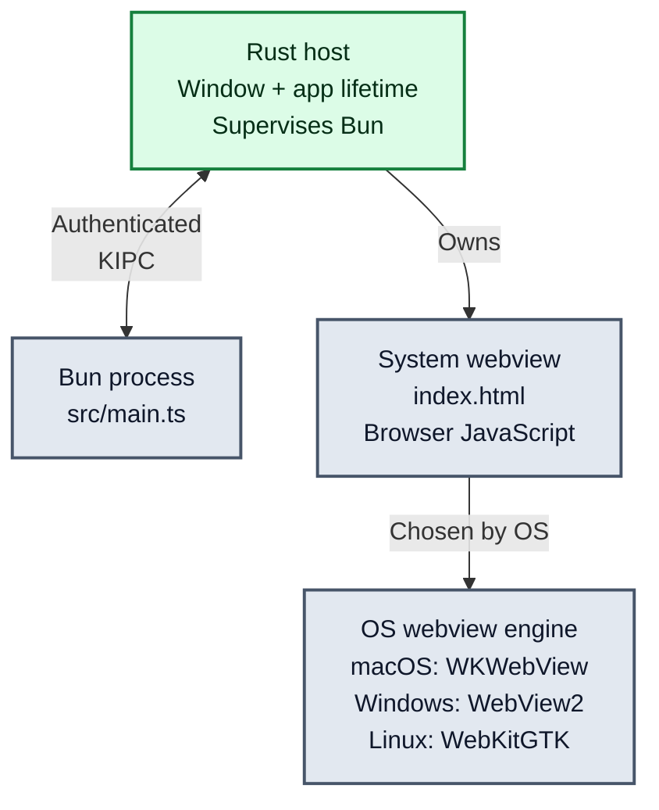
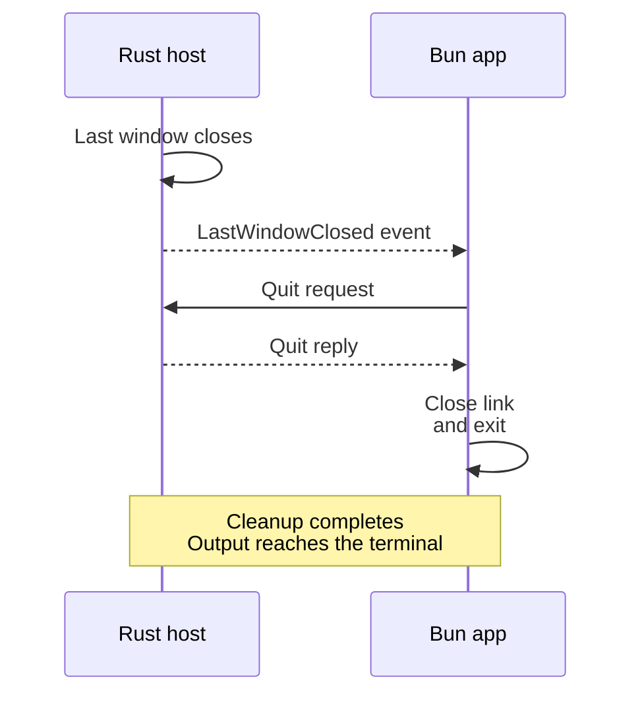

# KELD

**Keep your JavaScript. Change the desktop foundation.**

KELD is an open-source desktop framework for JavaScript and TypeScript.
Your app logic runs in **Bun**. A **Rust host** manages the native window and
application lifetime. Your interface runs in the platform's **system webview**,
without bundling a separate Chromium engine.

The goal is a path beyond Electron **without rewriting your application's core
in another language**.

> **Pre-alpha.** Start with the source-built demo below. KELD is not yet a
> drop-in Electron replacement or a production-ready distribution toolchain.

[Run the demo](#run-the-demo) · [How it works](#how-it-works) ·
[Coming from Electron](#coming-from-electron) · [Benchmarks](#early-benchmarks) ·
[Docs](docs/onboarding/README.md) · [Audits](docs/audits/README.md) · [Roadmap](ROADMAP.md)

## Early benchmark snapshot

KELD is still **pre-alpha**, so these are **initial benchmarks**, not a claim
that KELD wins every workload. The useful question is simpler: **what is the
architecture already buying us today?**

### The clearest signals so far

| What we measured | KELD | Comparison | What that means in plain English |
|---|---:|---:|---|
| **Windows host working set** · 30 paired rounds | **22,788 KiB** | Tauri **26,856 KiB** | **~15.2% less resident memory in KELD's native host.** A working set is the memory Windows currently keeps resident in RAM for the process. Host scope only: this excludes KELD's supervised Bun child and is **not total application memory**. The paired ratio has a **95% confidence interval (CI95)** of **[0.846864, 0.849548]**; this interval shows the statistical uncertainty around the measured ratio. |
| **Windows main-process RSS** · same direct-COM benchmark session | **19,552 KB** | Electron **89,140 KB** | **~78% less main-process RSS.** RSS means **Resident Set Size**: memory for that process that is currently resident in RAM. COM means **Component Object Model**, a native Windows interface; “direct-COM” means the KELD host calls those Windows interfaces directly. Electron's main process used about **4.6× as much** as KELD's in this session. This is **not total application memory**. |
| **Windows host executable** | **484,864 B** | Tauri **8,634,880 B** | **~94.4% smaller by bytes.** Tauri's recorded host executable is about **17.8× as large** as KELD's current Windows host. This is **not installer-to-installer** because KELD packaging is not shipped yet. |
| **Windows first paint** · host-only `keld-host --hello` diagnostic | **469 ms** | Tauri **479 ms** · Electron **275 ms** | This is a host-only diagnostic, not a full application-startup measurement. KELD and Tauri were close in this session, so the margin is too small to call a speed win. Electron was faster here. |

**Why these matter:** lower host memory leaves more RAM for the application,
and a smaller host binary reduces the native framework footprint. The first-paint
benchmark uses **double-rAF**: two `requestAnimationFrame` callbacks that act as a
browser signal that a paint opportunity occurred. It does **not** prove that the
operating system finished composing the frame or that the pixels reached the display.
These measurements answer different questions, so we do not combine them into one
"overall winner" score.

> Unit note: **KiB** means kibibytes (1 KiB = 1,024 bytes). **KB** is kept where
> the benchmark source reported that unit.

[See the reproducible benchmark repository](https://github.com/gyldlab/keld-benches) ·
[Full engineering scoreboard](docs/engineering/budget-scoreboard.md) ·
[Paired KELD vs Tauri memory result](https://github.com/gyldlab/keld-benches/blob/main/windows/bench/results/mem-idle/2026-08-25.kel25-windows-keld-vs-tauri-canonical-30.fresh-process.json)

> **Read the scope, not just the headline.** KELD does not currently lead every
> metric. Electron had lower **total process-tree RSS**—resident RAM summed across
> the measured application processes—and faster first paint in the cited Windows
> sessions. The pinned Linux result is a KELD-only paint-opportunity measurement
> without a paired Tauri arm, and it is not publication-eligible. It does not
> support a KELD-vs-Tauri interval comparison or a directional speed claim. We
> publish this non-comparison result too.

<details>
<summary><strong>Inside KELD: IPC (inter-process communication) latency</strong></summary>

On macOS, the authenticated Rust-to-Rust **KIPC** path recorded p99 round trips
of **9.375 µs** for a 6-byte message and **10.25 µs** for a 1,024-byte message on
an Apple M4 Mac mini. KIPC is KELD's authenticated inter-process communication
protocol. “Authenticated” means the two sides verify the connection before
accepting application messages. **µs** means microseconds.

| Message payload | Recorded p99 round trip |
|---|---:|
| **6 bytes** | **9.375 µs** |
| **1,024 bytes** | **10.25 µs** |

These September 10, 2026 measurements use two separate **Rust processes** over
an authenticated Unix socket, which is a local operating-system communication
channel. They measure the KIPC library, **not** Bun-to-host latency, app startup,
or a complete KELD application. Each message-size tier uses
**20 independent sessions × 100,000 calls**. Each session performs the initial
authentication handshake first, then records **99,999 CALL→REPLY round trips**.
A round trip is one request plus its reply. The handshake is excluded from the
reported p99. **p99 (99th percentile)** is the round-trip time at or below which
99% of those timed calls fall.

[Fixture and reproduction steps](https://github.com/gyldlab/keld-benches/tree/43ec7358fe6a5baeb7b183be17f07708198982ba/macos/keld/kipc-rust-echo) ·
[Raw sessions](https://github.com/gyldlab/keld-benches/tree/43ec7358fe6a5baeb7b183be17f07708198982ba/macos/bench/results/ipc-rtt)

The reported **95% bootstrap confidence intervals** for those p99 values are
**9.25–9.625 µs** and **10.083–10.459 µs**, respectively. A bootstrap interval
estimates uncertainty by repeatedly resampling the recorded session blocks.
KELD source: `4fbf94bbb755854058067b986877177f00b25a39`.

</details>

## Run the demo

You need **Git**, **Rust installed through rustup**, and **Bun**, plus the build
tools for your operating system. The commands must be available on your shell's
`PATH`, which is the list of directories the shell searches when you type a
command such as `cargo` or `bun`.

KELD pins **Rust 1.97.1** in [`rust-toolchain.toml`](rust-toolchain.toml).
**rustup** is Rust's toolchain manager. It reads that file and selects the
required Rust compiler automatically. **rustc** is the Rust compiler, and
**Cargo** is Rust's build and package tool.

### 1. Install the core tools

1. **Git** — install it from [git-scm.com/downloads](https://git-scm.com/downloads).
2. **Rust through rustup** — install it from [rustup.rs](https://rustup.rs/).
   Restart your terminal after installation if the `cargo` command is not found.
3. **Bun** — install it from the [Bun installation guide](https://bun.sh/docs/installation).
   The source-built demo needs Bun available on `PATH`. The full repository
   verification gate, `just ci`, currently requires **Bun 1.4.2**.

Verify the core tools:

```sh
git --version
rustup --version
rustc --version
cargo --version
bun --version
```

After you clone the repository and enter the `keld` directory,
`rustc --version` should use the pinned **1.97.1** toolchain.

### 2. Install the platform build tools

| Platform | Before you build |
|---|---|
| **macOS** | Install Apple's command-line developer tools with `xcode-select --install` if they are missing. **WKWebView**, the system webview used by KELD on macOS, is included with macOS. |
| **Windows** | Install the Microsoft C++ build tools required by Rust's **MSVC** target (Microsoft Visual C++ toolchain) and the **Microsoft Edge WebView2 Runtime**, which renders KELD's Windows interface. Use an interactive PowerShell session for the demo. |
| **Ubuntu / Debian x86_64** | Install a C/C++ build toolchain, `pkg-config` (used to locate native libraries), GTK3 development files (Linux UI toolkit), WebKitGTK 4.1 development files (Linux system webview), and `bubblewrap` / `bwrap` (the sandbox helper used by KELD's strict Linux launch). The currently qualified source-built product path is Ubuntu 26.04.1 x86_64 with GNOME Wayland. |

For Fedora, Arch, X11/Xorg status, Linux containment requirements, and
platform-specific troubleshooting, see the
[platform setup guide](docs/onboarding/README.md#prerequisites).

The full contributor gate needs additional tools beyond this quick start.
See the [development guide](docs/onboarding/05-development-guide.md#1-prerequisites)
before running `just ci`.

### Build KELD

```sh
git clone https://github.com/gyldlab/keld.git
cd keld
cargo build --locked -p keld-cli -p keld-host
```

Build **both** crates: the development command needs the host beside the CLI.
On Linux this also builds the required role launcher. No npm wrapper or prebuilt
release is available yet.

### Create and launch an app

**macOS / qualified Linux environment:**

```sh
./target/debug/keld create hello-keld
cd hello-keld
../target/debug/keld doctor
../target/debug/keld dev
```

**Windows PowerShell:**

```powershell
.\target\debug\keld.exe create hello-keld
Set-Location hello-keld
..\target\debug\keld.exe doctor
..\target\debug\keld.exe dev
```

You should see a native window titled **hello-keld**. Behind it, the demo starts
a Bun application process and exchanges an authenticated echo with the Rust host.
Captured Bun output appears **when the session shuts down**, not while you wait
at the open window:

```text
ipc-echo ok: message="keld" count=1
hello-keld: main process ready (IPC echo ok)
```

A successful `doctor` checks setup; the window, echo, clean exit, and successful
relaunch are separate checks. The [run guide](docs/onboarding/README.md#run-the-current-demo)
explains normal close, interrupt shutdown, and platform-specific diagnostics.

### Make your first change

Open `hello-keld/index.html`, change the visible text or styles, then stop and
restart `keld dev`. **Live reload is not implemented yet.**

| File in your generated app | What it controls |
|---|---|
| `index.html` | The interface rendered in the native window. |
| `src/main.ts` | The Bun-side app logic, including the demo's echo and shutdown handling. |
| `src/echo.generated.ts` | Rust-derived compile-time declarations for the demo's echo payloads. |
| `keld.config.ts` | The app's configuration, including its name and entry paths. |

The scaffold also includes its KIPC transport; there are no package dependencies
to install for this demo. Start it through `keld dev`, not `bun src/main.ts`:
the host supplies the authenticated application link.

## How it works

**Your interface and your main process are different things.** Browser-side
JavaScript runs in the webview. Application-side JavaScript or TypeScript runs
in Bun. Rust owns the native window, starts and supervises Bun, and coordinates
the application session.

KIPC is KELD's inter-process communication protocol. It carries authenticated
messages between Bun and the Rust host; it is not another JavaScript runtime.


```mermaid
flowchart TB
    accTitle: Current KELD runtime responsibilities
    accDescr: The Rust host owns the native window and application session and supervises a separate Bun process running src/main.ts. Bun and the host exchange authenticated KIPC messages. The host owns the system webview, where index.html and browser JavaScript run. The engine is WKWebView on macOS, WebView2 on Windows, or WebKitGTK on Linux. A general renderer-to-host bridge is not implemented.

    HOST["Rust host<br/>Window + app lifetime<br/>Supervises Bun"]
    BUN["Bun process<br/>src/main.ts"]
    VIEW["System webview<br/>index.html<br/>Browser JavaScript"]
    ENGINE["OS webview engine<br/>macOS: WKWebView<br/>Windows: WebView2<br/>Linux: WebKitGTK"]

    HOST <-->|"Authenticated<br/>KIPC"| BUN
    HOST -->|"Owns"| VIEW
    VIEW -->|"Chosen by OS"| ENGINE

    classDef current fill:#dcfce7,stroke:#15803d,color:#052e16,stroke-width:2px
    classDef external fill:#e2e8f0,stroke:#475569,color:#0f172a,stroke-width:2px
    class HOST current;
    class BUN,VIEW,ENGINE external;
```

This is the current demo's runtime layout, not a diagram of every planned API.
The general **renderer-to-host bridge is still incomplete**. See the
[implementation status](docs/engineering/product-status.md) and
[architecture overview](docs/architecture/01-overview.md) for the detailed boundaries.

### Closing the window closes the session

The stock demo does more than display a page. When its last window closes, the
host sends `LastWindowClosed` to the Bun app. The app requests an orderly quit over
the same KIPC link,
then exits after the host replies.


```mermaid
sequenceDiagram
    accTitle: Current stock demo normal-close sequence
    accDescr: After the last native window closes, the Rust host sends LastWindowClosed over the authenticated KIPC link. The stock Bun app sends a Quit request on the same link, waits for its reply, closes its connection and exits. Session cleanup and captured output forwarding finish before relaunch. Physical normal-close evidence is scoped to the linked Windows and Ubuntu captures.
    participant H as Rust host
    participant B as Bun app

    H->>H: Last window closes
    H-->>B: LastWindowClosed event
    B->>H: Quit request
    H-->>B: Quit reply
    B->>B: Close link<br/>and exit
    Note over H,B: Cleanup completes<br/>Output reaches the terminal
```

[Template implementation](crates/keld-cli/templates/hello/src/main-body.ts).
Native Close → cleanup → relaunch has recorded device evidence on
[Windows 11 x64](docs/onboarding/README.md#qualified-windows-native-close-evidence)
and [Ubuntu 26.04.1 / GNOME Wayland](docs/onboarding/README.md#qualified-linux-native-close-evidence).
Those records qualify their captured revisions and environments; macOS native
Close is not qualified by those captures.

## Coming from Electron

The destination is familiar JavaScript and TypeScript, with fewer changes to your
application. **Today, begin with the demo rather than migrating a production app.**
The current `@keld/electron` module implements a small lifecycle surface, not the
full Electron API.

| Surface | What to expect today |
|---|---|
| `app.whenReady()` and lifecycle events | Implemented in the current compatibility module. |
| `window-all-closed` | With no listener, the default is to quit. With a listener, the application decides. |
| `app.quit()` | Returns `Promise<void>` so callers can await the host's reply. Electron returns `void`. |
| Event-listener errors | Listeners are isolated: one throwing listener does not abort the KIPC reader. This differs from Electron's EventEmitter behavior. |
| `BrowserWindow`, `ipcMain`, broader Electron modules | Not implemented by the current compatibility module. |
| Native addons and automatic migration | No general native-addon compatibility guarantee; `keld migrate` is not implemented yet. |

[Compatibility details and tests](docs/engineering/compat-scoreboard.md) ·
[Current module exports](packages/@keld/electron/src/index.ts)

### What changes with system webviews?

KELD uses the platform's webview instead of including its own Chromium engine.
That changes the rendering environment: macOS and Linux use WebKit-based
backends; Windows uses WebView2. **Identical browser behavior across all three
platforms is not guaranteed.** Test the web APIs, CSS, media, and rendering your
app actually uses on each intended platform.

The [webview architecture](docs/architecture/05-webview-and-native.md) describes
the design; [current implementation status](docs/engineering/product-status.md)
distinguishes it from available functionality. The qualified Linux product path covers native GNOME Wayland on Ubuntu. Separate
bounded shipping-product runs exercise X11 through the same host's Mutter Xwayland
server, but the canonical product-status ledger still leaves X11/native Xorg
qualification open. Fedora 43 userland/X11-control and Arch build-portability evidence
are narrower: a bare-metal non-Debian desktop and other architectures remain separately
unverified.

## What is ready, and what is next?

The source-built window, supervised Bun process, authenticated application link,
and limited lifecycle compatibility are implemented. KELD is ready for
**evaluation and contributions**, not production adoption yet.

| Area | Current boundary |
|---|---|
| Permissions | Manifest parsing and guard-before-handler checks exist. The scoped filesystem broker is wire-tested but not connected to the production host; the broader native-service surface is unfinished. |
| Process isolation | Linux strict launch is implemented for the current primary process. Full strict-profile admission across platforms remains incomplete; authenticated IPC alone is not a complete sandbox. |
| Building and shipping apps | `keld build`, packaged releases, installers, signing, and signed updates are not available yet. |

The [product-status ledger](docs/engineering/product-status.md) tracks the
implementation; the [roadmap](ROADMAP.md) describes the destination.

## Explore and contribute

Built by [GYLDLAB](https://github.com/gyldlab), in the open.

| Your next step | Start here |
|---|---|
| Run or troubleshoot an app | [Onboarding](docs/onboarding/README.md) · [Error reference](docs/engineering/keld-error-codes.md) |
| Understand the runtime | [Architecture overview](docs/architecture/01-overview.md) |
| Explore performance | [KELD Benches](https://github.com/gyldlab/keld-benches) |
| Review technical audits | [Public audit registry](docs/audits/README.md) |
| Work with a coding agent | [llms.txt](llms.txt) · [Local read-only MCP server setup](docs/onboarding/07-mcp-server.md) |
| Make a contribution | [Contributing](CONTRIBUTING.md) · [Open issues](https://github.com/gyldlab/keld/issues) |

A useful first contribution is a real run report: OS, source revision, Bun
version, commands, and what worked or failed. Public code, docs, and issues are
sufficient; private research access is not required.

Report vulnerabilities through [SECURITY.md](SECURITY.md), not a public issue.

## License

**MIT OR Apache-2.0** · [MIT](LICENSE-MIT) · [Apache-2.0](LICENSE-APACHE)
