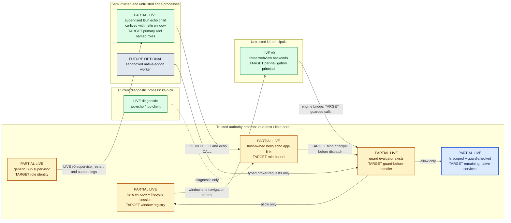

# Keld Architecture — Overview

> Keld (GYLDLAB): a Rust-core desktop framework with a Bun-powered JS/TS main process,
> system webviews by default, and a first-class Electron compatibility layer.
> This document is normative for v0.x. Changes go through a design PR.

## 1. Process and trust topology

Three principal classes, with host-minted instances inside each class:
1. **keld-host** (Rust): the authority root for every framework-controlled privileged
   resource—windows, webviews, native APIs, keys and update policy. It is the only
   long-lived general privileged process. A reviewed native plugin or minimal signed
   update relaunch helper receives only its declared narrow authority. The host is
   prebuilt per platform; app developers never compile it.
2. **App-process family** (destination: supervised Bun children): the developer's primary "main
   process" plus named compatibility roles when an app needs independent extension,
   watcher, PTY, agent, or shared-service lifecycles. Each child is a distinct
   host-minted principal with its own kipc link and grants. The destination Node-shaped
   npm world is proven against a versioned operation/extension corpus,
   but **zero ambient OS authority** in the strict profile — every privileged operation
   is a typed host call checked by the capability engine. Children are intended to be
   crashable and restartable without tearing down windows. v0 has KEL-70's one
   host-owned supervised primary-child echo slice with restart/backoff/output capture
   co-lived with the hello window (KEL-30),
   plus KEL-75 T1b/T2 Unix authenticated role generations: the host binds an
   accepted link to a principal and mints a fresh role generation on restart. It
   does not yet preserve a live renderer through restart, implement window-bound
   roles, or attach per-role grants.
3. **Webviews** (system or pinned engine): untrusted UI documents. Talk to the host over
   the native bridge; talk to the app process only through host-mediated routed channels.

Why this shape (each competitor fails differently — see `docs/research/00-landscape.md`):
- Electron: privileged JS **in-process** with window ownership → bloat + checklist security.
- Tauri: native ownership correct, but no JS main process → adoption cliff.
- Electrobun / Deno Desktop: JS main process, but it *owns* the native layer / shares the
  address space → no privilege separation, shared fate.
- Keld: Electron's mental model, Tauri's ownership, and a real security boundary that is
  also the compat seam (`@keld/electron` implements Electron APIs *on top of* kipc).

## 2. Design principles (ordered; when in conflict, earlier wins)

1. **Compatibility is the product.** The Electron surface is a protocol to implement
   (Rspack/Rolldown lesson). Every design must answer: "how does this behave under
   `@keld/electron`?"
2. **The host owns privileged OS resources; JS owns the app.** Application APIs expose
   capability-scoped ids, never reusable file/window/process handles. A supervised role
   receives only its IPC endpoint and, when validated, an optional role-private bulk
   mapping handle; those transport handles cannot authorize another OS operation.
3. **Default deny, generated, auditable.** One permission manifest, generated by
   tooling, human-diffed in review. No wildcard escape culture (Tauri's DX failure).
4. **Hot paths are state machines** (Bun-rewrite lesson): the host core runs on platform
   event loops with readiness-driven callbacks; no Tokio in the message path. Async Rust
   is allowed in cold tooling (CLI, packager, updater fetches).
5. **No Rust toolchain for app developers.** Prebuilt signed host + npm distribution
   (esbuild lesson). Rust is the *plugin* path, not the entry fee.
6. **Per-platform engine policy, not ideology.** System webviews where they're good
   (Windows/macOS), pinned engine where they're not (Linux opt-in). Polyfill pack +
   baseline matrix + doctor close the rest. The precise default claim is **no bundled
   Chromium**; Windows WebView2 is Chromium-derived, and any CEF tier is named plainly.
7. **Measured, budgeted, regression-gated.** The budgets below become CI gates when the
   benchmark harness lands. A number without a valid benchmark is marketing.
8. **Small public surface, prose-grade code.** Idiomatic, pedantic-clippy Rust; minimal
   `unsafe` behind reviewed wrappers (see `AGENTS.md`).

## 3. Crate & package topology

Cargo workspace (all crates `keld-*`, lib names `keld_*`). Role and `Depends on` state
what each crate **is** today; `TARGET` marks specified destination scope that is not
implemented. The per-crate status legend is the §1 diagram above.

| Crate | Role | Depends on |
|---|---|---|
| `keld-core` | host runtime: lifecycle session, hello window; TARGET event loop integration, window registry, plugin host | wv, ipc, guard (TARGET: native, runtime) |
| `keld-wv` | webview abstraction: live `wkwebview`/`webview2`/`webkitgtk` backends; CEF is a planned opt-in candidate, not a current feature | — |
| `keld-ipc` | kipc protocol: framing, codecs; TARGET channel registry, shm rings, schema runtime | — |
| `keld-native` | native APIs: `fs` scoped + guard-checked (live); TARGET menus, tray, dialogs, clipboard, notifications, shortcuts, screen, power, shell, secure storage | ipc, guard |
| `keld-guard` | capability engine: manifest parsing, scope matching, per-window/per-principal grants, audit log | — |
| `keld-runtime` | app-process-family supervisor: Bun discovery/pinning, named role spawn, health, per-role principal/lifecycle/restart policy, stdio capture | ipc |
| `keld-update` | updater: manifest polling, bsdiff/zstd patches, signature verification, rollback | — |
| `keld-pack` | packaging library: .app/dmg, MSI/NSIS, deb/rpm/AppImage, signing/notarization drivers, pure-Rust where possible (Deno lesson) | — |
| `keld-compat` | host-side Electron behavior emulation (session/protocol/webContents semantics) | core |
| `keld-cli` | `keld` binary: create/dev/build/migrate/doctor; downloads pinned host+Bun; delegates bundling to the app's tool | pack, update |
| `keld-host` | thin bin crate assembling core+backends into the shipping host executable | core |

npm packages (TypeScript, in `packages/`):

| Package | Role |
|---|---|
| `@keld/api` | typed SDK for supervised Bun roles (windows, native APIs, channels) — the "real" API |
| `@keld/electron` | Electron compat shim implementing `electron`'s module surface over `@keld/api` |
| `@keld/web` | renderer-side bridge (`window.keld`), polyfill pack loader |
| `@keld/cli` | npm wrapper that resolves the platform `keld` binary (esbuild-style optionalDependencies) |
| `create-keld` | scaffolding (`bun create keld` / `npm create keld`) |
| `@keld/schema` | channel/contract definition + codegen (TS types ↔ Rust types) |

**v0 (KEL-72):** `@keld/electron` exists and speaks kipc directly (`LIFECYCLE_CHANNEL`);
`@keld/api` is still absent. Other packages in this table are not in tree.

Rules: crates never depend "upward"; `keld-wv`/`keld-ipc`/`keld-guard` are host-agnostic
and unit-testable headless; every public item documented; `#![forbid(unsafe_code)]`
everywhere except `keld-wv` backends today, and the shm module of `keld-ipc` once that
module exists, where each `unsafe` block carries a `// SAFETY:` proof.

## 4. Process & thread model

- Host main thread = platform UI thread (AppKit/GTK demand it; Win32 tolerates it).
  All webview/window mutations happen here via a command queue (lock-free MPSC into the
  event loop's wakeup primitive — `CFRunLoopSource`, `PostMessage`, `g_idle_add`).
- IPC I/O threads: one reader + one writer per supervised-child link; readiness-driven state
  machines; messages dispatched to main thread only when they touch UI, else handled on
  pool threads (fs, dialogs marshal back as needed per-OS).
- App-process family: plain Bun. Keld injects the canonical role-scoped
  `KELD_APP_LINK`; the host binds the accepted link to its principal and sends/negotiates
  contract metadata after authentication rather than accepting identity from env.
  A destination role has exactly one host-owned lifecycle owner: `primary`, `app-bound`
  or `window-bound`. The host alone creates and reaps roles; one role cannot parent,
  select, upgrade or terminate another. Supervisor policy is per declared role:
  exponential-backoff restart, crash-loop breaker, window/app lifetime binding and
  `--inspect` passthrough in dev. Every destination spawn is a fresh principal/link
  generation—not a PID, token or socket name—and old authority is revoked before a
  successor is provisioned.   Current implementation has KEL-70's generic one-child
  supervision, the host-owned concurrent echo app-link (KEL-30), KEL-75 T1b's
  Unix authenticated role coordinator (`keld_runtime::primary`), and KEL-75 T2's
  Unix `keld_runtime::registry::RoleRegistry` for one `primary` plus one
  independent `app-bound` role, and KEL-75 T3 bounded host-owned virtual ports
  between authenticated role generations. Window-bound roles, role grants,
  strict sandbox admission, and Windows named-pipe/DACL bootstrap remain later
  KEL-75/KEL-78 slices.
- Webview content processes: whatever the selected engine does (WKWebView WebContent,
  WebView2 helpers, WebKitGTK web process, or future CEF subprocesses if that candidate
  lands). We never fight the engine's model.

## 5. Target performance budgets (future CI gates)

These are acceptance budgets for a hello-world app on an M-series Mac / mid-range
Windows laptop. They are not current product measurements or live CI gates.

| Metric | Budget | Electron baseline |
|---|---|---|
| Installer size (runtime = bun) | ≤ 20 MB | 85–150 MB |
| Installer size (runtime = none) | ≤ 6 MB | — |
| Cold start → first paint | ≤ 300 ms | 1–3 s |
| Idle RSS, 1 window (sum of keld processes) | ≤ 90 MB | 150–300 MB |
| kipc small-message round trip p99 | ≤ 100 µs | ~ms-class |
| kipc bulk throughput (when a shm lane is enabled) | ≥ 1 GB/s | n/a (copies) |
| Update patch, 1-line JS change | ≤ 50 KB | full installer |
| `keld dev` cold to window | ≤ 2 s | — |

`bench/` has not landed. Until it does, only rows backed by committed fixtures and raw
evidence in `docs/engineering/budget-scoreboard.md` are measurements. Once the harness
lands, valid regressions greater than 5% fail the PR or require a written waiver.

Windows/WebView2 cold start → first paint currently misses its ≤ 300 ms row by ~1.6x
(~470–510 ms measured), and that gap is not Keld's own cost: `CreateCoreWebView2Controller`
boots a Chromium process and is, per Microsoft, "the bulk of starting a WebView2 control"
(WebView2Feedback #1536) — Keld's attributable overhead is 3–6 ms (environment creation).
A controlled same-session A/B isolated and refuted the one remaining Keld-owned hypothesis
(wry's IPC-bridge injection); the direct-COM backend ties or leads Tauri on the identical
engine. Full attribution chain and raw numbers: KEL-62; direct-COM measurement:
`docs/engineering/budget-scoreboard.md` § "Windows first paint on the direct-COM backend".
The only supported lever past this floor is hidden-webview prewarm + `put_ParentWindow`
reparent — a memory-for-latency trade with no payoff for a bare hello window, deferred to
KEL-83 pending a real concurrent-init consumer (Bun boot) to overlap it against.

## 6. What Keld is not (v1 non-goals)

- Not a mobile framework (architecture reserves the seam — `keld-wv` backends — but no
  iOS/Android work in v1).
- Not a UI toolkit; no bespoke widgets. The web is the UI layer.
- Not a bundler; `keld dev/build` orchestrates the app's own Vite/Rolldown/Bun build.
- Not a permanently private Node/V8 reimplementation: compatibility comes through Bun.
  General, package-agnostic Node/N-API/V8/libuv fixes SHOULD go upstream; Keld MAY carry
  a temporary pinned Bun patch while an upstream fix is reviewed, with the same
  differential corpus and no package-name special cases.
- No CEF-by-default anywhere; pinned engines are opt-in and per-platform. Keld promises
  no bundled Chromium by default, not literal no-Chromium execution on WebView2.
