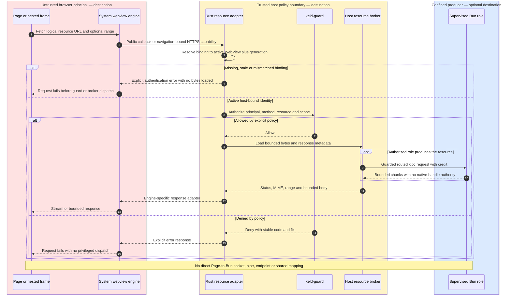

# keld-wv & keld-native — Engine Layer and Native APIs

## 1. keld-wv: our own webview layer (wry-informed, not wry-bound)

Destination decision: **build `keld-wv` as Keld's own thin binding layer** over
WKWebView (objc2), WebView2 (windows-rs + WebView2 COM), and WebKitGTK
(webkit6/gtk4 bindings), behind a `WebEngine` trait. Current macOS and Linux backends
remain tao+wry scaffolding (Linux links GTK3/WebKitGTK 4.1); Windows is direct COM.
wry/tao remain reference implementations and quirks catalogs.

Why not just use wry: (a) Keld needs first-class hooks wry doesn't prioritize —
measured per-engine bulk adapters, principal identity per navigation, pre-load
script atomicity guarantees, engine policy switching (system|pinned per platform),
multi-webview composition with native surfaces (Electrobun's OOPIF direction); (b) the
compat layer needs `webContents`-grade control (navigation interception, window.open
handling, print, zoom, find) that means touching platform APIs directly anyway; (c) the
host is prebuilt — we don't need wry's "works in any downstream cargo build" constraint.
What we keep from wry: its hard-won platform workarounds (documented per-commit),
its custom-protocol design shape, and tao's event-loop patterns. This is "from scratch"
the way wry itself is from scratch: direct platform bindings, ~15–20k LOC, no engine forks.

```rust
pub trait WebEngine {
    fn create(&mut self, spec: &WebviewSpec, host: HostHooks) -> Result<WebviewId, WvError>;
    fn navigate(&mut self, id: WebviewId, target: NavTarget) -> Result<(), WvError>;
    fn eval(&mut self, id: WebviewId, script: ScriptRef<'_>, cb: EvalCallback);
    fn post(&mut self, id: WebviewId, frame: ControlFrame) -> Result<(), WvError>;   // control plane
    fn register_scheme(&mut self, scheme: &str, handler: SchemeHandler) -> Result<(), WvError>;
    fn set_bounds(&mut self, id: WebviewId, rect: Rect, anchor: Anchor);
    fn devtools(&mut self, id: WebviewId, action: DevtoolsAction);
    fn destroy(&mut self, id: WebviewId);
}
```

Backends hold UI-thread-only platform handles (`WKWebView` today). All engine and
window mutations run on that thread (tao's main-thread event loop now; later
keld-core's command queue). The trait is therefore not `Send`. A `Send` bound
returns only with the command-queue design review.

The sketch is the destination API. v0 (KEL-26 hello slice) is the six-method
contract in `crates/keld-wv/src/engine.rs`: no `Send`, no `HostHooks` /
`post` / `register_scheme` / `Anchor`, and `set_bounds` / `devtools` /
`destroy` return `Result` so a stale id is a typed error. Methods from this
sketch land when a live backend implements them in the same change.

Backends: `wkwebview` (macOS wry scaffold), `webview2` (Windows direct COM since
KEL-65), and `webkitgtk` (Linux wry scaffold, KEL-28) all have live hello dispatch now.
`WvError::UnsupportedPlatform` (`KELD-WV-001`) is the fallback for any other
target. Platform extension traits are platform-neutral and compiled everywhere.
CEF is a planned opt-in pinned-engine candidate; no CEF feature/backend exists today.
If it lands, binaries are fetched at build time and the selected app/vendor owns their
security updates. Verso/Servo remain later conformance candidates only when embedding
stabilizes—the trait is the insurance policy, not evidence that those backends ship.

Linux resilience (`docs/research/library/host-platforms/06-webview-reality.md`): GPU-driver probe at startup → auto-apply
safe-mode. **Implemented (KEL-28):** `webkitgtk::probe_gpu_stack` detects
NVIDIA + Wayland and sets `WEBKIT_DISABLE_DMABUF_RENDERER=1` programmatically
before any GTK/WebKit call — never by asking users to export env vars — and
returns a `GpuSafeMode` apps can read (`is_degraded()` / `reason()`) as the
structured degraded-rendering fact. **Not yet built:** a `keld doctor` line
surfacing that result, and the fuller version-matrix probe in
`docs/research/library/host-platforms/06-webview-reality.md`
describes (today's probe is driver + session type only).

## 2. Renderer bridge contract (`window.keld`)

**Destination; not implemented in the live hello backends.** The bridge is injected
pre-load on every webview, with the same observable contract across engines (the
polyfill pack rides the same injection):

```ts
window.keld = {
  invoke(channel, payload, opts?): Promise<unknown>,   // control plane
  send(channel, payload): void,
  on(channel, handler): Unsubscribe,
  stream(channel, payload): ReadableStream,            // bounded engine-specific adapter
  meta: { platform, engine, appVersion, principal },
};
```

The planned `@keld/web` package wraps this with generated typed clients;
`@keld/electron`'s renderer shim implements `ipcRenderer`/`contextBridge` over it.

The resource path below is also a **destination contract**, not behavior implemented by
the live hello backends. An adapter may use authenticated HTTPS, a host-backed resource
callback, or a qualified engine-specific scheme; the observable policy and response
semantics stay host-owned. A Service Worker is optional machinery, not the authorization
boundary. An HTTPS adapter MUST use an unguessable capability bound to one active
WebView/navigation generation; missing, stale, cross-view or cross-generation bindings
fail before guard evaluation and before any response bytes are loaded.



## 3. keld-native: destination native API surface (built from scratch, guarded)

Every module is: Rust implementation per platform → guard check → kipc channel → typed
TS in `@keld/api` → (optionally) an Electron-compat facade. No module ships without all
three OS implementations or an explicit documented gap.

v0 is still a skeleton: its `MODULES` registry does not yet include the destination
`process` or `pty` rows below, and neither has implementation. KEL-76 must approve and
ship real behavior rather than adding placeholder identifiers.

| Module | Scope v0.x | Electron facade |
|---|---|---|
| `window` | create/close/show/focus/bounds/state, titlebar styles (hiddenInset/overlay), vibrancy/mica/acrylic, always-on-top, parenting/modal, fullscreen | `BrowserWindow` |
| `menu` | app menu, context menus, accelerators, role items (macOS roles complete) | `Menu`, `MenuItem` |
| `tray` | icon, tooltip, menu, click events, template images | `Tray` |
| `dialog` | open/save/message/error, scoped-path grants flow into fs scopes | `dialog` |
| `notify` | notifications with actions, macOS UNUserNotification / WinRT toast / libnotify | `Notification` |
| `clipboard` | text/html/image/files, change polling where OS allows | `clipboard` |
| `shortcut` | global shortcuts with conflict detection | `globalShortcut` |
| `screen` | displays, scale factors, work areas, DPI change events | `screen` |
| `power` | on-battery, suspend/resume, idle time, power-save blockers | `powerMonitor`, `powerSaveBlocker` |
| `shell` | open URL/path, reveal in folder, trash, beep | `shell` |
| `process` | scoped executable launch, env/stdio, child lifecycle and immutable process-tree snapshots | strict-profile `child_process`/`utilityProcess` broker facades |
| `pty` | host-owned PTY/ConPTY spawn, bytes, resize, signals, flow control, exit and parent death | `node-pty`-compatible operation facade |
| `fs+` | scoped fs ops via broker (watch included — notify crate), drag-out, recent docs | strict-profile virtual Node-fs/watcher facade; raw access only in an explicit sandbox-off legacy tier |
| `secrets` | keychain/DPAPI/libsecret | `safeStorage` |
| `deeplink` | protocol registration + single-instance handoff | `app.setAsDefaultProtocolClient` |
| `autostart` | login items / registry / .desktop | `app.setLoginItemSettings` |
| `dock/taskbar` | badge, progress, bounce, jump lists, thumbbar | `app.dock`, `setProgressBar` |
| `capture` (Tier 3) | window/screen capture via ScreenCaptureKit / Graphics.Capture / PipeWire | `desktopCapturer` |

Implementation notes: objc2/objc2-app-kit on macOS (no deprecated cocoa crate);
windows-rs on Windows; gtk4 + ashpd (XDG portals — file dialogs, notifications,
screencast on Wayland) on Linux, with portal-first behavior so sandboxed formats
(flatpak/snap) work day one.

## 4. Native extension path (`keld-ext`) — Rust as a plugin, never a requirement

**Optional destination; no plugin ABI, loader, CLI verb or package exists today.**

- Plugins are Rust cdylibs against a **stable C ABI** (`keld_ext_abi` versioned struct
  table, abi_stable-style vtables; no Rust ABI exposure). Loaded by the host at startup
  from `keld.config.ts` `extensions: []`. An in-host plugin joins the trusted computing
  base: its manifest constrains the kipc channels it may register and what the host
  exposes through those channels, but cannot prevent the native code from issuing
  direct syscalls or touching host memory. Only reviewed/trusted plugins may load
  in-process; untrusted native extensions require the sandboxed process boundary from
  architecture 03.
- Each plugin exports kipc channels — so a plugin is *just more typed API*, visible to
  TS with generated types like any built-in.
- Distribution: prebuilt per-platform npm packages (same pipeline as the host), or
  `keld ext build` for local ones (the only place an app repo ever needs cargo, and
  only plugin authors pay it).
- This replaces host-owned native functionality without making the app a Rust project.
  Third-party Node/N-API/V8 modules remain a separate operation-level Bun compatibility
  and sandbox problem; a passing artifact may be reused, isolated, or replaced behind
  the same facade. Host plugins have their own reviewed stable ABI.
