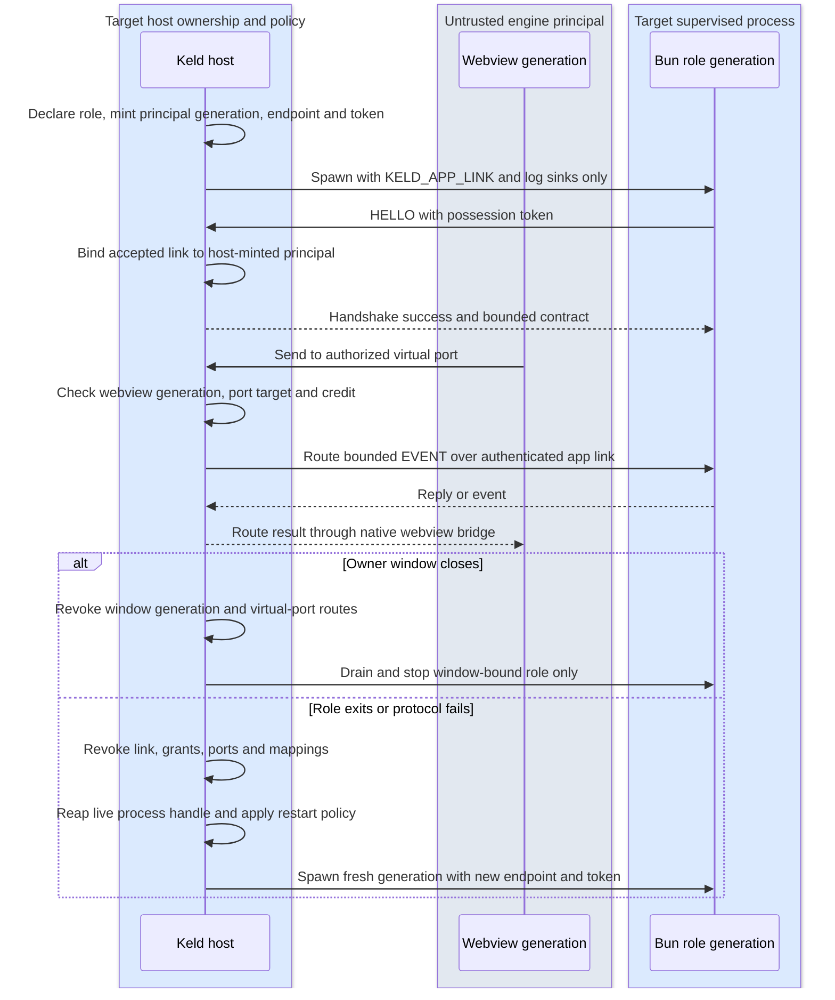

# Runtime, CLI, Packaging, Updates — The Solution-in-a-Box Layer

## 1. keld-runtime: Bun as a supervised component

- **Contract, not embedding.** Bun has no stable embedding C API (oven-sh/bun#12017 /
  #14252 remain unshipped; bun:ffi is explicitly experimental). Keld therefore treats
  the runtime as a *versioned process contract*. The live bootstrap contract is exactly
  `KELD_APP_LINK=<endpoint>#<64 hex chars>`; it names an endpoint and a one-session
  possession secret, never role/principal/grant metadata. Destination `@keld/api`
  (pure TS plus only reviewed enabled bulk glue) communicates with the host over kipc. Pin exact Bun version
  per Keld release (`keld.lock`); CLI downloads the pinned runtime once per machine
  (content-addressed cache), `keld-pack` embeds it per app at build. There are no
  parallel `KELD_LINK`, `KELD_SHM` or `KELD_CONTRACT` contracts.
- Trimming: ship Bun as-is first (compressed ~25–35 MB inside installers); track
  upstream size work; `runtime: "none"` mode omits it entirely (host-only apps score
  Tauri-class sizes). A `runtime: "node"` escape hatch is deliberately **not** in v1 —
  Bun's Node-compat is the compat plan; revisit only if corpus data forces it.
- **v0 (KEL-70/KEL-30):** `keld_runtime::Supervisor` provides exponential-backoff restart,
  crash-loop breaking (3 crashes/30 s), and stdout/stderr capture for one host-owned Bun
  child co-lived with the hello window via `keld_core::HostOwnedHelloSession`. It does not provide role identity, per-role grants, link binding, strict OS
  sandboxing, `--inspect` passthrough, graceful kipc draining, or renderer-continuity
  proof. Host ownership makes renderer survival architecturally plausible, not yet an
  exercised v0 claim.

### 1.1 Named role and lifecycle contract (destination, KEL-75)

The runtime accepts only host-declared roles. A role declaration names a trusted bundled
entry, one lifecycle owner, a restart policy, a logging policy and generated permission
policy. Initial lifecycle owners are `primary` (one app entry), `app-bound` (a shared
worker, PTY facade or agent owned by the host's app session), and `window-bound` (a
worker tied to one host window). These are lifecycle categories, not package, Electron
or VS Code identities. The host—not the primary role—creates and owns every child, so a
primary-role restart does not give it authority over an independent app-bound role.

For every destination spawn the host makes a fresh principal/link generation, endpoint and 32-byte
possession secret before it starts Bun. The child gets the canonical
`KELD_APP_LINK=<endpoint>#<64 hex chars>` and fixed-direction stdout/stderr log sinks;
those sinks are not authority handles. It receives no other inherited descriptor or OS
handle unless a later reviewed platform contract explicitly permits it. A successful
authenticated link accept consumes that bootstrap generation. On handshake failure,
role exit, protocol abuse, deadline, window close or host shutdown, the host revokes the
generation's link, grants, virtual ports and optional mapping handles before it
provisions or spawns a successor. For protocol failure, timeout and host shutdown,
revocation precedes close/kill. KEL-70 observes natural exit through `try_wait`, which
already reaps; this spec does not falsely promise portable pre-reap revocation. A numeric
PID is diagnostics only; reaping and termination use the host's live process handle,
never a PID recovered after exit.

`keld.config.ts` owns entry/lifecycle declaration; `keld.permissions.jsonc` owns the
generated capability subset and any separately reviewed role-specific addition. No
environment identity, child payload, token, PID or facade option can choose a role or
authority. Current Unix implementation is a two-slot host registry, not a complete
role family: KEL-70's generic one-child supervisor, KEL-75 T1a's Unix authenticated
bootstrap listener, T1b's per-role generation coordinator, and T2's
`keld_runtime::registry::RoleRegistry` which owns one `primary` and one `app-bound`
supervisor independently. A primary restart does not revoke or stop the app-bound
role. It does not implement window-bound lifecycle, role-specific grants, virtual
ports, strict OS sandboxing, or Windows named-pipe/DACL bootstrap.

The ordered destination flow below is KEL-75's source of truth for spawn, port routing,
window close and restart. KEL-78 separately owns real-OS sandbox admission proof.

### 1.2 Electron facade boundary (destination)

`@keld/electron` maps `utilityProcess.fork` to a host request for a declared role and
maps `MessageChannelMain` / `MessagePortMain` to host-owned virtual ports. The facade
does not obtain a raw child endpoint, mapping handle or authority to spawn a process.
Ports are FIFO per generation, transfers are one-shot and receiver-bound, and close or
generation revocation disconnects the peer without exposing another principal. Exact
Electron-observable queue/start, transfer validation and close-event behavior is owned
by pinned conformance entries—not assumed from this generic runtime contract. Live Unix
slices are T1b (one authenticated role generation) and T2 (one primary plus one
independent app-bound role in `RoleRegistry`). Window-bound roles and virtual ports
follow only after those slices.

## 2. keld CLI: verbs and guarantees

| Verb | Contract |
|---|---|
| `keld create` / `create-keld` | templates: vanilla-ts, react, vue, svelte, solid, electron-migration; first window < 60 s from cold |
| `keld dev` | starts app's own dev server (delegation, Deno lesson D4), spawns host with dev profile (permission recorder, hot-restart of app process on change via Bun watch, devtools open policy) |
| `keld build` | app bundle via the app's bundler → `keld-pack` → signed installers + update artifacts; `--frozen-permissions` gate |
| `keld migrate` | Electron analyzer + config generator + compat report (see 04-electron-compat) |
| `keld doctor` | env checks, native-module DB scan, permission diffs, web-baseline scan (`--web-compat`), Linux GPU matrix probe |
| `keld gen` | schema → TS/Rust codegen (also runs inside dev/build) |
| `keld ext` | plugin scaffolding/build (the only cargo touchpoint, plugin authors only) |

v0 live verbs: `create`, `dev`, `doctor`, `mcp`, `hello`, `ipc-echo`, `ipc-client`.
`keld doctor` checks Bun on PATH, hello-template layout (`keld.config.ts` +
`src/main.ts`), the configured renderer HTML (default `index.html`; missing or
non-project-relative is `KELD-CLI-035`), and a webview info line on macOS,
Windows, and Linux (all three live `WebEngine` backends as of KEL-28).
Native-module DB, permission diffs, and `--web-compat` are
not live. The Linux GPU-stack probe (`webkitgtk::probe_gpu_stack`, KEL-28) runs
automatically at engine creation and applies NVIDIA+Wayland safe-mode
internally; it is not yet its own `keld doctor` line — the `webview` check only
reports backend availability, not safe-mode state. Unknown flags on live verbs with a closed flag set (`create`, `dev`,
`doctor`, `hello`) are `KELD-CLI-044` (exit 2). `keld create` takes one project
name; `--template` is not live (vanilla-ts hello only). `keld dev` takes no
flags; `--watch` and `--inspect-ipc` are not live. Spec-named `build` /
`migrate` / `gen` / `ext` are `KELD-CLI-045` (exit 2) with a tracking issue and
the Phase 2 workaround (`keld create` then `keld dev`) — not a bare "unknown
command". Garbage verbs are `KELD-CLI-046` (exit 2).

**v0 env var is `KELD_APP_LINK`, not `KELD_LINK`/`KELD_SHM`/`KELD_CONTRACT`.**
§1's contract above is the destination shape; `keld-runtime`'s pinning/download of Bun,
the destination env vars, `--inspect` passthrough, and Bun watch hot-restart are not
built yet. Spawn/backoff/crash-loop supervision **is** built (KEL-70):
`keld_runtime::Supervisor` spawns the child, captures its stdout/stderr, and restarts it
on crash with exponential backoff up to a `RestartPolicy` (default 3 crashes / 30s)
before giving up with a typed `KELD-RUNTIME-002`. `keld dev` (`crates/keld-cli/src/dev.rs`
`run_dev_echo`) spawns through that supervisor, not a bare `Command::new("bun")` wait;
the app-link env var is still `KELD_APP_LINK=<endpoint>#<64 hex chars>`
(`docs/architecture/02-ipc.md` §1).
The Bun side speaks kipc directly — `templates/hello/src/kipc.ts` is a
hand-written, wire-exact v0 client (postcard framing, one `HELLO` per
connection, then N `CALL`/`REPLY` via `AppLinkSession`). `keld gen` /
`@keld/schema` codegen (KEL-13) is not built, so this is the actual
"Bun to Rust and back" vertical slice (KEL-30), not the destination codegen
pipeline. `keld ipc-client echo` remains a separate CLI-side kipc client,
useful standalone; the template no longer shells out to it.

Distribution: `@keld/cli` npm package with per-platform binaries under
`optionalDependencies` (esbuild pattern); `bunx keld` / `npx keld` work with zero
global install. Host + runtime binaries fetched signed, verified, cached.

## 3. keld-pack: packaging & cross-compilation

- Formats: macOS `.app`/`.dmg` (+ notarization via rcodesign — pure Rust, no Xcode
  needed for CI), Windows NSIS + MSI (WiX-free Rust authoring, Deno proved viability),
  Linux `.deb`/`.rpm`/AppImage/flatpak manifest.
- **Cross-compile everything from one machine**: because the host is prebuilt per
  platform and JS is portable, `keld build --target win-x64 --target linux-arm64` is
  data assembly + signing. Matches Deno Desktop's headline capability; beats
  Tauri/Electrobun (per-OS build farms) structurally.
- Signing: platform signers driven natively (rcodesign / signtool / osslsigncode
  fallback), config in `keld.build.ts`, CI recipes documented for GitHub Actions.

## 4. keld-update: delta updates as a default

- Artifacts: per-release zstd-compressed bsdiff patches (HDiffPatch evaluated in bench
  before freeze) between the last N releases + full package fallback; static-host
  compatible feed (`updates.json` manifest, any CDN/S3/GitHub Releases).
- Client: host-side (no separate updater binary), background polling with jitter,
  BLAKE3 post-conditions + ed25519 manifest signatures, atomic swap + N-1 rollback,
  channels (stable/beta/canary), UI hooks exposed as kipc events; `autoUpdater` compat
  facade for migrated apps; bridge-release recipe for Electron switchers (04 §7).
- Budget: 1-line JS change → ≤ 50 KB patch (Electrobun demonstrated 4 KB-class is
  feasible; our floor includes manifest + signature overhead).
- All three platforms at v1 — explicitly ahead of Electrobun (Windows stability caveats)
  and Deno Desktop (no Windows auto-update).

## 5. Dev loop targets

- `keld dev` cold → window ≤ 2 s (host prebuilt, Bun start ~10 ms class, webview init
  dominates); warm app-process restart ≤ 300 ms with renderer preserved.
- Unified logs: host (tracing, JSON), app process (stdout), renderer (console capture)
  interleaved in one stream with principal tags; `keld dev --inspect-ipc` is **planned**
  (decoded kipc JSON dump). Today the flag is `KELD-CLI-044` (not live).
- DevTools: system engines expose what they have (CDP on WebView2, Safari inspector on
  macOS, WebKitGTK inspector); `keld dev` prints exact attach instructions per OS —
  no pretending parity exists where it doesn't.
