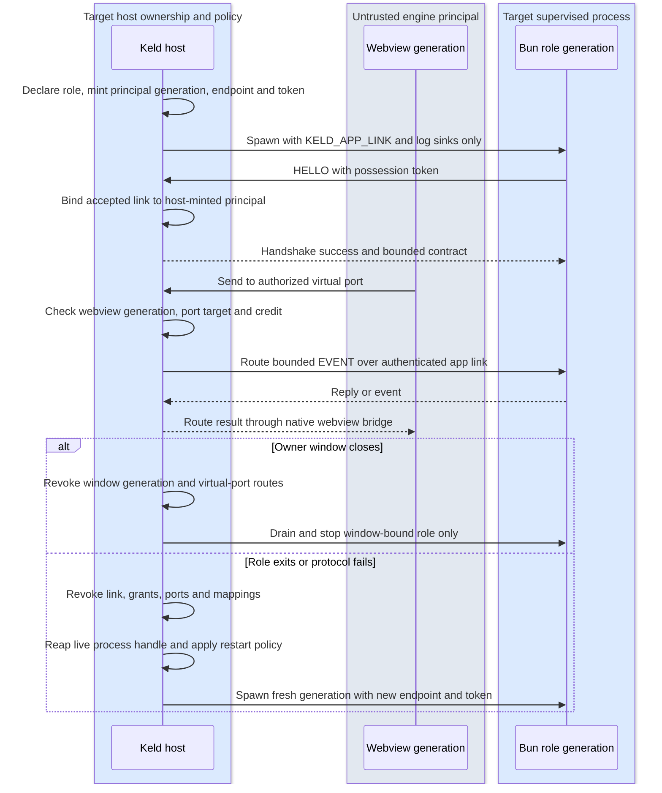

# Runtime, CLI, Packaging, Updates — The Solution-in-a-Box Layer

## 1. keld-runtime: Bun as a supervised component

- **Contract, not embedding.** Bun has no stable embedding C API (oven-sh/bun#12017 /
  #14252 remain unshipped; bun:ffi is explicitly experimental). Keld therefore treats
  the runtime as a *versioned process contract*. The live bootstrap contract is exactly
  `KELD_APP_LINK=<endpoint>#<64 hex chars>`; it names an endpoint and a one-session
  possession secret, never role/principal/grant metadata. Destination `@keld/api`
  (pure TS plus only reviewed enabled bulk glue) communicates with the host over kipc. Pin exact Bun version
  per Keld release (`keld.lock`); CLI downloads the pinned runtime once per machine
  (content-addressed cache), `keld-pack` embeds it per app at build. There are no
  parallel `KELD_LINK`, `KELD_SHM` or `KELD_CONTRACT` contracts.
- Trimming: ship Bun as-is first (compressed ~25–35 MB inside installers); track
  upstream size work; `runtime: "none"` mode omits it entirely (host-only apps score
  Tauri-class sizes). A `runtime: "node"` escape hatch is deliberately **not** in v1 —
  Bun's Node-compat is the compat plan; revisit only if corpus data forces it.
- **v0 (KEL-70/KEL-30):** `keld_runtime::Supervisor` provides exponential-backoff restart,
  crash-loop breaking (3 crashes/30 s), and stdout/stderr capture for one host-owned Bun
  child co-lived with the hello window via `keld_core::HostOwnedHelloSession`. It does not provide role identity, per-role grants, link binding, strict OS
  sandboxing, `--inspect` passthrough, graceful kipc draining, or renderer-continuity
  proof. Host ownership makes renderer survival architecturally plausible, not yet an
  exercised v0 claim.
- **macOS no-flag primary (KEL-96 T1a/T1b/T2/T3):** the no-flag `keld-host`
  validates its owner-private schema-v1 stage before any application resource,
  then uses the guardian-composed `Supervisor` for Bun's process group and
  KEL-116 self-termination ledger. T3 reuses KEL-75's generation owner: a
  recoverable nonzero Bun crash revokes its endpoint/token/stream before the
  persistent guardian's one Supervisor requests a fresh generation. The same
  host, native window and logical router install that authenticated successor,
  send `Ready` again and continue echo/lifecycle dispatch. Status-zero
  self-termination remains terminal; a status-zero exit after an accepted
  correlated Quit is host-authorized and is not added to that ledger. Shipping
  `keld dev` now compiles the same
  owner-private stage, launches that host with no Keld argument, directly
  forwards its stdout/stderr, places it in a process group separate from the
  terminal-facing CLI, and retains only the host process handle plus the write
  end of a private stdin-v1 liveness pipe. The host makes its reader
  non-inheritable before guardian/Bun spawn. CLI death yields EOF and enters
  the host's existing accepted-shutdown attribution, quiesce, link-close,
  guardian-reap and UI-exit tail without a fabricated lifecycle reply. The
  dev-leased host removes its own validated `.keld/dev/<nonce>` root on every
  ordered return, including CLI loss; an uncatchable host `SIGKILL` can retain
  that owner-private stage for a future bounded GC policy.
- **Windows no-flag primary (KEL-96/T4 Windows slice):** `keld dev` creates a
  fresh protected-current-user stage, launches `keld-host.exe` with no Keld
  flag, forwards logs and retains only the host handle plus stdin-v1 writer.
  The host independently reads back the protected one-ACE DACL, validates the
  same closed boot/policy contract before resources, and consumes T8's one
  `PrimaryRoleSupervisor` with a pre-Ready recovery gate. One logical router
  spans fresh loopback generations while the same WebView2 HWND remains live;
  `NavigationCompleted` drives `Ready` through tao's UI-thread
  `EventLoopProxy`. A link-only failure requests revoke/kill/reap/restart from
  that same supervisor rather than creating a core-side process loop. Retired
  capture readers are detached at this boundary so a descendant-held pipe
  cannot delay the successor; KEL-78 still owns descendant termination.
  The host clears inheritance on the stdin-v1 lease reader before the first
  Bun spawn, preserves lease-read/tail errors through the window result, and
  gates initial WebView2 creation under the common shutdown transition. An
  unrequested status-zero Bun exit is reported with its retained PID/status
  through `KELD-CORE-033` rather than collapsing to a generic UI failure.
  Correlated Quit and CLI EOF use the shared
  quiesce/link-close/supervisor-reap/UI-exit tail. Normal CLI-owned completion
  removes the stage after the host exits. CLI-death process teardown is live,
  but Windows cannot remove its running staged executable and no surviving
  cleanup helper is approved, so that empty-stage cleanup row remains open.
  Abnormal host-death descendants likewise remain KEL-78/T3 Job Object work;
  this slice makes no LPAC, named-pipe/DACL, or privileged-dispatch claim.
- **macOS host-death guardian (KEL-78/T2b):**
  `keld_runtime::macos_guardian` is the live shared cleanup owner.
  `GuardianBootstrap` mints an authenticated private registration link, owns
  the exact guardian child and sole non-inheritable liveness writer, and accepts
  only that guardian's fixed `KGR1` group record on the generic one-child API;
  callers cannot inject a numeric process-group id. KEL-96/T3 keeps the same
  authenticated stream open for fixed, bounded `KGC1` generation-control
  records. Each generation registers its exact Bun group, waits for host link
  revocation, clears the retired group, and only then prepares its successor.
  The guardian validates both inherited bootstraps
  before child creation, prevents the liveness reader from reaching Bun, runs a
  fresh command in an isolated process group, revokes registered resources on
  every post-start failure, signals the group once, and waits its direct child.
  `HostGuardian` consumes the group identity on every terminal path, so an API
  retry cannot signal a reused PGID. Unexpected guardian exit produces
  `KELD-RUNTIME-013` only after the host fail-safe; orderly shutdown closes the
  same writer. The KEL-96 supervised variant may first write one fixed
  non-authority accepted-Quit byte through that host-exclusive pipe; the
  guardian records attribution without terminating Bun, then returns fixed
  `KQA` over a dedicated acknowledgment pipe. The host requires that ack before
  publishing the correlated reply. The persistent T3 owner similarly
  acknowledges one `S`/`KSA` live-host cleanup discriminator before startup or
  window-failure rollback, so link revocation can complete before reap. An
  unmarked EOF remains abnormal host death and bypasses impossible host RPC.
  The generic
  KEL-78 `run` path continues to reject all pipe data. KEL-96 now provides its first shipping caller by composing the
  existing `Supervisor` inside the guardian and consuming the result from the
  no-flag host owner. The guardian still does not implement App Sandbox or
  Strict admission.

### 1.1 Named role and lifecycle contract (destination, KEL-75)

The runtime accepts only host-declared roles. A role declaration names a trusted bundled
entry, one lifecycle owner, a restart policy, a logging policy and generated permission
policy. Initial lifecycle owners are `primary` (one app entry), `app-bound` (a shared
worker, PTY facade or agent owned by the host's app session), and `window-bound` (a
worker tied to one host window). These are lifecycle categories, not package, Electron
or VS Code identities. The host—not the primary role—creates and owns every child, so a
primary-role restart does not give it authority over an independent app-bound role.

For every destination spawn the host makes a fresh principal/link generation, endpoint and 32-byte
possession secret before it starts Bun. The child gets the canonical
`KELD_APP_LINK=<endpoint>#<64 hex chars>` and fixed-direction stdout/stderr log sinks;
those sinks are not authority handles. It receives no other inherited descriptor or OS
handle unless a later reviewed platform contract explicitly permits it. A successful
authenticated link accept consumes that bootstrap generation. On handshake failure,
role exit, protocol abuse, deadline, window close or host shutdown, the host revokes the
generation's link, grants, virtual ports and optional mapping handles before it
provisions or spawns a successor. For protocol failure, timeout and host shutdown,
revocation precedes close/kill. KEL-70 observes natural exit through `try_wait`, which
already reaps; this spec does not falsely promise portable pre-reap revocation. A numeric
PID is diagnostics only; reaping and termination use the host's live process handle,
never a PID recovered after exit.

`keld.config.ts` owns entry/lifecycle declaration; `keld.permissions.jsonc` owns the
generated capability subset and any separately reviewed role-specific addition. No
environment identity, child payload, token, PID or facade option can choose a role or
authority. Current implementation is not a complete role family: KEL-70's generic
one-child supervisor, KEL-75 T1a/T8's platform authenticated bootstrap listener,
T1b/T8's shared per-role generation coordinator, and T2's Unix
`keld_runtime::registry::RoleRegistry` which owns one `primary` and one `app-bound`
supervisor independently. A primary restart does not revoke or stop the app-bound
role. It does not implement window-bound lifecycle, role-specific grants, or
strict OS sandboxing. KEL-75 T3 adds bounded host-owned virtual ports between
authenticated role generations in the Unix `VirtualPortRegistry`. T8 proves a real
Windows Bun primary g1→g2 over the unprivileged loopback interim and exposes the
authenticated stream to a future host router; it does not implement KEL-96/T4's
no-flag Windows host/window path or privileged dispatch. Windows named-pipe/DACL
bootstrap remains KEL-101 work.

The ordered destination flow below is KEL-75's source of truth for spawn, port routing,
window close and restart. KEL-78 separately owns real-OS sandbox admission proof.



### 1.2 Electron facade boundary (destination)

`@keld/electron` maps `utilityProcess.fork` to a host request for a declared role and
maps `MessageChannelMain` / `MessagePortMain` to host-owned virtual ports. The facade
does not obtain a raw child endpoint, mapping handle or authority to spawn a process.
Ports are FIFO per generation, transfers are one-shot and receiver-bound, and close or
generation revocation disconnects the peer without exposing another principal. Exact
Electron-observable queue/start, transfer validation and close-event behavior is owned
by pinned conformance entries—not assumed from this generic runtime contract. Live role
slices are T1b/T8 (one authenticated primary generation on Unix/Windows), T2 (one
primary plus one independent app-bound role in `RoleRegistry`), and T3 (bounded
virtual ports between authenticated roles); T2/T3 remain Unix-only. Window-bound
roles follow only after those slices and their shipping integration gates.

## 2. keld CLI: verbs and guarantees

| Verb | Contract |
|---|---|
| `keld create` / `create-keld` | templates: vanilla-ts, react, vue, svelte, solid, electron-migration; first window < 60 s from cold |
| `keld dev` | **Today:** on macOS and Windows compiles an owner-private stage and launches its no-flag host; the CLI owns logs, the host handle and a liveness writer but no window, app link, token or Bun supervisor. Linux fails closed until its KEL-96/T4 no-flag row. **Destination:** also starts the app's own dev server (delegation, Deno lesson D4) and adds the dev permission recorder, hot-restart on change via Bun watch, and devtools policy. |
| `keld build` | app bundle via the app's bundler → `keld-pack` → signed installers + update artifacts; `--frozen-permissions` gate |
| `keld migrate` | Electron analyzer + config generator + compat report (see 04-electron-compat) |
| `keld doctor` | env checks, native-module DB scan, permission diffs, web-baseline scan (`--web-compat`), Linux GPU matrix probe |
| `keld gen` | schema → TS/Rust codegen (also runs inside dev/build) |
| `keld ext` | plugin scaffolding/build (the only cargo touchpoint, plugin authors only) |

v0 live verbs: `create`, `dev`, `doctor`, `mcp`, `hello`, `ipc-echo`, `ipc-client`.
`keld doctor` checks Bun on PATH, hello-template layout (`keld.config.ts` +
`src/main.ts`), the configured renderer HTML (default `index.html`; missing or
non-project-relative is `KELD-CLI-035`), and a webview info line on macOS,
Windows, and Linux (all three live `WebEngine` backends as of KEL-28).
Native-module DB, permission diffs, and `--web-compat` are
not live. The Linux GPU-stack probe (`webkitgtk::probe_gpu_stack`, KEL-28) runs
automatically at engine creation and applies NVIDIA+Wayland safe-mode
internally; it is not yet its own `keld doctor` line — the `webview` check only
reports backend availability, not safe-mode state. Unknown flags on live verbs with a closed flag set (`create`, `dev`,
`doctor`, `hello`) are `KELD-CLI-044` (exit 2). `keld create` takes one project
name; `--template` is not live (vanilla-ts hello only). `keld dev` takes no
flags; `--watch` and `--inspect-ipc` are not live. Spec-named `build` /
`migrate` / `gen` / `ext` are `KELD-CLI-045` (exit 2) with a tracking issue and
the Phase 2 workaround (`keld create` then `keld dev`) — not a bare "unknown
command". Garbage verbs are `KELD-CLI-046` (exit 2).

**The Bun bootstrap env var is `KELD_APP_LINK`, not
`KELD_LINK`/`KELD_SHM`/`KELD_CONTRACT`.** The separate
`KELD_DEV_LEASE=stdin-v1` value is private CLI-to-host liveness classification:
it is removed at macOS guardian spawn or Windows primary spawn and never reaches Bun or selects authority.
§1's contract above is the destination shape; `keld-runtime`'s pinning/download of Bun,
the destination env vars, `--inspect` passthrough, and Bun watch hot-restart are not
built yet. Spawn/backoff/crash-loop supervision **is** built (KEL-70):
`keld_runtime::Supervisor` spawns the child, captures its stdout/stderr, and restarts it
on crash with exponential backoff up to a `RestartPolicy` (default 3 crashes / 30s)
before giving up with a typed `KELD-RUNTIME-002`. On macOS and Windows shipping
`keld dev` delegates to the staged host. macOS composes that supervisor through
the shared guardian; Windows consumes T8's primary supervisor directly. The
retained `run_dev_echo` diagnostic/test seam also spawns through
the supervisor, not a bare `Command::new("bun")` wait;
the app-link env var is still `KELD_APP_LINK=<endpoint>#<64 hex chars>`
(`docs/architecture/02-ipc.md` §1).
Teardown reads the supervision verdict rather than dropping it (KEL-105): if
the app process dies without a successful recovery, the no-flag host emits
`KELD-CORE-033` with the owning `KELD-RUNTIME-*` error and captured stderr, then
exits non-zero. Delegated `keld dev` forwards that stderr and returns its own
`KELD-CLI-048` host-exit wrapper instead of exiting 0 with no diagnostic. The
retained `run_dev_echo` diagnostic reports its direct session error.

The breaker alone cannot carry that verdict, which is why the supervisor also
publishes `CrashLedger`. Its original KEL-105 fields retain the crash-class count,
diagnostic and stdout position for non-zero statuses and signal terminations; KEL-116
adds a fixed-size, allocation-free total self-termination count plus the most recent
pid/status/stdout position. The two views let a completed-work caller accept a final
status zero without hiding an earlier post-ready crash.
`KELD-RUNTIME-002` requires three crash-class terminations (non-zero statuses or
signals) inside a 30s sliding window
(`RestartPolicy::default()`, `crash_times.retain`). Status zero does not consume
crash-loop budget or restart. Non-zero and signal terminations still follow
`RestartPolicy`, so one crash or crashes spaced beyond the window do not by themselves
mean no app is running. Every unrequested termination remains durable even when the
breaker does not trip. Under a strict post-ready liveness policy, an unrecovered
termination under a clean `Stopped` outcome surfaces `KELD-RUNTIME-012`; completed
windowless work accepts status-zero termination after its reply is captured. The host
reads both decisions from ledger state it never has to drain.

The two codes are not alternatives. `KELD-CORE-033` is always the outer session
diagnostic `keld dev` exits with; the `KELD-RUNTIME-*` code it quotes is the nested
cause — `012` for unrequested self-termination that did not trip the breaker
(including status zero), `002` for a crash loop, `003` for a generation that failed
to provision. Assert on the outer code for the command's contract and on the nested
one for the cause.

The fact and policy have separate owners. `keld-runtime` counts every observed
self-termination and retains the latest all-termination record plus the latest
crash-class diagnostic/record. The legacy window path uses strict
`HostOwnedHelloSession::shutdown` and treats every post-ready self-termination as
fatal. The macOS and Windows no-flag paths recover nonzero crashes below the breaker with a
fresh generation while keeping status zero, admission failure and a tripped
breaker terminal. The windowless echo path has completed its observable work after its reply is
captured, so it selects `shutdown_after_completed_work` and accepts only status-zero
self-termination; non-zero and terminal lifecycle failures still fail.

Whether the breaker also trips depends on how the restarted generation fails, which
is not something the host should have to predict. In the retained legacy diagnostic
run, restarted children cannot re-enter the session at all — the v0 echo listener admits exactly
one authenticated session (`crates/keld-core/src/echo_link.rs`) and their `connect`
failed outright — so they crashed fast enough to trip the breaker. The ledger makes
the verdict independent of that timing.

A crash the supervisor *recovered* from before the app reported ready stays a
success (KEL-70 AC1/AC3). Separating the two cases cannot be done by counting
terminations, because the supervisor publishes stdout and its `Exited` event
*before* it records the ledger fact: a host that samples the count when it notices
the ready marker can already see a death that happened after the app was live, and
would forgive it. The session therefore compares the ready marker's stdout offset
against the relevant latest retained all-termination and crash-class positions —
answering "printed, then terminated" versus "terminated, then printed" for the
records that decide the caller policy, rather than from when the host happened to
look.

Two limits remain. Linux `keld dev` fails closed before creating an app resource,
and its real T4 product rows are absent. The Windows no-flag slice does not prove
abnormal host-death descendant cleanup, post-CLI-death stage deletion, or LPAC
containment.
The Bun side speaks kipc directly — `templates/hello/src/kipc.ts` is a
hand-written, wire-exact v0 client (postcard framing, one `HELLO` per
connection, then N `CALL`/`REPLY` via `AppLinkSession`). `keld gen` /
`@keld/schema` codegen (KEL-13) is not built, so this is the actual
"Bun to Rust and back" vertical slice (KEL-30), not the destination codegen
pipeline. `keld ipc-client echo` remains a separate CLI-side kipc client,
useful standalone; the template no longer shells out to it.

Distribution: `@keld/cli` npm package with per-platform binaries under
`optionalDependencies` (esbuild pattern); `bunx keld` / `npx keld` work with zero
global install. Host + runtime binaries fetched signed, verified, cached.

## 3. keld-pack: packaging & cross-compilation

- Formats: macOS `.app`/`.dmg` (+ notarization via rcodesign — pure Rust, no Xcode
  needed for CI), Windows NSIS + MSI (WiX-free Rust authoring, Deno proved viability),
  Linux `.deb`/`.rpm`/AppImage/flatpak manifest.
- **Cross-compile everything from one machine**: because the host is prebuilt per
  platform and JS is portable, `keld build --target win-x64 --target linux-arm64` is
  data assembly + signing. Matches Deno Desktop's headline capability; beats
  Tauri/Electrobun (per-OS build farms) structurally.
- Signing: platform signers driven natively (rcodesign / signtool / osslsigncode
  fallback), config in `keld.build.ts`, CI recipes documented for GitHub Actions.

## 4. keld-update: delta updates as a default

- Artifacts: per-release zstd-compressed bsdiff patches (HDiffPatch evaluated in bench
  before freeze) between the last N releases + full package fallback; static-host
  compatible feed (`updates.json` manifest, any CDN/S3/GitHub Releases).
- Client: host-side (no separate updater binary), background polling with jitter,
  BLAKE3 post-conditions + ed25519 manifest signatures, atomic swap + N-1 rollback,
  channels (stable/beta/canary), UI hooks exposed as kipc events; `autoUpdater` compat
  facade for migrated apps; bridge-release recipe for Electron switchers (04 §7).
- Budget: 1-line JS change → ≤ 50 KB patch (Electrobun demonstrated 4 KB-class is
  feasible; our floor includes manifest + signature overhead).
- All three platforms at v1 — explicitly ahead of Electrobun (Windows stability caveats)
  and Deno Desktop (no Windows auto-update).

### 4a. v0 manifest & feed wire contract (KEL-53 trigger)

The paragraph above names the pieces; this subsection is the byte-level contract KEL-53
needs before its fixtures (valid/tampered manifest, corrupted patch, full-package
fallback, N-1 rollback) can be written as executable acceptance tests instead of
prose. **Not decided here:** bsdiff vs HDiffPatch (KEL-53 AC2 benchmarks that), the
exact `ed25519-dalek`/`zstd`/delta crate choices (KEL-53 AC3, dependency review gate),
or a TUF-style rotating root (03-security.md §4 point 4 names it as a target; v0 below
is a single pinned key, stated as a v0 limitation, not silently narrowed).

**Feed layout**, one static tree per channel **and target**, servable from any
CDN/S3/GitHub Releases (no server logic required):

```text
<feed-base>/<channel>/<target>/updates.json         # manifest payload (unsigned in-band)
<feed-base>/<channel>/<target>/updates.json.sig     # detached signature over updates.json's raw bytes
<feed-base>/<channel>/<target>/<version>/full.zst                     # full package, zstd-compressed
<feed-base>/<channel>/<target>/<version>/from-<from-version>.delta.zst  # delta, zstd-compressed (diff format: KEL-53 AC2)
```

`<target>` is one of the fixed platform/architecture triples Keld actually ships
(`macos-arm64`, `macos-x64`, `windows-x64`, `linux-x64`, …, matching `keld-pack`'s own
target list — not a wire-level enum defined here). A client polls only the path for its
own compiled-in target, so cross-target confusion would require the feed operator (or
an attacker who can write to the feed) to physically publish the wrong bytes at the
right path — the URL structure is the primary defense. The manifest's own `target`
field (below) is the second, redundant layer: the same defense-in-depth shape as the
`app.id`/`channel` check, for the same reason a single control is not trusted alone.

The signature is a **separate file over the manifest's literal bytes**, not a field
embedded inside the JSON. This removes the need for a canonicalization rule (key order,
whitespace, number formatting) *between signer and verifier* — the client verifies the
exact response bytes before parsing them at all, so no JSON serialization step sits
between what was signed and what was checked. It does **not** by itself remove parser
ambiguity between different JSON implementations; §4a settles that separately: `schema`
must be an unrecognized-value-fails-closed integer (already specified below), and a
parser that accepts duplicate object keys **MUST** reject the manifest rather than
silently taking the last (or first) value — the wire contract has exactly one value per
key, and a parser that can't guarantee that is not a valid implementation of it.

`updates.json.sig` — one line, base64-encoded 64-byte ed25519 signature, no wrapper.

`updates.json` — v0 schema. Every release requires `full`; `deltas` is the only
optional piece (a release **MUST NOT** omit `full` — the full-package fallback and the
post-delta-failure fallback below both assume it exists, so a fixture that rejects a
release missing `full` is part of AC1):

```json
{
  "schema": 1,
  "channel": "stable",
  "target": "macos-arm64",
  "app": { "id": "com.example.app" },
  "releases": [
    {
      "version": "1.4.2",
      "publishedAt": "2026-08-18T00:00:00Z",
      "full": {
        "url": "1.4.2/full.zst",
        "size": 12345678,
        "blake3": "<64 hex chars>",
        "contentSize": 23456789,
        "contentBlake3": "<64 hex chars>"
      },
      "deltas": [
        {
          "fromVersion": "1.4.1",
          "url": "1.4.2/from-1.4.1.delta.zst",
          "size": 45678,
          "blake3": "<64 hex chars>"
        }
      ]
    }
  ]
}
```

- `schema` is an integer, bumped on any incompatible field change — a client that does
  not recognize the value fails closed (refuses the feed) rather than guessing.
- `app.id`, `channel`, and `target` **MUST** match the host's compiled-in application
  identity, the channel it actually requested, and its own compiled-in target, checked
  fail-closed *after* signature verification and *before* any release is selected (step
  2 below). A correctly-signed manifest for a different app, channel, or target is not
  this host's update — accepting it on signature validity alone is exactly how feed
  misrouting, a shared signing key, or a wrong-target URL turns into a cross-app,
  cross-channel, or cross-platform install.
- `version` **MUST** be strict semver (`MAJOR.MINOR.PATCH`, no build-metadata suffix
  participating in ordering). Two `releases[]` entries with the same `version`, or two
  `deltas[]` entries within one release with the same `fromVersion`, make the whole
  manifest invalid — reject it outright (a schema violation, the same as an unknown
  `schema` value), not "pick one arbitrarily." Different clients silently picking
  different entries from the same signed manifest is the specific failure a duplicate
  would cause if it were merely tolerated.
- Release selection is deterministic: among releases that pass the version-floor check
  (step 4 below), the client selects the single **highest** version, never "any
  newer" — there is exactly one answer to "what does this manifest ask me to install,"
  not a client-dependent choice among several eligible releases.
- Each release's `deltas` array may be empty or contain zero or more entries; how many
  prior versions a publisher generates deltas for (the "last N releases" in the prose
  above) is a publish-time/`keld-pack` decision, not part of this wire contract — the
  client only ever looks for one entry whose `fromVersion` equals its own installed
  version.
- `size` is **normative, not advisory**: downloads are bounded, streaming reads that
  reject an artifact once received bytes exceed `size` and reject a stream that ends
  short of it. A `size` field that nothing checks is not a contract; this fixture
  (short and long artifacts) is part of AC1. `size` bounds only the **compressed**
  bytes on the wire — it says nothing about decompressed size, so it is not a
  decompression-bomb defense by itself (a small, valid zstd stream can still expand to
  an enormous one). `full.contentSize` is the separate, explicit bound on that: the
  decompressor **MUST** be given that ceiling up front and abort mid-stream the moment
  produced output exceeds it, checked incrementally as bytes are produced — never by
  fully decompressing first and measuring after.
- Two hash domains, not one. `blake3` (present on both `full` and every `deltas[]`
  entry) is the digest of the **artifact's bytes as downloaded** — the `.zst` file
  exactly as served — and proves transport integrity of what was fetched, nothing
  about what it decompresses or reconstructs to. `full.contentBlake3` is the digest of
  the **decompressed, installable package bytes**: the full-package path decompresses
  `full.zst` and checks the result against `contentBlake3` before install; the delta
  path decompresses the patch and applies it against the currently-installed content,
  then checks *its* result against that same `full.contentBlake3` — both paths
  converge on one deterministic, checkable content stream regardless of which artifact
  produced it. Deltas carry no `contentBlake3` of their own; there is nothing to check
  a delta's reconstruction against except the release's one canonical content hash.
- **The canonical content stream those bytes are a hash of** is a v0-defined package
  format, not "whatever bytes happen to decompress": a single POSIX ustar archive
  (`.tar`, before the outer zstd wrapper) with an exact, exhaustive byte-level
  profile — deliberately minimal, skipping the GNU/PAX long-name and sparse-file
  extensions entirely, so there is no optional-extension ambiguity for two
  implementations to disagree on:
  - Entries are **regular files (`typeflag '0'`) and directories (`typeflag '5'`)
    only** — no symlinks, hardlinks, device files, FIFOs, or extended attributes in
    v0 (a v1 packaging-format gap, named here, not solved by this contract; macOS
    `.app` bundles in particular are symlink-heavy). Any other `typeflag` is a
    manifest-shape violation.
  - `name`: a UTF-8 relative path, no leading `/`, no `.`/`..` path components, no
    empty segments, **at most 100 bytes** (the plain ustar `name` field's own limit —
    a path that doesn't fit is a v0 limitation; the ustar `prefix` field and
    GNU/PAX long-name extensions are explicitly out of scope, not silently assumed).
    No two entries may share a `name`.
  - `mode`: exactly `0644` for regular files, exactly `0755` for directories — no
    other value.
  - `uid`/`gid`: `0`. `uname`/`gname`: empty. `mtime`: `0`. `devmajor`/`devminor`: `0`.
    `linkname`: empty.
  - `magic`: `"ustar\0"`, `version`: `"00"` (POSIX ustar; not the pre-POSIX v7 or GNU
    tar variants). `chksum`: computed per the POSIX header-checksum algorithm.
  - Entries sorted by `name` (byte order). Archive terminated by exactly two 512-byte
    zero blocks; every header and data section padded to a 512-byte boundary with
    zero bytes — the standard tar block format, stated here so an implementer does
    not have to re-derive it from the POSIX spec.
  - Any producer and consumer that agree on every rule above produce and read
    byte-identical archives for the same input tree — that agreement is what makes
    `contentBlake3` reproducible at all; "roughly tar-shaped" is not enough.

  `contentBlake3`/`contentSize` are the digest and byte count of that exact tar
  stream. **Extraction is a two-pass operation — a full validation pass over every
  header, then writing — never validate-as-you-go while already writing:**
  1. Read every entry's header first, without writing any file. Reject the whole
     archive (no partial writes to clean up, because none happened) if any entry's
     `name` is absolute, contains a `..` component, is empty, or — after being joined
     against the destination versioned directory — does not stay lexically within it
     (standard "tar slip" defense; sorted names and the 100-byte/no-`..` `name` rule
     above narrow what a *valid* archive can contain, but do not by themselves stop a
     crafted or corrupted stream from attempting the escape during extraction). Also
     reject on any **namespace collision**: the same path claimed by two entries
     (already invalid per the no-duplicate-`name` rule, checked again here since this
     is the enforcement point), or a path that requires a directory where an *ancestor*
     path is already claimed as a regular file (e.g. entries for both `a` and `a/b` —
     `a` cannot be a file and a directory at once).
  2. Only after every header in the archive passes pass 1 does pass 2 write anything,
     directories before the regular files inside them (guaranteed satisfiable because
     pass 1 already proved no file/directory collisions exist).

  Every directory created during extraction is `fsync`ed **bottom-up** — each
  directory's own `fsync` happens only after every entry inside it (files and
  subdirectories alike) is already durable — ending with the versioned directory
  itself and then its parent (`<app-data>/versions/`, since adding a new child
  directory entry to it is itself a metadata change that needs its own directory
  `fsync`, the same rule this contract already applies everywhere else). Only once
  that full bottom-up sync completes is the `.complete` marker created — a marker
  that's durable while a nested child directory underneath it is not is not a
  meaningful "this write finished" signal.

**Client verification order — no step may be skipped or reordered:**

1. Fetch `updates.json` + `updates.json.sig`. Verify the detached signature against the
   ed25519 public key **compiled into the host binary at build time** (never fetched
   from the feed itself — a feed that can serve a fake manifest could equally serve a
   fake "trusted" key, so the key cannot be feed-supplied and stay a trust root).
   Reject and stop on any signature failure, before parsing a single field for meaning.
2. Parse JSON only after step 1 passes, with a parser that rejects duplicate keys.
   Reject unknown `schema`. Reject if `app.id`, `channel`, or `target` do not match this
   host's identity/requested channel/own target (fail closed on any mismatch).
3. Reject the whole manifest if any two `releases[]` entries share a `version`, or any
   two `deltas[]` entries within one release share a `fromVersion` — see the schema
   bullets above; this is a shape-validity check, independent of which release ends up
   selected.
4. **Filter** the remaining releases down to those whose `version` is **strictly
   greater than the persisted version floor** (see below) — not merely greater than
   the currently-installed version. This is filtering the eligible set, not rejecting
   the manifest: a normal feed legitimately carries its whole release history (1.0,
   1.1, … up to current), and a manifest is not invalid just because most of its
   releases are older than this host's floor — only step 2/3's checks (signature,
   schema, identity, duplicates) reject the manifest as a whole. The floor, not the
   running version, is the replay/downgrade defense: after a local rollback the
   running version can be lower than the floor on purpose, so anything **remaining
   after this filter** that a client would otherwise act on is either a legitimate
   forward update or an attacker replaying an old signed manifest — never both.
   Among the filtered set, select the single **highest** version.
5. Prefer a `deltas[]` entry whose `fromVersion` equals the installed version; else use
   `full`. Download the chosen artifact as a size-bounded stream: reject once received
   bytes exceed the artifact's `size`, and reject a stream that ends short of it.
6. BLAKE3 the downloaded bytes; compare to that artifact's own `blake3`. Reject and
   discard on mismatch — do not attempt to decompress or apply a patch that failed its
   own transport-integrity check.
7. Decompress, bounded incrementally by `contentSize` (abort the instant produced
   output exceeds it — see the `size`/`contentSize` bullet above). For `full`, check
   the decompressed tar bytes against `contentBlake3` — that is the installable
   package (see the canonical-content-stream bullet above for what "decompressed"
   means precisely, and for the path-safety rules extraction must enforce). For a
   delta, apply it against the **previous version's retained exact tar bytes** (see
   "Atomic swap and rollback" below — the delta base is never re-derived from an
   already-extracted directory tree), then check the *reconstructed* bytes against
   that same release's `full.contentBlake3`. This is the oracle step 6 cannot provide:
   step 6 only proves the patch file itself downloaded intact, not that applying it
   against this host's actual base produces the intended result.
8. **Any** failure on the delta path — size mismatch, transport `blake3` mismatch
   (step 6), a decompression error, a patch-application error, or a reconstructed-
   content `contentBlake3` mismatch (step 7) — triggers one `full` attempt (steps 5–7
   again, for the full artifact) **within the same update attempt**, not deferred to
   the next poll. Deferring would just re-select the same `deltas[]` entry next time
   (step 5's preference for a matching delta never changes on its own) and retry the
   identical failure forever.
9. Only content that passed a `contentBlake3` check (full path directly, delta path via
   reconstruction) is eligible to install.

**Atomic swap and rollback:**

- Each verified package is written to its own versioned directory
  (`<app-data>/versions/<version>/`), and that directory retains **both** the exact
  canonical tar bytes (`content.tar`, the literal stream `contentBlake3` was computed
  over) **and** the tree extracted from it per the rules above. A delta's base is
  always the previous version's retained `content.tar`, never a re-derivation from the
  extracted tree on disk — extraction is the lossy direction (entry order, block
  padding, and every v0-excluded metadata field are not guaranteed recoverable from an
  already-extracted directory), so only the retained bytes are a valid patch base.
  Every file — `content.tar`, every extracted file — is `fsync`ed, then the directory
  itself is `fsync`ed (POSIX: `fsync` on an open directory fd — durability for a
  directory entry is a metadata operation the file's own `fsync` does not cover, per
  the same rename-durability contract POSIX `rename(2)` documents: the rename is
  atomic but not durable without a following directory `fsync`). **Only then** is a
  `.complete` marker file created in that directory, and the marker file itself is
  `fsync`ed, followed by one more directory `fsync` to make the marker's own existence
  durable — a marker that isn't itself durably persisted is not a durable "this write
  finished" signal. A versioned directory without a durably-persisted `.complete`
  marker is a crash-interrupted write, never a candidate for `current`, rollback, or a
  future delta base.
- **A `publish-intent` file names the one thing that distinguishes "an update was
  interrupted mid-flight" from "the host deliberately rolled back."** Both can leave
  `current` pointing behind the persisted floor, and conflating them is a real bug:
  recovery logic that blindly republishes whatever `.complete`-marked directory
  matches the floor would silently *undo* an intentional rollback the moment the host
  restarts. `publish-intent` (containing the target version) is written durably (same
  temp-file + `fsync` + atomic-rename + directory-`fsync` sequence used everywhere
  else here) immediately **before** the floor is advanced for a forward update, and
  removed durably immediately **after** `current` is republished to that version.
  Rollback never writes it — rollback is a direct, one-step pointer flip to
  already-verified state, not a publish sequence with an in-flight version to name.
- **The version floor and the `current` pointer are two separate durable files, and
  their publish order is load-bearing**: `publish-intent` is written, then the floor
  is advanced, and only once that succeeds is `current` published to the new version,
  and only then is `publish-intent` removed. Floor-before-pointer (never the reverse)
  guarantees the floor is never behind whatever `current` could possibly show, even
  across a crash between the writes; the reverse order — pointer before floor — would
  leave a window where `current` already shows the new version but the floor still
  allows a replayed old signed manifest, exactly the gap this ordering exists to close.
- Publishing any of the three files above (`content.tar`'s directory, the floor, the
  pointer) is a durable-replace, not an in-place edit: write a temporary file **in the
  same directory as the target it will replace** — POSIX `rename()` requires both
  paths on one filesystem (cross-filesystem `rename()` fails `EXDEV`, and papering
  over that with a copy+delete fallback is exactly the non-atomic operation this whole
  scheme exists to avoid, so `EXDEV` is a hard error, not a fallback trigger); Windows
  `ReplaceFile`/`MoveFileEx` carry the same same-volume requirement. `fsync` the temp
  file, then atomically publish it over the target — POSIX `rename()` (atomic within
  one filesystem; the directory is `fsync`ed afterward for the same reason above);
  Windows `ReplaceFile`/`MoveFileEx(..., MOVEFILE_REPLACE_EXISTING |
  MOVEFILE_WRITE_THROUGH)` on the temp file. **None of these files is ever removed
  before its replacement is durably in place** — there is no window where a required
  pointer is absent.
- **All of the above — a full update attempt, a rollback, and startup recovery — are
  serialized by a single-writer lock** (a host-process-lifetime lock, e.g. an
  exclusively-held lock file under `<app-data>/`, held for the entire sequence from
  "start selecting a release" through "publish-intent removed"). Every ordering
  guarantee above (floor before pointer, publish-intent written before either) assumes
  exactly one writer; two concurrent update polls, or a poll racing a manual rollback,
  can otherwise interleave their steps and produce a floor/pointer pair neither writer
  ever intended (e.g. an older poll's pointer publish landing after a newer one's).
  `keld-update` owning this lock, not merely documenting the ordering, is what makes
  the ordering guarantees actually hold.
- The **previous** version's directory is kept, not deleted, until the new version has
  been confirmed healthy (e.g. survives `keld-runtime`'s crash-loop breaker window,
  KEL-70) — kept specifically for both rollback *and* as the next delta's base.
- **Startup recovery, in order (holding the single-writer lock above):**
  1. If `publish-intent` exists and `current` **already points at the version it
     names**, the publish itself finished before the crash — only its removal
     didn't. Durably remove `publish-intent` and stop; there is nothing else to
     recover. (This case matters on its own: a `publish-intent` left over from an
     already-completed publish, with no removal step ever reached, is exactly the
     stale marker that a later rollback would otherwise leave sitting on disk —
     without this step, step 2 below could see that stale intent, plus `current`
     now behind the floor after the rollback, and wrongly conclude an update needs
     completing, undoing the rollback.)
  2. Otherwise, if `publish-intent` names a version whose directory carries a
     durable `.complete` marker and matches the persisted floor, **and** `current`
     does not already point there, complete the interrupted publish: republish
     `current` to that directory, then remove `publish-intent`. No re-download, no
     re-verification — the marker and the floor already prove this exact version was
     fully verified before the crash; this is finishing an interrupted local write,
     not trusting new, unverified state.
  3. Otherwise, if `current` is behind the floor with **no** `publish-intent` on
     disk, that is not an interrupted publish to fix — leave `current` exactly where
     it is. This is the intentional-rollback case: the operator/host chose to run an
     older, already-verified version, and startup recovery must not silently move it
     forward again.
  4. Otherwise, if `current` is missing, unreadable, or points at a versioned
     directory with no `.complete` marker, fall back to the most recent kept
     versioned directory that *does* have one.
  5. If none of the above recovers to a valid state, startup fails closed with a
     typed error — it never runs a partially-written install.
- **Rollback** is a host/user-authorized local action: flipping `current` back to the
  kept N-1 directory via the same durable-pointer mechanism above — no re-download, no
  re-verification of already-verified bytes, and (as above) no `publish-intent`
  written, since there is no in-flight publish to name. Rollback **does not** touch
  the persisted version floor: it only changes what is currently running, so a
  subsequent feed poll still can't be tricked by a replayed old signed manifest into
  re-offering, as if new, anything at or below a version this host has already run.
  Authorization for rollback (what triggers it — the crash-loop breaker automatically,
  or an explicit host/operator action) is `keld-update`'s own decision to make when it
  exists; this contract only fixes what rollback *does* to the pointer and the floor,
  not what decides to invoke it.
- **Version floor storage**: a small file alongside `current` (e.g. `version-floor`,
  containing just the semver string), written durably as specified above, updated only
  on a successful install (never by rollback). Missing on first run (no floor yet — any
  signed release for this app/channel/target is accepted); unreadable or corrupt on a
  run that has already installed at least one update is treated the same as an absent
  `current` with no `.complete` marker — fail closed, do not silently treat it as "no
  floor."

## 5. Dev loop targets

- `keld dev` cold → window ≤ 2 s (host prebuilt, Bun start ~10 ms class, webview init
  dominates); warm app-process restart ≤ 300 ms with renderer preserved.
- Unified logs: host (tracing, JSON), app process (stdout), renderer (console capture)
  interleaved in one stream with principal tags; `keld dev --inspect-ipc` is **planned**
  (decoded kipc JSON dump). Today the flag is `KELD-CLI-044` (not live).
- DevTools: system engines expose what they have (CDP on WebView2, Safari inspector on
  macOS, WebKitGTK inspector); `keld dev` prints exact attach instructions per OS —
  no pretending parity exists where it doesn't.
