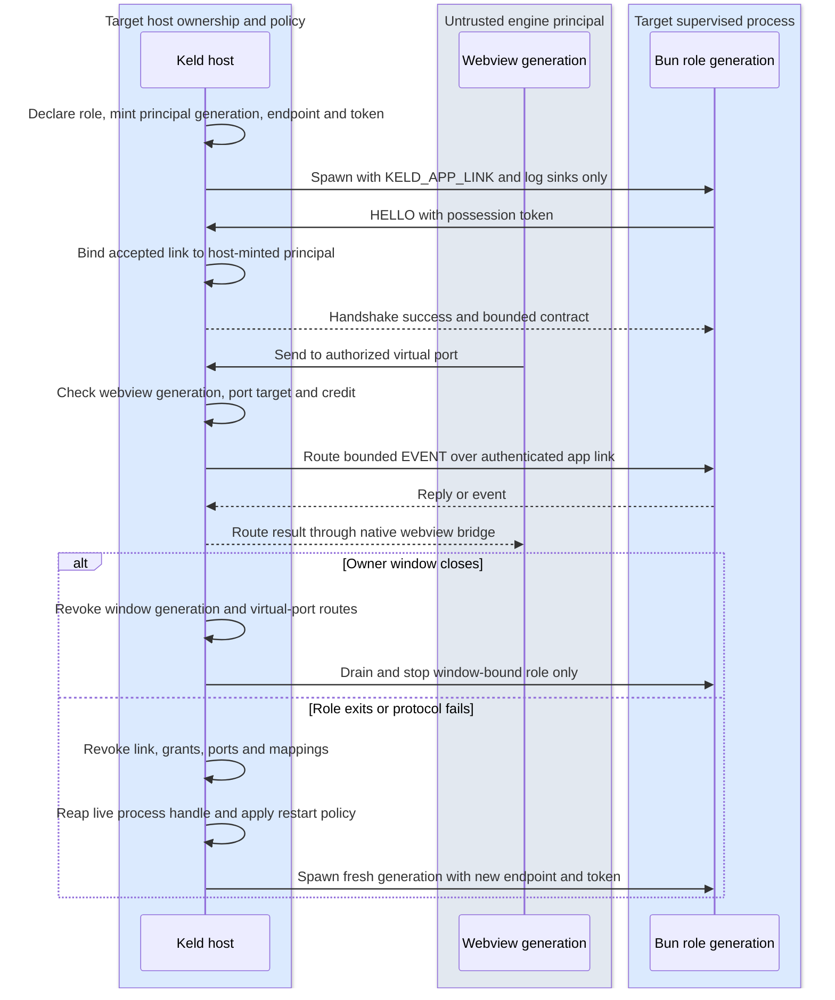

# Runtime, CLI, Packaging, Updates — The Solution-in-a-Box Layer

## 1. keld-runtime: Bun as a supervised component

- **Contract, not embedding.** Bun has no stable embedding C API (oven-sh/bun#12017 /
  #14252 remain unshipped; bun:ffi is explicitly experimental). Keld therefore treats
  the runtime as a *versioned process contract*. The live bootstrap contract is exactly
  `KELD_APP_LINK=<endpoint>#<64 hex chars>`; it names an endpoint and a one-session
  possession secret, never role/principal/grant metadata. Destination `@keld/api`
  (pure TS plus only reviewed enabled bulk glue) communicates with the host over kipc. Pin exact Bun version
  per Keld release (`keld.lock`); CLI downloads the pinned runtime once per machine
  (content-addressed cache), `keld-pack` embeds it per app at build. There are no
  parallel `KELD_LINK`, `KELD_SHM` or `KELD_CONTRACT` contracts.
- Trimming: ship Bun as-is first (its compressed size inside an installer is unmeasured
  for the pinned Bun; the scoreboard records a summary-only zstd-19 figure of
  16.8 MB for Bun 1.3.14 and architecture 01 §5 budgets 20,000,000 B for the whole
  `runtime = bun` installer); track upstream size work; `runtime: "none"` mode omits it
  entirely (host-only apps score Tauri-class sizes). A `runtime: "node"` escape hatch is
  deliberately **not** in v1 — Bun's Node-compat is the compat plan; revisit only if
  corpus data forces it.
- **v0 (KEL-70/KEL-30):** `keld_runtime::Supervisor` provides exponential-backoff restart,
  crash-loop breaking (3 crashes/30 s), and stdout/stderr capture for one host-owned Bun
  child co-lived with the hello window via `keld_core::HostOwnedHelloSession`. It does not provide role identity, per-role grants, link binding, strict OS
  sandboxing, `--inspect` passthrough, graceful kipc draining, or renderer-continuity
  proof. Host ownership makes renderer survival architecturally plausible, not yet an
  exercised v0 claim.
- **macOS no-flag primary (KEL-96 T1a/T1b/T2/T3):** the no-flag `keld-host`
  validates its owner-private schema-v1 stage before any application resource,
  then uses the guardian-composed `Supervisor` for Bun's process group and
  KEL-116 self-termination ledger. T3 reuses KEL-75's generation owner: a
  recoverable nonzero Bun crash revokes its endpoint/token/stream before the
  persistent guardian's one Supervisor requests a fresh generation. The same
  host, native window and logical router install that authenticated successor,
  send `Ready` again and continue echo/lifecycle dispatch. Status-zero
  self-termination remains terminal; a status-zero exit after an accepted
  correlated Quit is host-authorized and is not added to that ledger. Shipping
  `keld dev` now compiles the same
  owner-private stage, launches that host with no Keld argument, directly
  forwards its stdout/stderr, places it in a process group separate from the
  terminal-facing CLI, and retains only the host process handle plus the write
  end of a private stdin-v1 liveness pipe. The host makes its reader
  non-inheritable before guardian/Bun spawn. CLI death yields EOF and enters
  the host's existing accepted-shutdown attribution, quiesce, link-close,
  guardian-reap and UI-exit tail without a fabricated lifecycle reply. The
  dev-leased host removes its own validated `.keld/dev/<nonce>` root on every
  ordered return, including CLI loss; an uncatchable host `SIGKILL` can retain
  that owner-private stage for a future bounded GC policy.
- **Windows no-flag primary (KEL-96/T4 Windows slice):** `keld dev` creates a
  fresh protected-current-user stage and an unnamed, non-inheritable,
  kill-on-close outer attempt Job, then launches `keld-host.exe` with no Keld
  flag, forwards logs and retains the host handle, stdin-v1 writer and sole
  outer Job handle. Before application resources, the launcher assigns the
  host to that exact Job, reads membership back, and releases a fixed startup
  token on the private stdin pipe. Missing, extra or malformed token bytes,
  pipe loss, or Job-assignment failure refuses startup. This outer Job is
  process-family cleanup only; it grants no updater write authority.
  The host starts in a separate Windows process group with Ctrl+C disabled.
  Interactive terminal Ctrl+C retains the CLI's native interrupt exit while
  closing its lease, so the host can forward captured output and finish its
  existing ordered shutdown. Closing the terminal itself is a distinct event.
  The host independently reads back the protected one-ACE DACL, validates the
  same closed boot/policy contract before resources, and consumes T8's one
  `PrimaryRoleSupervisor` with a pre-Ready recovery gate. One logical router
  spans fresh authenticated app-link generations while the same WebView2 HWND remains live;
  `NavigationCompleted` drives `Ready` through tao's UI-thread
  `EventLoopProxy`. Revoked-attempt tombstones prevent a separately queued
  bound stream from being installed after its revocation. A link-only failure requests revoke/kill/reap/restart from
  that same supervisor rather than creating a core-side process loop. Retired
  capture readers receive a direct-child stop signal, drain bytes already
  buffered via `PeekNamedPipe`, and join without waiting for descendant EOF;
  this preserves crash-ledger ordering while KEL-78 still owns descendant
  termination. Accepted shutdown also closes successor
  admission without killing the current child before its correlated reply.
  The host clears inheritance and starts watching the stdin-v1 lease before the
  first app resource; a locked `PeekNamedPipe` preflight rejects already-observed
  EOF before listener/child or WebView startup. It preserves lease-read/tail
  errors through the window result, and gates listener/child and initial
  WebView2 creation under the common shutdown transition. A bounded existing
  self-termination observation prevents socket EOF from restarting a Bun that
  is already exiting zero. That exit is reported as the top-level
  `KELD-CORE-033` with its retained PID/status; crash-loop/runtime failures use
  the same outer code with their `KELD-RUNTIME-*` cause nested.
  Correlated Quit and CLI EOF use the shared
  quiesce/link-close/supervisor-reap/UI-exit tail. Windows staging atomically protects,
  pins and validates `.keld`/`dev` before nonce creation and pins the nonce
  before the first staged file write, rejecting or preventing junctions without
  writing through them. The installed
  `keld.windows-dev-stage-cleanup/v1` role is the approved surviving
  post-CLI-death stage-deletion owner: it validates the exact stage and host
  identity, then waits for a one-shot cleanup release. The CLI sends that
  release after the direct host exits. Its inherited Job handle has only query
  and terminate rights and is bound to that exact host before helper readiness;
  it cannot assign processes or change Job limits. If the CLI disappears, pipe EOF gives the host a
  bounded graceful-shutdown interval; if it stalls, the helper terminates the
  exact Job. In either case, the helper deletes the stage only after the direct
  host exits and Job accounting reports zero active processes. Failed proof
  leaves the stage for safe recovery. Before WebView/app startup, the no-flag host also
  installs KEL-78/T3's separate unnamed, non-breakaway, kill-on-close inner
  Job, so host-only death reaps Bun and its enrolled descendants even while the
  launcher survives. The two Jobs have separate owners and separate host-death
  falsifiers. The CLI keeps the full outer Job handle; only the reduced cleanup
  duplicate reaches the sentinel, never the host or Bun. This `keld dev` proof does
  not make it an installed updater launcher or select a MachineSeamless writer
  mechanism. KEL-101 separately owns the named-pipe/DACL boundary; this KEL-96
  slice makes no LPAC or privileged-dispatch claim.
- **Windows installed-root product direction (KEL-254/KEL-53):** the default direct
  install is per-user under the user's application location, with automatic updates
  under the same-user authority and no UAC. Program Files installs support explicit-UAC
  activation, and an opt-in seamless mode only after KEL-270 supplies its lifecycle
  proof and a separately approved architecture/spec amendment selects and qualifies
  the privileged authority. KEL-270 does not select the mechanism. All direct modes
  share one KEL-53 updater state machine; only acquisition of its activation write
  lease differs. The ordinary application host and
  Bun roles remain non-SYSTEM. MSIX, App Installer, Store, enterprise and other
  deployment-owned installs remain with that owner and cannot acquire a competing Keld
  writer. This is approved product direction, not evidence that installed boot or the
  seamless authority is implemented; KEL-96 currently boots the Windows dev stage.
- **macOS host-death guardian (KEL-78/T2b):**
  `keld_runtime::macos_guardian` is the live shared cleanup owner.
  `GuardianBootstrap` mints an authenticated private registration link, owns
  the exact guardian child and sole non-inheritable liveness writer, and accepts
  only that guardian's fixed `KGR1` group record on the generic one-child API;
  callers cannot inject a numeric process-group id. KEL-96/T3 keeps the same
  authenticated stream open for fixed, bounded `KGC1` generation-control
  records. Each generation registers its exact Bun group, waits for host link
  revocation, clears the retired group, and only then prepares its successor.
  The guardian validates both inherited bootstraps
  before child creation, prevents the liveness reader from reaching Bun, runs a
  fresh command in an isolated process group, revokes registered resources on
  every post-start failure, signals the group once, and waits its direct child.
  `HostGuardian` consumes the group identity on every terminal path, so an API
  retry cannot signal a reused PGID. Unexpected guardian exit produces
  `KELD-RUNTIME-013` only after the host fail-safe; orderly shutdown closes the
  same writer. The KEL-96 supervised variant may first write one fixed
  non-authority accepted-Quit byte through that host-exclusive pipe; the
  guardian records attribution without terminating Bun, then returns fixed
  `KQA` over a dedicated acknowledgment pipe. The host requires that ack before
  publishing the correlated reply. The persistent T3 owner similarly
  acknowledges one `S`/`KSA` live-host cleanup discriminator before startup or
  window-failure rollback, so link revocation can complete before reap. An
  unmarked EOF remains abnormal host death and bypasses impossible host RPC.
  The generic
  KEL-78 `run` path continues to reject all pipe data. KEL-96 now provides its first shipping caller by composing the
  existing `Supervisor` inside the guardian and consuming the result from the
  no-flag host owner. The guardian still does not implement App Sandbox or
  Strict admission.
- **Linux strict mechanism (KEL-78/T4):**
  `keld_runtime::linux_strict` constructs one unprivileged, fail-closed role
  boundary through a validated root-owned non-setuid/capability Bubblewrap and
  a reviewed Keld launcher. Bubblewrap owns fresh user/mount/PID/network
  namespaces, the empty-root exact-file mount table, zero capabilities,
  `no_new_privs`, a PID-1 reaper and parent-death coupling. Keld passes two
  x86_64 architecture-checked seccomp programs only through child-private FDs
  3–4; every other architecture currently fails closed before command creation;
  an async-signal-safe pre-exec step duplicates those FDs and marks every
  higher descriptor close-on-exec without mutating caller-owned flags. The
  read-only launcher stacks the highest supported Landlock filesystem/network
  ABI, records `NotImplemented` when the kernel lacks Landlock, fails on a
  disabled or broken available implementation, emits the exact observed state
  after that decision through a parent-controlled pipe that is closed before
  target exec, and replaces itself with the target. The writable role cannot
  forge this state or inherit the channel. `NotImplemented` does not waive the
  independently required namespace, empty-root mount, capability, descriptor,
  or seccomp layers and never selects `legacy`.
  Real Linux tests prove exact runtime-file/code mounts, writable role-private
  paths, host/update/device absence, AF_INET and namespace-escape denial,
  ancillary-FD denial, ambient-FD closure, equally contained descendants,
  host-only death reaping and relaunch. Bun 1.4.0 starts under the mechanism.
  KEL-96 now consumes this mechanism for every Linux no-flag primary generation
  through the existing `PrimaryRoleSupervisor`: the dev stage includes a
  dedicated minimal launcher, an exact Ubuntu/Debian x86_64 runtime-file
  manifest, one writable role root, and exact authenticated socket mounts. It
  does not create a second restart loop. Other named roles and unproved profile
  or artifact combinations remain fail-closed.

### 1.1 Named role and lifecycle contract (destination, KEL-75)

The runtime accepts only host-declared roles. A role declaration names a trusted bundled
entry, one lifecycle owner, a restart policy, a logging policy and generated permission
policy. Initial lifecycle owners are `primary` (one app entry), `app-bound` (a shared
worker, PTY facade or agent owned by the host's app session), and `window-bound` (a
worker tied to one host window). These are lifecycle categories, not package, Electron
or VS Code identities. The host—not the primary role—creates and owns every child, so a
primary-role restart does not give it authority over an independent app-bound role.

For every destination spawn the host makes a fresh principal/link generation, endpoint and 32-byte
possession secret before it starts Bun. The child gets the canonical
`KELD_APP_LINK=<endpoint>#<64 hex chars>` and fixed-direction stdout/stderr log sinks;
those sinks are not authority handles. It receives no other inherited descriptor or OS
handle unless a later reviewed platform contract explicitly permits it. A successful
authenticated link accept consumes that bootstrap generation. On handshake failure,
role exit, protocol abuse, deadline, window close or host shutdown, the host revokes the
generation's link, grants, virtual ports and optional mapping handles before it
provisions or spawns a successor. For protocol failure, timeout and host shutdown,
revocation precedes close/kill. KEL-70 observes natural exit through `try_wait`, which
already reaps; this spec does not falsely promise portable pre-reap revocation. A numeric
PID is diagnostics only; reaping and termination use the host's live process handle,
never a PID recovered after exit.

`keld.config.ts` owns entry/lifecycle declaration; `keld.permissions.jsonc` owns the
generated capability subset and any separately reviewed role-specific addition. No
environment identity, child payload, token, PID or facade option can choose a role or
authority. Current implementation is not a complete role family: KEL-70's generic
one-child supervisor, KEL-75 T1a/T8's platform authenticated bootstrap listener,
T1b/T8's shared per-role generation coordinator, and T2's Unix
`keld_runtime::registry::RoleRegistry` which owns one `primary` and one `app-bound`
supervisor independently. A primary restart does not revoke or stop the app-bound
role. It does not implement window-bound lifecycle, role-specific grants, or
strict OS sandboxing. KEL-75 T3 adds bounded host-owned virtual ports between
authenticated role generations in the Unix `VirtualPortRegistry`. T8 proves a real
Windows Bun primary g1→g2 over the current-user-DACL named pipe; KEL-96/T4
consumes that authenticated stream in the no-flag Windows host/router and
composes KEL-78's Windows Job/LPAC owner. Privileged dispatch remains later work.

The ordered destination flow below is KEL-75's source of truth for spawn, port routing,
window close and restart. KEL-78 separately owns real-OS sandbox admission proof.


```mermaid
sequenceDiagram
    accTitle: Destination host-owned role spawn, routing, and restart
    accDescr {
      The host creates a fresh role generation before starting Bun, authenticates its
      only app link, and mediates each virtual-port route. A window close revokes only
      that window's routes and roles. A crash revokes all old generation capabilities
      before a fresh restart; a webview never receives a Bun endpoint or handle.
    }

    box rgb(219, 234, 254) Target host ownership and policy
        participant H as Keld host
    end
    box rgb(226, 232, 240) Untrusted engine principal
        participant W as Webview generation
    end
    box rgb(219, 234, 254) Target supervised process
        participant R as Bun role generation
    end

    H->>H: Declare role, mint principal generation, endpoint and token
    H->>R: Spawn with KELD_APP_LINK and log sinks only
    R->>H: HELLO with possession token
    H->>H: Bind accepted link to host-minted principal
    H-->>R: Handshake success and bounded contract
    W->>H: Send to authorized virtual port
    H->>H: Check webview generation, port target and credit
    H->>R: Route bounded EVENT over authenticated app link
    R-->>H: Reply or event
    H-->>W: Route result through native webview bridge
    alt Owner window closes
        H->>H: Revoke window generation and virtual-port routes
        H->>R: Drain and stop window-bound role only
    else Role exits or protocol fails
        H->>H: Revoke link, grants, ports and mappings
        H->>H: Reap live process handle and apply restart policy
        H->>R: Spawn fresh generation with new endpoint and token
    end
```

### 1.2 Electron facade boundary (destination)

`@keld/electron` maps `utilityProcess.fork` to a host request for a declared role and
maps `MessageChannelMain` / `MessagePortMain` to host-owned virtual ports. The facade
does not obtain a raw child endpoint, mapping handle or authority to spawn a process.
Ports are FIFO per generation, transfers are one-shot and receiver-bound, and close or
generation revocation disconnects the peer without exposing another principal. Exact
Electron-observable queue/start, transfer validation and close-event behavior is owned
by pinned conformance entries—not assumed from this generic runtime contract. Live role
slices are T1b/T8 (one authenticated primary generation on Unix/Windows), T2 (one
primary plus one independent app-bound role in `RoleRegistry`), and T3 (bounded
virtual ports between authenticated roles); T2/T3 remain Unix-only. Window-bound
roles follow only after those slices and their shipping integration gates.

## 2. keld CLI: verbs and guarantees

| Verb | Contract |
|---|---|
| `keld create` / `create-keld` | templates: vanilla-ts, react, vue, svelte, solid, electron-migration; first window < 60 s from cold |
| `keld dev` | **Today:** on macOS, Windows, and Linux compiles an owner-private stage and launches its no-flag host; the CLI owns logs, the host handle and a liveness writer but no window, app link, token or Bun supervisor. Linux also stages the strict-role launcher and removes the exact nonce after normal, lease-loss, or observed abnormal host exit. **Destination:** also starts the app's own dev server (delegation, Deno lesson D4) and adds the dev permission recorder, hot-restart on change via Bun watch, and devtools policy. |
| `keld build` | app bundle via the app's bundler → `keld-pack` → signed installers + update artifacts; `--frozen-permissions` gate |
| `keld migrate` | Electron analyzer + config generator + compat report (see 04-electron-compat) |
| `keld doctor` | env checks, native-module DB scan, permission diffs, web-baseline scan (`--web-compat`), Linux GPU matrix probe |
| `keld gen` | schema → TS/Rust codegen (also runs inside dev/build) |
| `keld ext` | plugin scaffolding/build (the only cargo touchpoint, plugin authors only) |

v0 live verbs: `create`, `dev`, `doctor`, `mcp`, `hello`, `ipc-echo`, `ipc-client`.
`keld doctor` checks Bun on PATH, hello-template layout (`keld.config.ts` +
`src/main.ts`), the configured renderer HTML (default `index.html`; missing or
non-project-relative is `KELD-CLI-035`), and a webview info line on macOS,
Windows, and Linux (all three live `WebEngine` backends as of KEL-28).
Native-module DB, permission diffs, and `--web-compat` are
not live. Linux process entry runs
`webkitgtk::prepare_gpu_safe_mode_process` (KEL-28/KEL-132), which exact-self
re-execs with NVIDIA+Wayland safe-mode before engine creation; the constructor
fails closed if preparation was skipped. This is not yet its own `keld doctor`
line — the `webview` check only reports backend availability, not safe-mode
state. Unknown flags on live verbs with a closed flag set (`create`, `dev`,
`doctor`, `hello`) are `KELD-CLI-044` (exit 2). `keld create` takes one project
name; `--template` is not live (vanilla-ts hello only). `keld dev` takes no
flags; `--watch` and `--inspect-ipc` are not live. Spec-named `build` /
`migrate` / `gen` / `ext` are `KELD-CLI-045` (exit 2) with a tracking issue and
the Phase 2 workaround (`keld create` then `keld dev`) — not a bare "unknown
command". Garbage verbs are `KELD-CLI-046` (exit 2).

**The Bun bootstrap env var is `KELD_APP_LINK`, not
`KELD_LINK`/`KELD_SHM`/`KELD_CONTRACT`.** The separate
`KELD_DEV_LEASE=stdin-v1` value is private CLI-to-host liveness classification:
it is removed at macOS guardian spawn or Windows primary spawn and never reaches Bun or selects authority.
§1's contract above is the destination shape; `keld-runtime`'s pinning/download of Bun,
the destination env vars, `--inspect` passthrough, and Bun watch hot-restart are not
built yet. Spawn/backoff/crash-loop supervision **is** built (KEL-70):
`keld_runtime::Supervisor` spawns the child, captures its stdout/stderr, and restarts it
on crash with exponential backoff up to a `RestartPolicy` (default 3 crashes / 30s)
before giving up with a typed `KELD-RUNTIME-002`. On all three desktop OSes shipping
`keld dev` delegates to the staged host. macOS composes that supervisor through
the shared guardian; Windows consumes T8's primary supervisor directly; Linux
uses the same primary owner with each generation prepared by the strict profile. The
retained `run_dev_echo` diagnostic/test seam also spawns through
the supervisor, not a bare `Command::new("bun")` wait;
the app-link env var is still `KELD_APP_LINK=<endpoint>#<64 hex chars>`
(`docs/architecture/02-ipc.md` §1).

Unix capture retirement serializes a post-direct-child `FIONREAD` snapshot with
the reader iteration, publishes that finite queued-byte budget, wakes the `poll`
worker through a private close-on-exec socket, drains at most the snapshot, and
joins. Natural exit still publishes the observed exit and ledger and revokes the
generation when capture retirement fails; a revocation error takes precedence
because authority may remain live. Shutdown and requested restart, where supported,
reap the direct child before the same retirement. Capture retirement neither
terminates nor reaps an inherited-writer descendant: KEL-78 owns that process family.
KEL-118's separate blanket descendant-group cleanup criterion remains open under
that owner; finite capture retirement alone does not satisfy it.

Teardown reads the supervision verdict rather than dropping it (KEL-105): if
the app process dies without a successful recovery, the no-flag host emits
`KELD-CORE-033` with the owning `KELD-RUNTIME-*` error and captured stderr, then
exits non-zero. Delegated `keld dev` forwards that stderr and returns its own
`KELD-CLI-048` host-exit wrapper instead of exiting 0 with no diagnostic. The
retained `run_dev_echo` diagnostic reports its direct session error.

The breaker alone cannot carry that verdict, which is why the supervisor also
publishes `CrashLedger`. Its original KEL-105 fields retain the crash-class count,
diagnostic and stdout position for non-zero statuses and signal terminations; KEL-116
adds a fixed-size, allocation-free total self-termination count plus the most recent
pid/status/stdout position. The two views let a completed-work caller accept a final
status zero without hiding an earlier post-ready crash.
`KELD-RUNTIME-002` requires three crash-class terminations (non-zero statuses or
signals) inside a 30s sliding window
(`RestartPolicy::default()`, `crash_times.retain`). Status zero does not consume
crash-loop budget or restart. Non-zero and signal terminations still follow
`RestartPolicy`, so one crash or crashes spaced beyond the window do not by themselves
mean no app is running. Every unrequested termination remains durable even when the
breaker does not trip. Under a strict post-ready liveness policy, an unrecovered
termination under a clean `Stopped` outcome surfaces `KELD-RUNTIME-012`; completed
windowless work accepts status-zero termination after its reply is captured. The host
reads both decisions from ledger state it never has to drain.

The two codes are not alternatives. `KELD-CORE-033` is always the outer session
diagnostic `keld dev` exits with; the `KELD-RUNTIME-*` code it quotes is the nested
cause — `012` for unrequested self-termination that did not trip the breaker
(including status zero), `002` for a crash loop, `003` for a generation that failed
to provision. Assert on the outer code for the command's contract and on the nested
one for the cause.

The fact and policy have separate owners. `keld-runtime` counts every observed
self-termination and retains the latest all-termination record plus the latest
crash-class diagnostic/record. The legacy window path uses strict
`HostOwnedHelloSession::shutdown` and treats every post-ready self-termination as
fatal. The macOS, Windows, and Linux no-flag paths recover nonzero crashes below the breaker with a
fresh generation while keeping status zero, admission failure and a tripped
breaker terminal. The windowless echo path has completed its observable work after its reply is
captured, so it selects `shutdown_after_completed_work` and accepts only status-zero
self-termination; non-zero and terminal lifecycle failures still fail.

Whether the breaker also trips depends on how the restarted generation fails, which
is not something the host should have to predict. In the retained legacy diagnostic
run, restarted children cannot re-enter the session at all — the v0 echo listener admits exactly
one authenticated session (`crates/keld-core/src/echo_link.rs`) and their `connect`
failed outright — so they crashed fast enough to trip the breaker. The ledger makes
the verdict independent of that timing.

A crash the supervisor *recovered* from before the app reported ready stays a
success (KEL-70 AC1/AC3). Separating the two cases cannot be done by counting
terminations, because the supervisor publishes stdout and its `Exited` event
*before* it records the ledger fact: a host that samples the count when it notices
the ready marker can already see a death that happened after the app was live, and
would forgive it. The session therefore compares the ready marker's stdout offset
against the relevant latest retained all-termination and crash-class positions —
answering "printed, then terminated" versus "terminated, then printed" for the
records that decide the caller policy, rather than from when the host happened to
look.

The Windows no-flag slice proves abnormal host-death descendant cleanup through
KEL-78/T3's host Job and post-CLI-death stage deletion through
`keld.windows-dev-stage-cleanup/v1`. The Linux no-flag slice proves the
corresponding real host-only death against KEL-78/T4's PID namespace and
parent-death coupling: the Bun leader and descendant disappear, the live CLI
removes its exact stage, and a fresh Wayland launch succeeds. LPAC and the wider
strict-profile admission matrix remain separately owned and evidenced by
KEL-78; KEL-96 consumes only the landed per-OS mechanisms.
The Bun side speaks kipc directly — `packages/@keld/kipc/src/transport.ts` is the
one TypeScript framing/HELLO/deadline/write owner (KEL-136). `keld create` embeds
that file as `src/kipc-transport.ts`; the hello echo adapter and `@keld/electron`
lifecycle adapter import it. `DirectedReader` on that transport parks lifecycle
Events while waiting for Echo Reply so stock echo survives a preceding `Ready`.
The non-release boot compiler copies that sidecar
into the owner-private stage when present so `keld dev` Bun can resolve it.
Linux strict remaps the entry to `/code/main.ts` and, when the sidecar exists,
binds `src/kipc-transport.ts` to `/code/kipc-transport.ts` as a second file
mount (directory-wide `/code` mounts stay forbidden). KEL-98's bounded cold generator
derives the checked-in `src/echo.generated.ts` payload declarations from the Rust echo
structs for `keld create`; type-only use keeps that source-time file out of the runtime
stage. General `keld gen` / `@keld/schema` codegen (KEL-13) is not built, so this shared
transport plus the echo adapter remains the actual "Bun to Rust and back" vertical slice
(KEL-30), not the destination codegen pipeline. `keld ipc-client echo` remains a separate
CLI-side kipc client, useful standalone; the template no longer shells out to it.

Target distribution (not implemented): an `@keld/cli` npm package with per-platform
binaries under `optionalDependencies` (esbuild pattern). `bunx keld` / `npx keld`
are planned package-manager invocations; no npm wrapper is currently shipped.
The target fetches signed, verified host and runtime binaries into a cache. Today,
use the [source-build quick-start](../onboarding/README.md#run-the-current-demo);
the [product-status ledger](../engineering/product-status.md#packages) owns package maturity.

## 3. keld-pack: packaging & cross-compilation

- Formats: macOS `.app`/`.dmg` (+ notarization via rcodesign — pure Rust, no Xcode
  needed for CI), Windows NSIS + MSI (WiX-free Rust authoring, Deno proved viability),
  Linux `.deb`/`.rpm`/AppImage/flatpak manifest.
- **Cross-host assembly is the target**: because the host is prebuilt per platform and
  JS is portable, `keld build --target win-x64 --target linux-arm64` should be data
  assembly + signing. Support cells still qualify independently. For KEL-53's first
  Windows x64 direct-update v0 package producer, exact namespace admission calls the
  guard-owned Windows `NormalizationC` and ordinal-comparison contract; that producer
  currently requires a Windows host. Other hosts MUST return a typed unsupported-host
  result before writing output. This is a temporary producer-host limit, not a package
  or feed format change; remove it only after independent evidence proves equivalent
  Windows namespace behavior.
- Signing: platform signers driven natively (rcodesign / signtool / osslsigncode
  fallback), config in `keld.build.ts`, CI recipes documented for GitHub Actions.

## 4. keld-update: verified full packages before delta optimization

- Baseline artifact: every release carries a bounded zstd-compressed full package.
  The first admitted cell is Windows x64 direct distribution with a file-only tree that
  fits the v0 canonical archive. Delta entries remain parseable but are ignored until
  the full-package activation and recovery baseline lands. macOS/Linux package cells
  require KEL-137's executable-mode/link representation first.
- Client: host-side, with a detached ed25519 manifest signature, BLAKE3 transport and
  content post-conditions, protected install-channel provenance, a monotonic
  semantic-version trust floor, attempt-bound activation/health, retained
  last-known-good state and typed manual recovery. Store/package-manager-owned installs
  refuse direct mutation. Current code implements logical protected-provenance
  admission, signed v0 manifest validation/selection, streamed full-artifact
  size/BLAKE3 verification and read-only Windows canonical archive/namespace preflight
  with exact no-migration policy admission. `keld-pack::produce_windows_v0` supplies
  the matching Windows-host streaming producer as a library API. Windows extraction
  binds the receipt's installation/key/profile to an actual owner-private, fixed-NTFS
  staging root and retains flushed/read-back files in an unpublished incomplete stage;
  PerUserDirect can complete an immutable stage under the retained writer lease without
  publishing or selecting it. KEL-266 implements actual-SYSTEM machine-baseline
  initialization and a read-only protected baseline loader. KEL-270 adds the
  PerUserDirect baseline/bootstrap primitive with owner-private records and provenance-last
  commit, and the common journaled transaction: PerUserDirect journals, publishes and
  activates a completed stage, binds an exact attempt health receipt, commits or rolls back, and resumes from
  every persisted cut under the writer lease. `select_windows_active_package` mints the
  journal-free `ActivePackageSelection` (KEL-254 AC4): under the shared snapshot lease it
  requires `current` to equal last-known-good or previous-known-good within the floor,
  admits only referenced versions, gives each the baseline loader's metadata admission
  plus its signed no-migration package policy, refuses a pending journal as
  journal-bound and a lease sharing conflict (normally the held writer lease) as
  `WriterActive`, and keeps the selected version,
  its tree and the protected ancestry pinned. It carries the protected installation
  identity and publisher scope for the host's comparison with the verified image. When the
  `current` record is absent or does not decode, a `PerUserDirect` selection republishes
  last-known-good under the exclusive writer lease after re-validating both known-good
  slots and the floor; a decoded non-known-good `current` still halts, and a machine
  installation refuses because only its elevated writer may repair. Live feed
  orchestration, host candidate launch, the private health channel and its 30-second
  `Ready` observation, installed-host lifecycle composition, candidate-mode selection and
  the KEL-96 host consumer of the selection remain unimplemented. Planned Windows
  direct modes share this state machine: same-user authority for per-user installs,
  explicit UAC for machine installs, and no-UAC machine activation only after KEL-270's
  lifecycle proof and a separately approved architecture/spec amendment selects and
  qualifies the authority. In UAC mode, only KEL-53's bounded updater runs elevated; it
  must launch the candidate under the exact initiating user's ordinary token. Managed
  deployment owners retain mutation.
- Optional delta: only a measured later transport optimization. It reconstructs the
  same full-package content identity, retains a same-attempt full fallback and cannot
  change activation, health, trust-floor or rollback semantics.
- UI hooks, `autoUpdater` compatibility and the bridge-release recipe remain target
  behavior. All platform/format/channel support cells qualify independently.

### Windows install modes and update authority

The default Windows direct install is per-user under the installing user's
`FOLDERID_LocalAppData` application tree. `PerUserDirect` updates run as that ordinary
user without UAC; strict Keld role restrictions deny Bun/webview writes to the install
and updater state. This does not claim protection from the owning user or arbitrary
native malware already running as that user.

An explicitly selected Program Files installation records one of two machine-wide
modes. `MachineUacDirect` is the simple fallback: its trusted installer assigns BUILTIN
Administrators as owner only when that SID is a valid owner group in the actual
installer token, then provisions a protected DACL that grants full control to
Administrators and SYSTEM while ordinary BUILTIN Users/Keld roles receive only
read/execute (`0x1200A9`). If Administrators cannot be assigned as owner, installation
fails without owner/ACL takeover. Each protected activation invokes a fixed signed
updater helper through UAC: a dedicated minimal `keld-updater-helper.exe` whose signer
matches the protected publisher scope and whose image the verified artifact covers,
never an elevated `keld-host.exe`. Cancellation performs no protected write. The helper
owns that live attempt through commit/rollback; any keeper is minimal and bound to one
attempt, and no persistent privileged broker exists. The ordinary-user host may download and
prevalidate into its owner-private cache, but the cache is only untrusted input. After
authenticating the admitted-host request and obtaining the lease, the helper independently
revalidates bounded source bytes under retained read handles, then materializes a fresh
protected sibling through the shared extraction/copy/readback pipeline. Every destination
directory and file receives the exact Administrators/SYSTEM/Users DACL at creation,
before payload writes; it never promotes a user-owned stage by rename or seals an
ordinary-user-writable stage afterward. The helper starts the exact candidate as the
initiating ordinary user, including when a different administrator approves UAC, from
the exact initiating process's own primary token; impersonation only pins the user's
staged source. If the elevated owner exits, Windows restarts or every owner is lost
before resolution, the next ordinary launch infers and writes nothing: it returns a
typed recovery-required state before admission. Its supported recovery
path needs no ordinary host boot: the journaled `keld-updater-helper.exe` image, from a
protected version tree and behind fresh UAC consent, runs a recovery-only role that
takes the writer lease, fully revalidates and resolves only through the KEL-53 phase
rules, or writes nothing. For a launched attempt after owner loss its retirement
evidence is two facts: the recovery helper holds the share-zero writer lease that every
live owner retains, and the initiating user's logon session has ended, since a logon
session terminates when the last token referencing it is deleted. A full restart always
provides the second, and sign-out or Fast Startup shutdown normally does; otherwise the
fix guidance says to restart Windows first. The helper's kill-on-close Job only ends the
candidate promptly; Job-handle-holder death, Job-name absence, PID enumeration and a
reboot itself prove nothing about the family. Until KEL-53 T4d qualifies this evidence,
that case halts. The application and Bun roles
never run elevated or as SYSTEM. This ACL profile differs from KEL-266's SYSTEM-only
machine-baseline profile; updates never take ownership or repair ACLs ad hoc. The
profile label and descriptor predicates are owned by `keld-guard`; a persisted profile
id does not prove the live owner or DACL.

`MachineSeamlessDirect` is an explicit opt-in for machine-wide installs. The product
requires no repeated UAC and the same common updater guarantees, but its privileged
authority mechanism remains unselected. A fixed Scheduled Task is only a candidate; a
service or other Windows-native mechanism must meet the same authentication, fresh
attempt, replay, exclusive-writer, process-family, ordinary-user launch, exact-health
and crash/reboot-recovery contract before selection. A privileged trigger is a wake-up,
never update authorization. Do not add a broad broker. Package/deployment-managed
installations record `Managed(owner)` and defer mutation to MSIX/App Installer, Store,
enterprise deployment or the owning package manager.

Every direct mode uses the single `keld-update` transaction below. Mode selection changes
only how the updater obtains its one exclusive write lease; signed-candidate
verification, floor, journal, staging, current/LKG, candidate health, commit/rollback
and crash recovery have one owner and identical semantics. KEL-135 owns publisher/app/
profile identity. KEL-53 alone mints `ActivePackageSelection` from journal/current/LKG and
owns mode provenance and the sole updater writer. KEL-254 verifies installed-image and
protection profiles but never selects current/LKG or mints an active selection. KEL-96/
`keld-core` consumes `ActivePackageSelection`, performs host boot admission and returns
`ValidatedBootSelection` to the ordinary-user host. No boot/profile owner grants updater
write authority or infers mode from a path.

Each trusted direct install seeds one stable regular `activation.lock` in its protected
`update_root`. It is never deleted, recreated or replaced, and its presence does not
prove a process owns the transaction; KEL-266's `bootstrap.lock` remains a separate
initializer marker. A writer opens the existing lease read/write with share mode zero;
normal selection readers open it read-only with `FILE_SHARE_READ` only and retain that
short lease for one coherent mutable-record snapshot. A sharing conflict returns busy
or refusal without sleep, retry or PID takeover. The writer keeps the exclusive lease
through the attempt and health window. The authenticated candidate boot is the one
exception: the writer keeps journal/current stable while the exact candidate performs
bounded bootstrap reads, closes mutable-record pins and acknowledges completion before
app execution; it retains only immutable selected-tree pins and the health endpoint.
Lease ownership never replaces OS-backed process-family death proof.

The approved Windows lifecycle proof slice uses one bounded keeper per exact unnamed
attempt Job. Its reduced handle is limited to query and termination; the keeper is not
a transaction writer. A trusted install-scoped rendezvous lets a cold successor find
the keeper before reading mutable journal state under the share-zero lease; the
rendezvous is only a locator. A reduced `activation.lock` handle couples writer
exclusion to the keeper's lifetime. After exact Job-family zero is independently
queried by the authenticated successor and acknowledged on the fresh attempt-bound
connection, the keeper releases its retention handle; only then does the successor
acquire and revalidate the writer lease. A competing writer without that witness must
refuse pending recovery. Coordinator/keeper loss before the proof is authenticated to a
successor preserves the journal and pointers and halts recovery. Job-name absence, PID
enumeration, reboot or hibernation does not establish retirement. The proof slice stays
disconnected from production activation writes until its adversarial crash and replay
controls pass; boot recovery after all owners are lost remains an evidence blocker.
The lifecycle installation ID comes only from the updater's canonical protected
provenance contract: `BLAKE3(UTF8("keld.installation-binding/provenance-v2/v1\0") ||
u64_le(record_bytes.len()) || record_bytes)`, where `record_bytes` is the exact
canonical `keld.install-provenance/v2` encoding. This binds install mode, owner,
application scope, install/update roots, signing key, baseline, profile, principal
model, publisher scope and volume. The host derives its expected ID from trusted
installer configuration; recovery re-derives it from admitted protected provenance.
This public identifier is context, not authentication. The v2 projection is frozen;
future provenance schema changes preserve it or version the lifecycle-ID derivation.
Lifecycle authentication uses its own named-pipe namespace and retained connected-pipe/
process objects plus exact installed-role, image and token-profile validation; a bearer
HELLO, DACL, PID or signer alone is insufficient. Fresh client/server nonces bind
purpose, install, attempt and generation but provide freshness rather than identity.
The listener consumes the one-shot before issuing its final accepted receipt. A cold
successor revalidates keeper-supplied attempt/channel IDs against the protected journal
after lease acquisition and before mutation. Pipe handles MUST remain
non-inheritable and undistributed to app roles; server-side message authentication also
checks the last writer's token using identification-level named-pipe impersonation and
always reverts. If endpoint-handle isolation is not proved, peer PID observations cannot
authorize capability transfer. Failure of `RevertToSelf` MUST terminate the process;
the impersonating thread MUST NOT return to admission or retry work.

The explicit-UAC Program Files profile has BUILTIN Administrators as owner only when
the installer token's Administrators SID is a valid owner group (`SE_GROUP_OWNER` and
not deny-only). Its protected DACL grants full control to BUILTIN Administrators and
SYSTEM and read/execute (`0x1200A9`) to BUILTIN Users. The trusted installer creates
and verifies this profile; updates never repair it. The per-user profile remains owned
by the installing user while application roles lack updater-state mutation rights.
Managed installs do not seed a direct-update lease or admit Keld as a writer.

### 4a. v0 manifest & feed wire contract (KEL-53 trigger)

This subsection is the byte-level contract for signed-manifest and full-package
fixtures. It also freezes the local activation invariants needed to distinguish a
verified candidate, an exact healthy attempt, a retained last-known-good package and a
monotonic trust floor. Delta fields remain in the wire for compatibility; selecting an
algorithm/dependency is later measured work. A TUF-style rotating root also remains
future work: v0 uses one compiled-in key and states that limitation directly.

**Feed layout**, one static tree per channel **and target**, servable from any
CDN/S3/GitHub Releases (no server logic required):

```text
<feed-base>/<channel>/<target>/updates.json         # manifest payload (unsigned in-band)
<feed-base>/<channel>/<target>/updates.json.sig     # detached signature over updates.json's raw bytes
<feed-base>/<channel>/<target>/<version>/full.zst                     # full package, zstd-compressed
<feed-base>/<channel>/<target>/<version>/from-<from-version>.delta.zst  # delta, zstd-compressed (diff format: KEL-53 AC2)
```

`<target>` is one of the fixed platform/architecture triples Keld actually ships
(`macos-arm64`, `macos-x64`, `windows-x64`, `linux-x64`, …, matching `keld-pack`'s own
target list — not a wire-level enum defined here). A client polls only the path for its
own compiled-in target, so cross-target confusion would require the feed operator (or
an attacker who can write to the feed) to physically publish the wrong bytes at the
right path — the URL structure is the primary defense. The manifest's own `target`
field (below) is the second, redundant layer: the same defense-in-depth shape as the
`app.id`/`channel` check, for the same reason a single control is not trusted alone.

The signature is a **separate file over the manifest's literal bytes**, not a field
embedded inside the JSON. This removes the need for a canonicalization rule (key order,
whitespace, number formatting) *between signer and verifier* — the client verifies the
exact response bytes before parsing them at all, so no JSON serialization step sits
between what was signed and what was checked. It does **not** by itself remove parser
ambiguity between different JSON implementations; §4a settles that separately: `schema`
must be an unrecognized-value-fails-closed integer (already specified below), and a
parser that accepts duplicate object keys **MUST** reject the manifest rather than
silently taking the last (or first) value — the wire contract has exactly one value per
key, and a parser that can't guarantee that is not a valid implementation of it.

`updates.json.sig` — one line, base64-encoded 64-byte ed25519 signature, no wrapper.

`updates.json` — v0 schema. Every release requires `full`; `deltas` is the only
optional piece (a release **MUST NOT** omit `full` — the full-package fallback and the
post-delta-failure fallback below both assume it exists, so a fixture that rejects a
release missing `full` is part of AC1):

```json
{
  "schema": 1,
  "channel": "stable",
  "target": "macos-arm64",
  "app": { "id": "com.example.app" },
  "releases": [
    {
      "version": "1.4.2",
      "publishedAt": "2026-08-18T00:00:00Z",
      "full": {
        "url": "1.4.2/full.zst",
        "size": 12345678,
        "blake3": "<64 hex chars>",
        "contentSize": 23456789,
        "contentBlake3": "<64 hex chars>"
      },
      "deltas": [
        {
          "fromVersion": "1.4.1",
          "url": "1.4.2/from-1.4.1.delta.zst",
          "size": 45678,
          "blake3": "<64 hex chars>"
        }
      ]
    }
  ]
}
```

- `schema` is an integer, bumped on any incompatible field change — a client that does
  not recognize the value fails closed (refuses the feed) rather than guessing.
- `app.id`, `channel`, and `target` **MUST** match the host's compiled-in application
  identity, the channel it actually requested, and its own compiled-in target, checked
  fail-closed *after* signature verification and *before* any release is selected (step
  2 below). A correctly-signed manifest for a different app, channel, or target is not
  this host's update — accepting it on signature validity alone is exactly how feed
  misrouting, a shared signing key, or a wrong-target URL turns into a cross-app,
  cross-channel, or cross-platform install.
- `version` **MUST** be strict SemVer. Pre-release identifiers participate in SemVer
  precedence; build metadata may be present but does not. Any two `releases[]` versions
  that compare equal in SemVer precedence make the whole manifest invalid, including
  distinct strings such as `1.4.2+host` and `1.4.2+vendor`. Two `deltas[]` entries within
  one release with the same exact `fromVersion` also make it invalid. Reject either case
  outright (a schema violation, the same as an unknown `schema` value), not "pick one
  arbitrarily." Different clients silently picking different entries from the same
  signed manifest is the specific failure a duplicate would cause if it were merely
  tolerated. Floor filtering and highest-release selection compare SemVer precedence;
  the complete version string, including build metadata, remains part of the selected
  artifact's exact identity. Delta `fromVersion` matching uses that exact identity.
- Release selection is deterministic: among releases that pass the version-floor check
  (step 4 below), the client selects the single **highest** version, never "any
  newer" — there is exactly one answer to "what does this manifest ask me to install,"
  not a client-dependent choice among several eligible releases.
- Each release's `deltas` array may be empty or contain zero or more entries; how many
  prior versions a publisher generates deltas for (the "last N releases" in the prose
  above) is a publish-time/`keld-pack` decision, not part of this wire contract — the
  client only ever looks for one entry whose `fromVersion` equals its own installed
  version.
- Every `size` and `full.contentSize` value **MUST** use a positive base-10 JSON
  integer with no sign, fraction or exponent, in the inclusive range
  `1..=9007199254740991` (`2^53 - 1`, the interoperable JSON safe-integer ceiling).
  Validate every release and delta entry before release selection or network access;
  any other representation or value invalidates the manifest. Consumers use checked
  `u64` counters and MUST NOT convert these values to `usize` or preallocate the declared
  size. This wire ceiling preserves exact values across Rust and JavaScript; streaming
  and ordinary storage failures still enforce practical resource limits.
- `size` is **normative, not advisory**: downloads are bounded, streaming reads that
  reject an artifact once received bytes exceed `size` and reject a stream that ends
  short of it. A `size` field that nothing checks is not a contract; this fixture
  (short and long artifacts) is part of AC1. `size` bounds only the **compressed**
  bytes on the wire — it says nothing about decompressed size, so it is not a
  decompression-bomb defense by itself (a small, valid zstd stream can still expand to
  an enormous one). `full.contentSize` is the separate, explicit bound on that: the
  decompressor **MUST** be given that ceiling up front and abort mid-stream the moment
  produced output exceeds it, checked incrementally as bytes are produced — never by
  fully decompressing first and measuring after. End-of-stream is valid only when the
  produced canonical tar byte count exactly equals `full.contentSize`; both shorter and
  longer output reject before extraction, even when `contentBlake3` otherwise matches.
- Two hash domains, not one. `blake3` (present on both `full` and every `deltas[]`
  entry) is the digest of the **artifact's bytes as downloaded** — the `.zst` file
  exactly as served — and proves transport integrity of what was fetched, nothing
  about what it decompresses or reconstructs to. `full.contentBlake3` is the digest of
  the **decompressed, installable package bytes**: the full-package path decompresses
  `full.zst` and checks the result against `contentBlake3` before install; the delta
  path decompresses the patch and applies it against the currently-installed content,
  then checks *its* result against that same `full.contentBlake3` — both paths
  converge on one deterministic, checkable content stream regardless of which artifact
  produced it. Deltas carry no `contentBlake3` of their own; there is nothing to check
  a delta's reconstruction against except the release's one canonical content hash.
- **The canonical content stream those bytes are a hash of** is a v0-defined package
  format, not "whatever bytes happen to decompress": a single POSIX ustar archive
  (`.tar`, before the outer zstd wrapper) with an exact, exhaustive byte-level
  profile — deliberately minimal, skipping the GNU/PAX long-name and sparse-file
  extensions entirely, so there is no optional-extension ambiguity for two
  implementations to disagree on:
  - Entries are **regular files (`typeflag '0'`) and directories (`typeflag '5'`)
    only** — no symlinks, hardlinks, device files, FIFOs, or extended attributes in
    v0 (a v1 packaging-format gap, named here, not solved by this contract; macOS
    `.app` bundles in particular are symlink-heavy). Any other `typeflag` is a
    manifest-shape violation.
  - `name`: a UTF-8 relative path, no leading `/`, no `.`/`..` path components, no
    empty segments, **at most 100 bytes** (the plain ustar `name` field's own limit —
    a path that doesn't fit is a v0 limitation; the ustar `prefix` field and
    GNU/PAX long-name extensions are explicitly out of scope, not silently assumed).
    Directory names have no trailing `/`; `typeflag` carries their type. No two
    entries may share a byte-identical `name`.
  - Windows admission applies before any write. T3 calls the guard-owned
    `keld-guard::validate_windows_package_paths`, which reuses the component
    classifier and applies Windows NormalizationC plus ordinal whole-path
    comparison; package code cannot copy a second list. The complete rule rejects
    `\`, colon/ADS, NUL and controls U+0001–U+001F, `< > " | ? *`,
    drive/UNC/NT/device prefixes, components ending in dot or space, every reserved
    device basename including superscript-digit forms, and `~`. Tilde is forbidden
    for the first Windows package cell so an archive cannot name an NTFS 8.3 alias of
    another entry. Each UTF-8 component must already equal Windows
    `NormalizationC`. The full relative-path set is unique under
    `CompareStringOrdinal(..., TRUE)`; case or normalization aliases and every
    file/directory ancestor collision reject the archive during pass 1. This includes
    `.keld/update-policy.v1`. Microsoft documents
    [file naming](https://learn.microsoft.com/windows/win32/fileio/naming-a-file),
    [normalization](https://learn.microsoft.com/windows/win32/api/winnls/nf-winnls-normalizestring)
    and [ordinal case comparison](https://learn.microsoft.com/windows/win32/api/stringapiset/nf-stringapiset-comparestringordinal).
  - The first Windows x64 producer runs on a Windows host so it can apply that exact
    native namespace contract before producing bytes; another host refuses before its
    output sink receives data. Cross-host assembly remains the target after an
    equivalent Windows-name admission path is independently proven.
  - Fixed-width string fields contain their bytes followed by zero bytes to the field
    width. `name` is 100 bytes; `linkname` (100), `uname` (32),
    `gname` (32), `prefix` (155) and header padding bytes 500–511 are all
    zero except for the used `name` bytes.
  - Numeric fields use ASCII octal only; base-256/GNU numeric extensions are forbidden.
    `mode`, `uid`, `gid`, `devmajor` and `devminor` are seven
    octal digits plus NUL. Mode is `0000644\0` for a regular file and
    `0000755\0` for a directory; the four identity/device fields are
    `0000000\0`. `size` and `mtime` are eleven octal digits plus NUL.
    Directory size and every mtime are zero; regular-file size is the exact byte length
    and must fit the field and `contentSize`.
  - `typeflag` is ASCII `0` or `5`. `magic` is the six bytes
    `ustar\0` and `version` is `00`. To compute `chksum`, treat
    its eight bytes as ASCII spaces, sum every unsigned header byte, then encode exactly
    six octal digits, NUL and one ASCII space. Noncanonical but numerically equivalent
    encodings reject.
  - Entries sorted by `name` (byte order). Archive terminated by exactly two 512-byte
    zero blocks; every header and data section padded to a 512-byte boundary with
    zero bytes — the standard tar block format, stated here so an implementer does
    not have to re-derive it from the POSIX spec.
  - The archive has no root-directory entry and has exactly one `typeflag '5'`
    entry for every non-root directory, including every implicit parent and empty
    directory. A regular-file entry therefore never creates an omitted parent as a
    side effect. A nested-tree golden vector makes omission or duplication fail.
  - Golden vectors cover an empty directory, a one-byte file and a multi-block file,
    including the complete 512-byte headers, data padding, two terminal zero blocks,
    total `contentSize` and `contentBlake3`. Any producer and consumer that
    agree on every rule above produce and read
    byte-identical archives for the same input tree — that agreement is what makes
    `contentBlake3` reproducible at all; "roughly tar-shaped" is not enough.

  `contentBlake3`/`contentSize` are the digest and byte count of that exact tar
  stream. **Extraction is a two-pass operation — a full validation pass over every
  header, then writing — never validate-as-you-go while already writing:**
  1. Read every entry's header first, without writing any file. Reject the whole
     archive (no partial writes to clean up, because none happened) if any entry's
     `name` is absolute, contains a `..` component, is empty, or — after being joined
     against the destination `<version>/tree/` directory — does not stay lexically
     within it
     (standard "tar slip" defense; sorted names and the 100-byte/no-`..` `name` rule
     above narrow what a *valid* archive can contain, but do not by themselves stop a
     crafted or corrupted stream from attempting the escape during extraction). Also
     reject on any **namespace collision**: the same path claimed by two entries
     (already invalid per the no-duplicate-`name` rule, checked again here since this
     is the enforcement point), or a path that requires a directory where an *ancestor*
     path is already claimed as a regular file (e.g. entries for both `a` and `a/b` —
     `a` cannot be a file and a directory at once).
  2. Only after every header in the archive passes pass 1 does pass 2 write beneath
     `<version>/tree/`, directories before the regular files inside them
     (guaranteed satisfiable because pass 1 proved complete directory entries and no
     collisions). Updater-owned `<version>/content.tar` and
     `<version>/.complete` are siblings of `tree/`, never archive
     destinations; archive members named `content.tar` or `.complete` can
     exist only inside `tree/` and cannot replace recovery metadata.

  Pass 2 then calls the selected platform adapter's ordered file and directory-entry
  persistence sequence. That adapter must make every tree entry durable before
  publishing the sibling `.complete` and the final version-directory name. POSIX
  adapters synchronize directories bottom-up; Windows uses the staging-directory
  publish sequence below. A completion marker visible without its tree is not a
  meaningful "this write finished" signal.

  The first Windows extraction adapter opens existing owner-private `update_root`
  and `versions` directories and creates only a fresh incomplete child. It binds the
  verified receipt to the complete installation context and admission-floor snapshot,
  locks the source against data writers, and retains authenticated `content.tar`.
  Directory creation is native and relative to retained handles; safe capability
  opens create regular files without following links. Shared guard owns the exact
  descriptor policy, while the updater qualifies fixed writable NTFS through handles.
  File flush/readback returns exclusive stage ownership without `.complete` or final
  publication. T4 must reread protected state under its lock and qualify the publication
  crash cuts. The detailed support cell, refusal/lifetime and native proof requirements
  are in `docs/specs/kel53-full-package-activation.md` § T3b.

**Client verification order — no step may be skipped or reordered:**

1. Fetch `updates.json` + `updates.json.sig`. Verify the detached signature against the
   ed25519 public key **compiled into the host binary at build time** (never fetched
   from the feed itself — a feed that can serve a fake manifest could equally serve a
   fake "trusted" key, so the key cannot be feed-supplied and stay a trust root).
   Reject and stop on any signature failure, before parsing a single field for meaning.
2. Parse JSON only after step 1 passes, with a parser that rejects duplicate keys.
   Reject unknown `schema`. Reject if `app.id`, `channel`, or `target` do not match this
   host's identity/requested channel/own target (fail closed on any mismatch).
3. Reject the whole manifest if any two `releases[]` versions compare equal in SemVer
   precedence (including strings that differ only in build metadata), or any two
   `deltas[]` entries within one release share the same exact `fromVersion`. Reject any
   `size` or `full.contentSize` outside the canonical safe-integer form and range above.
   These are shape-validity checks, independent of which release ends up selected.
4. **Filter** the remaining releases down to those whose `version` has SemVer
   precedence **strictly greater than the persisted version floor** (see below) — not
   merely greater than the currently-installed version. This is filtering the eligible
   set, not rejecting the manifest: a normal feed legitimately carries its whole release
   history (1.0, 1.1, … up to current), and a manifest is not invalid just because most
   of its releases are older than this host's floor — only step 2/3's checks (signature,
   schema, identity, duplicates) reject the manifest as a whole. The floor, not the
   running version, is the replay/downgrade defense: after a local rollback the
   running version can be lower than the floor on purpose, so anything **remaining
   after this filter** that a client would otherwise act on is either a legitimate
   forward update or an attacker replaying an old signed manifest — never both.
   If the filtered set is empty, return a typed successful no-update result without
   downloading, package-policy validation, staging or protected-state mutation. This
   does not turn a malformed manifest or missing/corrupt protected floor into success.
   Otherwise select the single **highest** version.
5. Slice A selects `full` even when a matching `deltas[]` entry exists. Download it
   as a size-bounded stream: reject once bytes exceed `size`, and reject a stream
   that ends short. Merely parsing a delta entry does not make delta support live.
6. BLAKE3 the downloaded full artifact and compare it with `full.blake3`. Reject and
   discard on mismatch before decompression.
7. Decompress while incrementally enforcing `full.contentSize`, reject unless EOF lands
   at exactly that byte count, then compare the exact canonical tar bytes with
   `full.contentBlake3`. Only matching bytes may enter the two-pass archive
   validation/extraction contract above.
8. Future delta support may select one entry whose `fromVersion` matches the retained
   exact prior `content.tar`. It must bound and verify the patch artifact, verify
   reconstructed bytes against the selected release's `full.contentBlake3`, and on
   any delta-path failure try `full` once in the same update attempt. The full path
   remains independently complete when all delta code and dependencies are absent.
9. Only content that passed the selected release's `full.contentBlake3` check is
   eligible for package-policy validation and staging.

**Full-package activation and rollback:**

**Package and channel admission.** The first support cell is Windows x64 direct
distribution whose complete runnable tree fits v0's regular-file/directory-only archive.
The canonical tar contains `.keld/update-policy.v1` with exact UTF-8 bytes
`{"schema":1,"dataMigration":"none"}\n`; `contentBlake3` covers that
file. `keld-pack` is the single owner of its path and portable byte constant, and
`keld-update` consumes that owner through a one-way internal dependency. Missing,
duplicate or different policy refuses activation. The package producer includes it;
the consumer checks its exact bytes before any extraction. macOS/Linux and any
package requiring executable modes, links or other v0-excluded metadata remain blocked
on an approved KEL-137 representation.

The trusted installer creates canonical `keld.install-provenance/v2` naming app id,
channel, target, explicit install mode, owner, install root, update root, installed
baseline artifact, compiled-in signing-key identity, channel owner and admitted
mode-specific OS protection profile. `PerUserDirect` is the default and records its
LocalAppData user owner; application roles cannot write updater metadata, while the
installing user retains normal package/update authority and arbitrary native malware
under that user remains outside the threat claim. `MachineUacDirect` records the Program
Files profile writable by elevated Administrators/SYSTEM and read/execute for ordinary
users/Keld roles. `MachineSeamlessDirect` is explicit opt-in and retains the
SYSTEM-protected machine profile; its runtime authority remains a separate unselected
gate. `Managed(mechanism)` records the package/deployment owner and refuses direct
mutation before feed access. `Direct` admits the updater only when every recorded value
matches the running host. Provenance changed by a principal outside its mode's admitted
writer authority refuses before feed access or filesystem mutation. Missing/mutable/
mismatched provenance refuses. Paths, executable names, registry-location guesses and
writable config never infer mode or direct ownership. Legacy same-user role mode refuses
direct update because its role token cannot be restricted away from updater state. The
installer first writes and synchronizes the immutable
baseline version directory, then durably seeds `version-floor`, `current` and
`last-known-good` to that exact baseline artifact/version, and publishes provenance
last as the install transaction's commit record. Once direct provenance exists, a
missing/corrupt floor fails closed; it never means “accept any signed version.” The
first update therefore has both a replay floor and authenticated rollback destination.

KEL-266's actual SYSTEM initializer implements only the protected machine baseline
profile. It is not the default per-user installer or the Machine-UAC writer. The latter
uses a separately provisioned Administrators/SYSTEM DACL and a signed UAC helper; no
update may repair descriptors or take ownership. The Machine-UAC helper is the authority
adapter for the common transaction: it authenticates its bootstrap from the admitted
host, obtains the write lease, and then reuses the shared verifier on the exact staged
candidate under retained read handles before creating the protected journal.
UAC consent alone and caller-supplied
paths/argv/environment are not attempt authorization. The optional post-exit helper
described below remains a separate inherited-handle-only component for an already
journaled attempt; it has no manifest/package parser. Per-user bootstrap uses the same
signature, baseline and local-record validators while installing under the owning
user's LocalAppData tree.

**Independent trust and runnable-state owners.**

- `version-floor` is the monotonic trust/replay floor. It advances only to a
  verified higher strict-semver candidate and never rolls back.
- `current` names what the launcher may run. It may point below the floor after
  an intentional local rollback.
- `last-known-good` names the retained verified package that may replace
  `current` after candidate failure. It stays unchanged until the exact
  candidate's health is durable.
- `previous-known-good` retains the immediately preceding health-confirmed
  package for N-1/manual rollback and a future delta base. It may be absent only before
  the first successful update.

Each points only to an immutable version directory containing sibling
`content.tar`, `tree/` and durable `.complete`; the policy and runnable
files live below `tree/`. Files are flushed before directories, directories are
synchronized bottom-up,
the version parent is synchronized, and only then is `.complete` published and
synchronized. An incomplete directory is never current, last-known-good, a delta base or
a recovery source.

A versioned local activation journal replaces a version-only
`publish-intent`. It carries one fresh host-generated 32-byte attempt id, exact
candidate `(app id, channel, target, version, contentBlake3)`, validated rollback
target, exact prior floor, prior last-known-good, prior previous-known-good, the verified activation-
coordinator/helper image digest, a fresh health-channel identity, and exactly one phase:

```text
publish-pending -> awaiting-health -> health-accepted -> journal removed
                                 \-> rollback-pending -> journal removed
```

Every phase retains the common attempt context. `rollback-pending` additionally
binds its target/prior current but never drops the expected floor, both known-good slots,
coordinator/helper image or optional health-channel identity.

Unknown journal versions, duplicate/missing fields, noncanonical values, replayed attempt
ids, artifact/pointer mismatch and mixed component sets fail closed. Directory presence,
the trust floor or a generic health marker cannot reconstruct or replace journal facts.

**Single-writer transition.** One mode-specific authority adapter obtains the same
installation-wide exclusive write lease and serializes selection through recovery. It
does not change journal semantics. `PerUserDirect` uses the ordinary user-owned updater;
`MachineUacDirect` uses the live explicitly elevated helper; `MachineSeamlessDirect`
remains unavailable until its coordinator passes the named proof gate; `Managed(owner)`
does not enter this transaction:

1. Validate direct-channel provenance and mode; obtain the mode's exclusive write lease;
   verify and stage `full`; validate the policy; retain valid current as the rollback
   target plus both known-good slots.
2. Durably write `publish-pending` with exact attempt/artifact identities. Until then
   the candidate exists only as a completed `incomplete-*` stage.
3. Durably rename that stage to the candidate's absent version name, then fully
   re-verify and pin the published candidate.
4. Durably advance `version-floor`. A crash cannot expose a candidate while
   still allowing its version or an older one to be re-offered as new.
5. Durably publish `current` to the candidate.
6. Durably write `awaiting-health`, then launch that exact candidate with a
   private attempt-bound health channel.
7. On accepted health, durably write `health-accepted`, publish the prior
   last-known-good to `previous-known-good`, publish
   `last-known-good` to the candidate, retire the superseded older version (if any), then
   remove the journal durably. Deleting retired trees afterwards is best-effort
   cleanup that never touches either known-good slot.
8. On launch/health failure, durably write `rollback-pending`, republish
   `current` to the attempt's validated rollback target, retire the failed candidate,
   remove the journal durably, and report failure. Rollback never changes the floor. The failed candidate therefore
   cannot be automatically selected again at the same version: selection returns the
   successful no-update result until a newly signed release advances beyond that floor.
   Failures that occur before step 4 may retry the same signed version after repair.

Retirement is the only mutation of a published version. While the journal still
authorizes it, the writer renames the one unreferenced version directory, with the
same-parent absent-target write-through adapter, to a generated `retired-<64 hex>`
name. Generated `incomplete-*` and `retired-*` names can never equal a SemVer version
directory, so the census admits them only as never-selectable diagnostics. Retiring
under the journal closes the crash window in which a removed journal would leave an
orphan complete version that halts every later writer. On NTFS an open file handle
anywhere in the retiring tree, with any sharing mode, makes the rename fail; the journal
then stays for journal-bound recovery. A process still executing a mapped image from
that tree does not block the rename: it keeps running from the retired tree, cannot
open further files by their original path, and its tree is deleted only after it
exits. A launched candidate is therefore retired only after process-family retirement,
and the host must not run other instances from a superseded version.
Journal removal is a write-through rename of the journal to a generated `pending-*`
leaf followed by deletion. A crash before any record sibling's publication rename
leaves only such a `pending-*` file. The census admits `pending-*` names; before its
first write, the next transaction removes each one only after verifying a regular,
single-link file with the exact installation profile, and refuses anything else.
A new attempt never publishes a version before its `PublishPending` journal is
durable. A refused start, or a process crash before the journal, leaves only the
completed stage under its `incomplete-*` name: no version, record or journal is
published, and the next resolution deletes stale completed `incomplete-*` stages
together with `retired-*` trees through retained handles. After installation only the
writer-lease holder completes a stage (the initializer does so only in an empty
`versions` before provenance exists), so a stage without a completion record, which may
be a live or failed extraction by a root without the lease, stays as a diagnostic. Recovery identifies the stage by its
completion record, which must name the exact journaled candidate; a pending attempt
whose candidate is neither published nor staged at the recorded prior floor is
abandoned with no record changed. Only a missing completion record or one naming
another artifact excludes a stage; any fault reading a stage halts recovery with the
journal intact. A published copy that fails its full re-verification is retired under
the journal and the next exact stage is tried; with none left the attempt is abandoned
before the floor moves, so the same signed version may be retried. A census fault about
other entries retires nothing and keeps the journal. An installation that already holds an
orphan complete version from the earlier publication order still halts the ordinary
loader; only the explicit unjournaled-version repair, admitted when no journal exists
and every record validates, retires it under the writer lease. The repair first verifies and pins every
referenced version, removes stale `pending-*` record siblings, and admits for retirement
only strict-SemVer entries whose completion record names that version in the
installation's scope; any other unknown or damaged entry, including a non-directory under a
generated name, refuses the repair before any rename and needs manual recovery.

A `PublishPending` journal is resumable under the exclusive writer lease alone: no
candidate is launched before `AwaitingHealth` is durable, and every live transaction
owner retains the share-zero lease (or its keeper retains a duplicate), so acquiring
the lease proves no prior owner can still write and no candidate family exists. Every
resumed owner durably re-mints the attempt's health and lifecycle channel identities
before continuing, so no health receipt or retirement witness from a lost owner binds
to the resumed run. Launched phases still require an exact process-family retirement
binding. That binding is an exact installation/attempt/lifecycle-channel value that the
host composes from the QF1 retirement witness or its own retained Job-zero observation,
or that the Machine-UAC recovery-only helper composes from KEL-53's owner-loss
retirement facts once T4d qualifies them; `keld-update` cannot authenticate its
producer. A sealed witness type was rejected
because it would add a `keld-update` -> `keld-runtime` edge outside the approved crate
graph.

`HealthAccepted` records `BLAKE3(UTF8("keld.activation-health-receipt/v1\0") ||
attempt_id || health_channel_id || u64_le(n) || a)`, where `a` is the canonical
artifact-identity encoding of the candidate and `n` its byte length. The receipt binds
the attempt, its private health channel and the exact candidate; recovery recomputes
the digest from the journal's own fields and halts on a mismatch.

No required pointer or journal is removed before its replacement is durable. A temporary
file is created in the same directory as its target; cross-filesystem copy/delete is a
hard error. The lock covers automated update, explicit rollback and startup recovery.
An explicit rollback selects only `previous-known-good`, journals
`rollback-pending`, publishes `current` to that package and keeps the trust
floor plus both known-good slots unchanged.

Each direct installation receives a persistent installer-created `activation.lock`
regular file under `update_root`; never delete or replace it and never infer ownership
from its presence. Writers open the existing file read/write with share mode zero.
Snapshot readers open it read-only with `FILE_SHARE_READ` only and hold that short
lease while they read the complete mutable-record set. Sharing conflicts return a
typed busy/refusal without retry or sleep. The writer holds its lease through candidate
health. Authenticated candidate startup briefly reads the attempt and current while the
writer holds them stable, closes mutable-record pins and acknowledges bootstrap before
app execution, retaining immutable selected-tree pins and the health endpoint. Recovery
separately requires proof that the prior process family exited. `bootstrap.lock`
remains KEL-266's initializer marker.

Windows keeps absent-target version-directory publication separate from mutable-record
replacement. A fixed typed adapter replaces only prevalidated journal/floor/current/
known-good slots in the same parent with
`MOVEFILE_REPLACE_EXISTING | MOVEFILE_WRITE_THROUGH`; it writes, flushes and reads
back a protected sibling first, closes conflicting mutable-record pins, replaces under
the stable lease, then reopens and verifies exact bytes and profile before advancing.
It never truncates in place, copies across volumes, schedules work after reboot or
accepts caller paths/flags. A failure after replacement is effect-aware and does not
claim the old bytes stayed unchanged. The `keld-update` crate rule still keeps
`publish_new` absent-target-only and permits only the separate fixed-slot replacement
adapter, which refuses every leaf outside journal/floor/current/last-known-good/
previous-known-good before the system call. Its exact diff requires independent
unsafe/security review.

**Health identity.** A candidate receives a private host-owned channel minted for the
journaled attempt. Its receipt repeats the attempt id and full artifact identity. The
host must prove it booted from that exact version, reached application `Ready`,
and remained alive for 30 monotonic seconds with no unexpected application-generation
exit. A prior receipt, generic file marker, wrong artifact, clean early exit, lost
channel, timeout, crash or crash-loop result cannot commit health. The 30-second window
reuses KEL-70's default crash-window duration but treats any unexpected generation exit
as failure; it delays commit/LKG replacement, not initial candidate launch.

The candidate inherits no endpoint and takes no authority from argv or environment.
At startup, a pending `AwaitingHealth` journal whose candidate is the exact version tree
holding the running executable makes it a claimant: it derives the owner's one-shot
endpoint with KEL-53's single locator function of the provenance-derived installation
ID and the journaled attempt and health-channel IDs (the same function the owner listens
with; the keeper
rendezvous is never a health endpoint), authenticates the owner
against the journaled coordinator or helper identity, and presents itself. The owner
binds installation, attempt and channel IDs, fresh nonces, the exact process object and
PID it launched, image, TokenUser, `AuthenticationId`, session, integrity and elevation.
Only that acceptance selects authenticated candidate-boot mode before ordinary updater
startup. Candidate mode verifies the exact attempt/current/artifact, does not acquire
the writer lock or invoke orphan recovery, starts the application and reports
boot/Ready/health over that connection. It cannot write the journal or commit itself. A
refused, replayed, substituted or mismatched claim fails before app code, and any other
process started from the candidate while the owner lives receives no selection. The candidate runs under the initiating ordinary user's token/session in every
direct mode; an elevated helper or SYSTEM coordinator must not run the application or a
Bun role with its own token. UAC approval authority and the initiating-user candidate
identity are separate facts, including over-the-shoulder consent. With no live owner,
startup follows the recovery path below.

**Startup recovery.** With no journal, validate the protected provenance, floor,
`current`, both known-good slots, policy and complete markers. If current is
valid, it must equal last-known-good or previous-known-good; any other complete artifact
is an orphan and halts (generated `incomplete-*` and `retired-*` diagnostics are not
artifacts). If current is invalid and last-known-good is valid, republish
last-known-good. Missing/invalid last-known-good after installation halts;
previous-known-good may be absent only before the first successful update. With a valid
journal, first acquire its exclusive attempt lease. If another coordinator retains the
lease, that owner continues and the new process performs no recovery. After acquisition,
the platform process-family owner must prove the recorded coordinator and candidate
have exited; an unknown/live process state halts rather than starting a second
candidate. The one exception is an unlaunched `publish-pending` attempt, which the lease
alone proves has no live owner or candidate family. Windows places the candidate in the helper/host's kill-on-close Job and
waits for its zero-active-process observation before recovery proceeds; after
Machine-UAC owner loss, the qualified owner-loss retirement proof above replaces that
observation.

1. For `publish-pending`, validate the floor and `current` against the exact
   journaled values. If current still equals the rollback target, the floor must equal
   either the recorded prior floor or the candidate. At the prior floor, publish a
   still-staged candidate, or abandon the attempt without changing any record when the
   candidate is neither published nor staged; then advance the floor to the exact
   candidate, publish `current` and enter `awaiting-health`. At the candidate floor the
   candidate must already be published. If current already equals
   the candidate, the floor must equal that exact candidate and recovery enters
   `awaiting-health` without republishing. Any third pointer/floor value, including
   a floor above the candidate, halts. The journal is never cleared before health or
   rollback.
2. `awaiting-health` rolls back only after the process-family proof above; recovery
   never accepts an old receipt.
3. `health-accepted` completes both known-good publications, the superseded
   version's retirement and journal removal.
4. `rollback-pending` completes current rollback, the candidate's retirement and
   journal removal only when
   floor, both known-good slots, coordinator/helper identity, optional health identity
   and current exactly match its recorded context. Any substitution halts.

Any corrupt or inconsistent journal halts without deleting evidence. Recovery never
guesses the newest directory, treats the floor as health, or silently recreates trusted
state.

**Per-OS durability.** Every adapter fails closed when its required barrier or
same-filesystem condition is unavailable, and each support cell retains native crash-cut
evidence.

- Windows: require a supported local volume. Stage the entire version as one unique
  sibling directory under `versions/`; create `tree/`, `content.tar`
  and `.complete` there in that order, call `FlushFileBuffers` on every
  writable file handle, close all stage handles, then publish the absent final version
  directory with same-volume `MoveFileExW(MOVEFILE_WRITE_THROUGH)`; an update does so
  only after its `publish-pending` journal is durable. Reopen the
  final directory and read back every digest, policy and marker before floor and pointer
  publication. Journal/pointer record replacement separately uses a
  same-directory temporary file, `FlushFileBuffers`, and same-volume
  `MoveFileExW` with replace-existing plus write-through. Neither path sets
  `MOVEFILE_COPY_ALLOWED` or claims directory-handle `FlushFileBuffers`.
  Real crash-cut evidence must establish this admitted filesystem cell before support.
  Microsoft documents the
  [file flush](https://learn.microsoft.com/windows/win32/api/fileapi/nf-fileapi-flushfilebuffers)
  and [write-through move](https://learn.microsoft.com/windows/win32/api/winbase/nf-winbase-movefileexw)
  contracts.
- Linux, after its package predecessor: `fsync` each file,
  same-filesystem `rename`, then `fsync` every directory whose entry
  changed, bottom-up. POSIX notes that directory synchronization is required for
  durability; Linux likewise requires an explicit directory `fsync`
  ([POSIX rationale](https://pubs.opengroup.org/onlinepubs/9799919799/xrat/V4_xbd_chap01.html),
  [Linux `fsync(2)`](https://man7.org/linux/man-pages/man2/fsync.2.html)).
- macOS, after its package predecessor: use `F_FULLFSYNC` for
  ordering-sensitive file records before same-filesystem rename, then synchronize
  changed directories bottom-up. If the selected filesystem does not support the
  barriers, that cell is unsupported rather than downgraded
  ([Apple `fcntl(2)`](https://developer.apple.com/library/archive/documentation/System/Conceptual/ManPages_iPhoneOS/man2/fcntl.2.html)).

If Windows locked-file behavior requires a post-exit helper, it is a signed minimal
package component, not a second updater. The trusted host passes only protected
update-root/lock handles, its process wait handle and the observer/server endpoint for
the already minted attempt-health channel. The helper waits for that exact host to exit,
reads attempt/artifact/path identity from the protected journal, performs the journaled
same-volume publish, launches only that journaled executable with no inherited candidate
endpoint (the candidate connects back over the authenticated one-shot endpoint, taking
its attempt identity from protected state), observes exact health, commits or rolls
back, and exits. It has no feed, network, manifest/package parser, shell, arbitrary-path
or caller-provided command authority. The journal binds the helper image and
health-channel identities. Replayed attempt, endpoint substitution/reuse, helper
substitution, mixed
host/runtime/app/native-role set or path substitution rejects.

In every admitted direct mode, application roles and webviews cannot write provenance,
trust root, floor, journal, packages, pointers, helper inputs or install state. The
per-user updater and host may share the ordinary user's OS identity, but strict role
restrictions must still deny Keld roles write access to that user's updater state.
Legacy same-user role mode refuses direct update. Per-user mode does not protect against
its owning user or arbitrary same-user native malware; machine modes do not protect
against administrators or arbitrary native malware on an already compromised host
account.

The first slice exposes no migration hook and accepts only the content-hashed
`dataMigration:"none"` policy. A release requiring data migration waits for a
separately approved compatibility/backup/forward-recovery contract; binary rollback
never implies data rollback.

**Future delta.** A later measured implementation may select one delta whose
`fromVersion` matches the retained exact prior `content.tar`. It
verifies the patch artifact and reconstructed bytes against the selected release's
`full.contentBlake3`; any failure tries `full` once in the same
attempt. Delta never changes provenance, journal, health, trust-floor, LKG or rollback.
## 5. Dev loop targets

- `keld dev` cold → window ≤ 2 s (host prebuilt, Bun start ~10 ms class, webview init
  dominates); warm app-process restart ≤ 300 ms with renderer preserved.
- Unified logs: host (tracing, JSON), app process (stdout), renderer (console capture)
  interleaved in one stream with principal tags; `keld dev --inspect-ipc` is **planned**
  (decoded kipc JSON dump). Today the flag is `KELD-CLI-044` (not live).
- DevTools: system engines expose what they have (CDP on WebView2, Safari inspector on
  macOS, WebKitGTK inspector); `keld dev` prints exact attach instructions per OS —
  no pretending parity exists where it doesn't.
