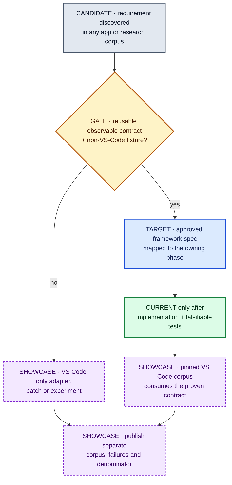

# Product phases ↔ Linear project mapping

Linear projects describe scheduling and ownership; product phases classify target scope.
Use these tables when linking issues to product phases. Neither placement turns a
research result or future spec into implemented behavior. The generated
[Current/Target/Evidence ledger](product-status.md#phases) owns phase status.

Keld is framework-first. The VS Code work is a north-star lane consuming general Keld
contracts; it does not define the framework phase or justify application-specific core
APIs.

## Project mapping

| Linear project | Product-phase relationship |
|----------------|-------------------|
| Phase 0 — Research & Competitive Analysis | Pre-foundation research, source surveillance and external evidence intake |
| Phase 1 — Architecture & Specs | Spec/RFC work and review-gated changes to process, permissions, wire or public API |
| Phase 2 — Foundation Scaffolding | Phase 0 evidence/foundation + Phase 1 window/primary-role slices + carefully selected Phase 2 prerequisites |
| Meta — Program & Process | Cross-project coordination, surveillance and agent/process health; never a product feature lane |
| *(not projectized yet)* | Phase 3 distribution/strict proof and Phase 4 compatibility/showcase execution |

Backlog placement in Phase 2 does not mean “implement now.” The issue's spec gate,
dependencies, current active PRs and roadmap exit order still control sequencing.

The selection flow below shows ownership and gating, not dates. The status ledger owns
phase classification, approved issue specs own scoped acceptance, and Linear owns live
execution state.

## Maximum-compatibility workstreams

| Linear issue | Framework scope | Product phase | Scheduling rule |
|---|---|---|---|
| KEL-51 | VS Code north-star research record | research/showcase | Research execution done; raw P-report claims remain non-normative pending direct source ledgers |
| KEL-68 | Runtime/engine surveillance | standing track | Keep moving snapshots out of phase scope churn |
| KEL-74 | Generic compatibility schema, artifact/workflow denominator and scoreboard | Phase 0 → Phase 2 | Framework-first; median app corpus before headline percentages |
| KEL-75 | Named child roles, principal binding and Electron `utilityProcess` mapping | Phase 1 spec → Phase 2/4 | Spec/human review before implementation; no VS Code names in runtime core |
| KEL-76 | General guarded PTY/ConPTY service plus compatibility facade | Phase 2 native core | General API first; `node-pty` is an oracle, not architecture |
| KEL-77 | Bun semantic differential harness using VS Code as one stress corpus | standing runtime + Phase 4 showcase | Keep package-agnostic fixtures separate from VS Code activation |
| KEL-78 | Strict addon-worker/sandbox specification and hostile proof | Phase 1 spec → Phase 3/4 | No implementation/strict claim before per-OS proof |
| KEL-79 | Cross-engine resource/origin contract and extension-webview spike | Phase 2 webview → Phase 4 showcase | Generic resource profile first; VS Code backend second |
| KEL-80 | Bounded kipc/virtual-port invariants and real traffic replay | Phase 2 bridge → Phase 4 showcase | Preserve live versioned frame; shared memory stays gated |
| KEL-53 | Signed update and recovery slice | Phase 3 | Package/channel ownership and A/B recovery spec before code |

## VS Code north-star boundary

The following stay showcase-only unless a separate corpus proves general demand:

- VS Code source/product commit alignment and transformed fork packaging;
- `acquireVsCodeApi`, notebook/custom-editor frame quirks and remote protocol adapters;
- `vsda`, Copilot, MXC, Foundry and other product-specific payloads;
- authorized VSIX selection and Marketplace/Open VSX policy;
- exact VS Code fork rebase/conflict automation.

The following remain framework-wide:

- final-artifact scanning and operation-level compatibility evidence;
- role-scoped supervision, guard binding and bounded IPC;
- PTY/process/watch/files/secrets brokers;
- resource/origin profiles and native IME/a11y/clipboard/DnD quality gates;
- sandbox, packaging, update, recovery and benchmark validity contracts.

Product Phase 3 and Phase 4 should become separate Linear projects only after their
entry specs and owners are approved. Do not create implementation tickets for a
clean-room browser, native GPU core, mandatory shared memory or an extension mirror.
