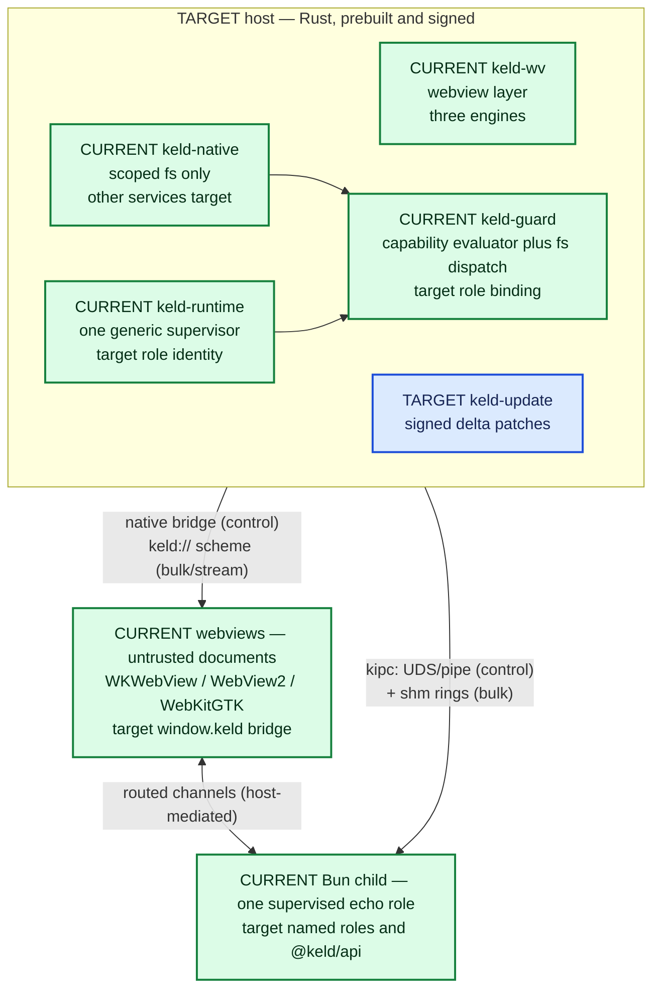

# 01 — What Keld Is, and Where It Actually Stands

> For a new engineer on day one. Everything below is traceable to a file in this repo;
> where something is specified but not built, it says so and names the source.
> Companion: [`06-documentation-map.md`](06-documentation-map.md) tells you what to read next.

## The one-paragraph version

Keld is a desktop application framework built by [GYLDLAB](https://github.com/gyldlab)
to replace Electron **without asking anyone to rewrite their app**. A prebuilt, signed
Rust host owns every OS resource (windows, webviews, native APIs, keys, updater); the
developer's JS/TS "main process" runs on **Bun as a supervised, unprivileged child
process**; the UI runs in **system webviews** (WKWebView / WebView2 / WebKitGTK) with a
per-platform engine policy; the two sides talk over **kipc**, a typed binary IPC plane;
and every privileged call is checked against a **default-deny capability manifest** that
tooling generates from your code. Electron compatibility is delivered as a shim
(`@keld/electron`) plus a mechanical `keld migrate`, not as a porting guide.
Sources: [`README.md`](../../README.md), [`docs/architecture/01-overview.md`](../architecture/01-overview.md) §1.

**Read this next, before you believe any of it:** [Current state](#current-state--what-exists-vs-what-is-specified).
The specs describe target behavior; the generated status ledger distinguishes that target
from evidence-backed implementation without freezing source counts or branch history.

| Fact | Value | Source |
|---|---|---|
| Version | `0.0.1`, pre-alpha | [`Cargo.toml`](../../Cargo.toml) `[workspace.package]` |
| License | MIT OR Apache-2.0 | [`Cargo.toml`](../../Cargo.toml), [`deny.toml`](../../deny.toml) |
| Language / edition | Rust, edition 2024, MSRV 1.97 | [`Cargo.toml`](../../Cargo.toml) |
| Toolchain | pinned `1.97.1` + rustfmt + clippy | [`rust-toolchain.toml`](../../rust-toolchain.toml) |
| Workspace status | Current crates, packages, phases, platform slices, and evidence | [`product-status.md`](../engineering/product-status.md) |

## The problem Keld exists to solve

Every current Electron alternative asks you to rewrite. That is the whole thesis in one
sentence, and [`docs/research/library/compatibility-competitors/00-landscape.md`](../research/library/compatibility-competitors/00-landscape.md) breaks it
into five structural problems that no shipping framework has solved *together*:

1. **The migration cliff.** Ten years of Electron apps; Tauri, Electrobun, and Deno
   Desktop all require rewriting the main process and every IPC channel (published
   migration reports: 4–6+ developer-weeks for a mid-size app, plus an updater
   discontinuity trap). The only Electron compat layer that ever existed is an abandoned
   experiment.
2. **JS main process vs. native ownership.** Tauri gives native ownership to Rust but
   removes the JS backend. Electrobun and Deno Desktop give the JS backend back but let
   the JS runtime *own* windows and native state — so app-logic crashes take the UI with
   them and sandboxing is impossible.
3. **Webview fragmentation treated as all-or-nothing.** Either accept three engines
   (Tauri) or ship Chromium everywhere (Electron). Reality is uneven: WebView2 is
   evergreen Chromium and basically fine, WKWebView is acceptable on recent macOS, and
   WebKitGTK on Linux is the problem child. See
   [`docs/research/library/host-platforms/06-webview-reality.md`](../research/library/host-platforms/06-webview-reality.md).
4. **IPC as an afterthought.** Chatty structured-clone JSON (Electron), serde-JSON
   `invoke` (Tauri), a localhost WebSocket on port 50000+ (Electrobun).
5. **Security either optional or hostile.** Electron: remember five code patterns or ship
   an RCE. Tauri: right model, painful hand-written-JSON DX. Electrobun: no model.

Keld's answer to each is the corresponding architecture spec: compat (04), the
host/child split (01), engine policy (05), kipc (02), and the generated default-deny
manifest (03).

## Competitive positioning — each competitor fails differently

From [`docs/architecture/01-overview.md`](../architecture/01-overview.md) §1 and the
head-to-head matrix in [`docs/research/library/compatibility-competitors/00-landscape.md`](../research/library/compatibility-competitors/00-landscape.md):

| Framework | Architecture | The specific failure Keld targets |
|---|---|---|
| **Electron** | Node.js main process + bundled Chromium renderers | Privileged JS **in-process** with window ownership → 85–150 MB installers, 150–300 MB idle, checklist security |
| **Tauri 2** | Rust main process + system webviews (wry/tao) | Native ownership is correct, but there is no JS main process and app devs need a Rust toolchain → adoption cliff |
| **Electrobun** | Bun main + Zig native host + system webviews | JS main process exists, but it *owns* the native layer → no privilege separation, shared fate |
| **Deno Desktop** | `deno desktop` subcommand, runtime in-process with the webview | Same shared-address-space problem; permissions are compile-time flags with no runtime enforcement |
| **Keld** | Rust host + supervised Bun child + system webviews + kipc | Electron's mental model, Tauri's ownership, and a real security boundary that is *also* the compat seam — `@keld/electron` implements Electron's API on top of kipc |

Two things to internalize from that table. First, **compatibility is the product**, not a
nice-to-have: architecture principle #1 says the Electron surface is "a protocol to
implement," and every design must answer "how does this behave under `@keld/electron`?"
Second, Keld's differentiation against Tauri is explicitly *not* "lighter than Tauri" —
it's Tauri-class footprint without giving up the JS main process, without a Rust
toolchain, and with an Electron on-ramp ([`docs/research/library/compatibility-competitors/02-tauri.md`](../research/library/compatibility-competitors/02-tauri.md)).

## The shape of the system

Three principals at three trust levels. The canonical, normative version of this picture
is the ASCII diagram in [`docs/architecture/01-overview.md`](../architecture/01-overview.md) §1;
this is the same thing in fewer boxes.

- **keld-host** owns every OS resource. App developers never compile it — they download a
  signed prebuilt binary. "No Rust toolchain for app developers" is principle #5.
- **The app process** is the developer's own code with the full npm world but **zero
  ambient OS authority**. It can crash and be restarted without tearing down windows,
  because the host — not the app — owns the webviews.
- **Webviews** are untrusted. They reach the app process only through host-mediated
  routed channels, never directly.

Everything else in the architecture follows from that ownership split. Hot paths (kipc,
event loop, guard) are callback/state-machine code with no async runtime and no
steady-state allocation — the lesson taken from Bun's Rust rewrite
([`docs/research/library/agents-tooling/05-rust-wave.md`](../research/library/agents-tooling/05-rust-wave.md), enforced by
[`AGENTS.md`](../../AGENTS.md) § Rust, TypeScript, and naming).

## Who it's for

- **Teams with an existing Electron app** who want the footprint of a native-ish
  framework without a 4–6 week rewrite. The falsifiable promise in
  [`docs/architecture/04-electron-compat.md`](../architecture/04-electron-compat.md):
  a median Electron app runs on Keld by changing **configuration, not code** — six files
  at most (`keld.config.ts`, `keld.permissions.jsonc`, `keld.build.ts`, `keld.compat.ts`,
  an edited `package.json`, and a bundler alias). No `src-tauri/`, no Rust files.
- **New desktop apps in JS/TS** that want small installers, fast start, real delta
  updates, and secure defaults without adopting Rust.
- **Coding agents**, treated as a first-class user persona rather than an afterthought:
  [`docs/architecture/07-agent-experience.md`](../architecture/07-agent-experience.md)
  makes "errors state the fix," `--json` CLI output, stable exit codes, an official MCP
  server, and a one-shot agent-eval pass rate into normative requirements — and, in
  Phase 3, a release gate.

## What "success" means: the performance budgets

Keld's claims are numbers with benchmarks attached, or they don't get made ("a number
without a benchmark is marketing" — principle #7). These are the CI-gated budgets from
[`docs/architecture/01-overview.md`](../architecture/01-overview.md) §5, measured on a
hello-world app on an M-series Mac / mid-range Windows laptop:

| Metric | Budget | Electron baseline |
|---|---|---|
| Installer size (runtime = bun) | ≤ 20 MB | 85–150 MB |
| Installer size (runtime = none) | ≤ 6 MB | — |
| Cold start → first paint | ≤ 300 ms | 1–3 s |
| Idle RSS, 1 window (sum of keld processes) | ≤ 90 MB | 150–300 MB |
| kipc small-message round trip p99 | ≤ 100 µs | ~ms-class |
| kipc bulk throughput (shm lane) | ≥ 1 GB/s | n/a (copies) |
| Update patch, 1-line JS change | ≤ 50 KB | full installer |
| `keld dev` cold to window | ≤ 2 s | — |

These are **target budgets**, not live gates. Once `bench/` exists, a regression greater
than 5% fails the PR or needs a written waiver with benchmarks
([`AGENTS.md`](../../AGENTS.md) § Security, performance, and review gates). **Not yet real:** the `bench/`
directory does not exist, so none of these are currently gated. Living measured rows
(hello host/CLI/RSS; no DMG yet) are in
[`docs/engineering/budget-scoreboard.md`](../engineering/budget-scoreboard.md). Building
`bench/` CI is parked (KEL-39 YAGNI).

## What Keld is deliberately not (v1 non-goals)

From [`docs/architecture/01-overview.md`](../architecture/01-overview.md) §6 — these are
decided, not open questions:

- **Not a mobile framework.** The `keld-wv` backend seam reserves the possibility; no
  iOS/Android work in v1.
- **Not a UI toolkit.** No bespoke widgets. The web is the UI layer.
- **Not a bundler.** `keld dev` / `keld build` orchestrate the app's own
  Vite/Rolldown/Bun build.
- **Not a Node fork.** Node-API compatibility comes from Bun's implementation; Keld does
  not patch runtimes.
- **No CEF by default anywhere.** Pinned engines are opt-in, per platform.

There is also an explicit honesty ledger in
[`docs/architecture/03-security.md`](../architecture/03-security.md) §6 about what the
security model does *not* promise (the sandbox protects the user from supply-chain
compromise of the developer's code, not the developer from themselves; webview engine
CVEs belong to the platform, or to us if we ship a pinned engine; signed updates are not
secure boot).

## Current state — what exists vs. what is specified

The generated [Current/Target/Evidence ledger](../engineering/product-status.md) is the
single repository-status owner. It covers crates, packages, product phases, and
platform-scoped slices, and links every current claim to tracked code/test/CI evidence
plus the immutable commit at which that evidence was verified.

The seven architecture documents remain normative target design; they do not imply
implementation. Linear remains the owner of live issue status, assignees, dependencies,
and claims. The status-table check compares ledger crate records with Cargo workspace
metadata without making documentation consistency a product or real-OS completion claim.

Run `just product-status-check` for semantic consistency and `just llms-check` for
generated-corpus byte freshness. `just ci` remains the exact local gate inventory;
gitleaks remains GitHub-only.

## How work is tracked

- **Linear** is the issue tracker: workspace `gyldlab-keld`, team/project **KELD**, issues
  numbered **KEL-\***. You will see these IDs everywhere in the code — `KEL-27` and
  `KEL-28` head the Windows and Linux `keld-wv` backend modules, `KEL-29`/`KEL-30`
  head the CLI and IPC modules. Grepping a KEL number is a fast way to find every file
  that participates in a work item.
- Linear project placement and product-phase classification are distinct. Use the
  tracked [`linear-roadmap-mapping.md`](../engineering/linear-roadmap-mapping.md) for
  that translation and the generated status ledger for current product facts.
- Historical execution evidence lives in Linear issue comments and dated engineering
  audits such as [`alignment-audit-2026-07-08.md`](../engineering/alignment-audit-2026-07-08.md).
  Read those as point-in-time records, never as a live to-do list.
- **Features need an approved spec** before implementation
  ([`docs/agents/spec-template.md`](../agents/spec-template.md)), and the development loop
  — worktree isolation, verification gate, review gates, PR shape — is in
  [`docs/agents/workflow.md`](../agents/workflow.md).

## Before you write any code

1. Read [`AGENTS.md`](../../AGENTS.md) end to end. It is the compact binding invariant
   floor; `.agents/index.md` routes task-specific playbooks. `just ci` is the exact local
   gate inventory.
2. Read the crate-level `AGENTS.md` for whatever you're touching —
   [`keld-ipc`](../../crates/keld-ipc/AGENTS.md), [`keld-wv`](../../crates/keld-wv/AGENTS.md),
   [`keld-guard`](../../crates/keld-guard/AGENTS.md),
   [`keld-compat`](../../crates/keld-compat/AGENTS.md). This is required, not optional.
3. Query only the relevant area in [`docs/agents/learnings.md`](../agents/learnings.md);
   it is evidence, not default full-file context. For example, `wv/macos` records the
   tao+wry scaffold and `tooling` records cargo-deny configuration gotchas.
4. Then go to [`06-documentation-map.md`](06-documentation-map.md) for what to read, in
   what order, and which documents are binding versus exploratory.

## Sources used in this document

`README.md` · `AGENTS.md` · `docs/engineering/product-status.tsv` · `docs/engineering/alignment-audit-2026-07-08.md` · `Cargo.toml` · `rust-toolchain.toml` ·
`justfile` · `.gitignore` · `.github/workflows/ci.yml` ·
`docs/architecture/01-overview.md` (§1, §2, §5, §6) · `docs/architecture/03-security.md` §6 ·
`docs/architecture/04-electron-compat.md` §2 · `docs/architecture/06-runtime-and-tooling.md` §2 ·
`docs/architecture/07-agent-experience.md` §2 · `docs/research/library/compatibility-competitors/00-landscape.md` ·
`docs/research/library/execution-governance/14-phase0-synthesis.md` (from the separately tracked nested research checkout after `just research-sync`) · `docs/engineering/linear-roadmap-mapping.md` ·
`crates/*/src/**` · `crates/*/AGENTS.md` · `git log`, `git ls-files`,
`cargo nextest run --workspace --profile ci` (all run 2026-08-10).
