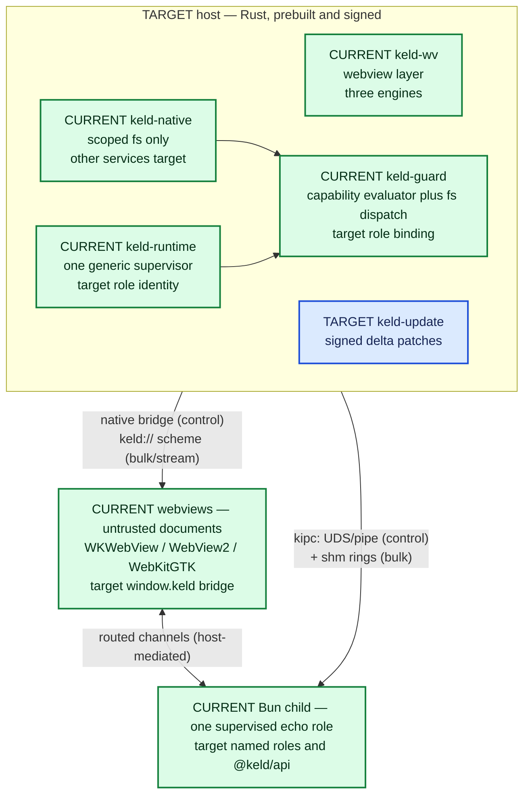

# 01 — What Keld Is, and Where It Actually Stands

> For a new engineer on day one. Everything below is traceable to a file in this repo;
> where something is specified but not built, it says so and names the source.
> Companion: [`06-documentation-map.md`](06-documentation-map.md) tells you what to read next.

## The one-paragraph version

Keld is a desktop application framework built by [GYLDLAB](https://github.com/gyldlab)
to replace Electron **without asking anyone to rewrite their app**. A prebuilt, signed
Rust host owns every OS resource (windows, webviews, native APIs, keys, updater); the
developer's JS/TS "main process" runs on **Bun as a supervised, unprivileged child
process**; the UI runs in **system webviews** (WKWebView / WebView2 / WebKitGTK) with a
per-platform engine policy; the two sides talk over **kipc**, a typed binary IPC plane;
and every privileged call is checked against a **default-deny capability manifest** that
tooling generates from your code. Electron compatibility is delivered as a shim
(`@keld/electron`) plus a mechanical `keld migrate`, not as a porting guide.
Sources: [`README.md`](../../README.md), [`docs/architecture/01-overview.md`](../architecture/01-overview.md) §1.

**Read this next, before you believe any of it:** [Current state](#current-state--what-exists-vs-what-is-specified).
Keld today is a heavily-researched, lightly-implemented project. The specs describe a
finished framework. The code is roughly 2,300 lines of Rust that opens one window and
echoes one IPC message. Both facts are true at the same time, and holding them together
is the single most important thing to understand about this repo.

| Fact | Value | Source |
|---|---|---|
| Version | `0.0.1`, pre-alpha | [`Cargo.toml`](../../Cargo.toml) `[workspace.package]` |
| License | MIT OR Apache-2.0 | [`Cargo.toml`](../../Cargo.toml), [`deny.toml`](../../deny.toml) |
| Language / edition | Rust, edition 2024, MSRV 1.97 | [`Cargo.toml`](../../Cargo.toml) |
| Toolchain | pinned `1.97.1` + rustfmt + clippy | [`rust-toolchain.toml`](../../rust-toolchain.toml) |
| Workspace | 11 crates; `packages/@keld/electron` live (KEL-72) | [`Cargo.toml`](../../Cargo.toml) `members`, `packages/@keld/electron/` |
| Rust in tree | 2,339 lines across `crates/**/*.rs` | `find crates -name '*.rs' \| xargs wc -l` (2026-08-10) |
| Test suite | 17 tests, all passing | `cargo nextest run --workspace --profile ci` (2026-08-10) |
| Last commit | `6d642c4` "feat: Keld workspace scaffold and macOS hello window" (2026-07-08) | `git log -1` |

## The problem Keld exists to solve

Every current Electron alternative asks you to rewrite. That is the whole thesis in one
sentence, and [`docs/research/library/compatibility-competitors/00-landscape.md`](../research/library/compatibility-competitors/00-landscape.md) breaks it
into five structural problems that no shipping framework has solved *together*:

1. **The migration cliff.** Ten years of Electron apps; Tauri, Electrobun, and Deno
   Desktop all require rewriting the main process and every IPC channel (published
   migration reports: 4–6+ developer-weeks for a mid-size app, plus an updater
   discontinuity trap). The only Electron compat layer that ever existed is an abandoned
   experiment.
2. **JS main process vs. native ownership.** Tauri gives native ownership to Rust but
   removes the JS backend. Electrobun and Deno Desktop give the JS backend back but let
   the JS runtime *own* windows and native state — so app-logic crashes take the UI with
   them and sandboxing is impossible.
3. **Webview fragmentation treated as all-or-nothing.** Either accept three engines
   (Tauri) or ship Chromium everywhere (Electron). Reality is uneven: WebView2 is
   evergreen Chromium and basically fine, WKWebView is acceptable on recent macOS, and
   WebKitGTK on Linux is the problem child. See
   [`docs/research/library/host-platforms/06-webview-reality.md`](../research/library/host-platforms/06-webview-reality.md).
4. **IPC as an afterthought.** Chatty structured-clone JSON (Electron), serde-JSON
   `invoke` (Tauri), a localhost WebSocket on port 50000+ (Electrobun).
5. **Security either optional or hostile.** Electron: remember five code patterns or ship
   an RCE. Tauri: right model, painful hand-written-JSON DX. Electrobun: no model.

Keld's answer to each is the corresponding architecture spec: compat (04), the
host/child split (01), engine policy (05), kipc (02), and the generated default-deny
manifest (03).

## Competitive positioning — each competitor fails differently

From [`docs/architecture/01-overview.md`](../architecture/01-overview.md) §1 and the
head-to-head matrix in [`docs/research/library/compatibility-competitors/00-landscape.md`](../research/library/compatibility-competitors/00-landscape.md):

| Framework | Architecture | The specific failure Keld targets |
|---|---|---|
| **Electron** | Node.js main process + bundled Chromium renderers | Privileged JS **in-process** with window ownership → 85–150 MB installers, 150–300 MB idle, checklist security |
| **Tauri 2** | Rust main process + system webviews (wry/tao) | Native ownership is correct, but there is no JS main process and app devs need a Rust toolchain → adoption cliff |
| **Electrobun** | Bun main + Zig native host + system webviews | JS main process exists, but it *owns* the native layer → no privilege separation, shared fate |
| **Deno Desktop** | `deno desktop` subcommand, runtime in-process with the webview | Same shared-address-space problem; permissions are compile-time flags with no runtime enforcement |
| **Keld** | Rust host + supervised Bun child + system webviews + kipc | Electron's mental model, Tauri's ownership, and a real security boundary that is *also* the compat seam — `@keld/electron` implements Electron's API on top of kipc |

Two things to internalize from that table. First, **compatibility is the product**, not a
nice-to-have: architecture principle #1 says the Electron surface is "a protocol to
implement," and every design must answer "how does this behave under `@keld/electron`?"
Second, Keld's differentiation against Tauri is explicitly *not* "lighter than Tauri" —
it's Tauri-class footprint without giving up the JS main process, without a Rust
toolchain, and with an Electron on-ramp ([`docs/research/library/compatibility-competitors/02-tauri.md`](../research/library/compatibility-competitors/02-tauri.md)).

## The shape of the system

Three principals at three trust levels. The canonical, normative version of this picture
is the ASCII diagram in [`docs/architecture/01-overview.md`](../architecture/01-overview.md) §1;
this is the same thing in fewer boxes.

- **keld-host** owns every OS resource. App developers never compile it — they download a
  signed prebuilt binary. "No Rust toolchain for app developers" is principle #5.
- **The app process** is the developer's own code with the full npm world but **zero
  ambient OS authority**. It can crash and be restarted without tearing down windows,
  because the host — not the app — owns the webviews.
- **Webviews** are untrusted. They reach the app process only through host-mediated
  routed channels, never directly.

Everything else in the architecture follows from that ownership split. Hot paths (kipc,
event loop, guard) are callback/state-machine code with no async runtime and no
steady-state allocation — the lesson taken from Bun's Rust rewrite
([`docs/research/library/agents-tooling/05-rust-wave.md`](../research/library/agents-tooling/05-rust-wave.md), enforced by
[`AGENTS.md`](../../AGENTS.md) § Rust, TypeScript, and naming).

## Who it's for

- **Teams with an existing Electron app** who want the footprint of a native-ish
  framework without a 4–6 week rewrite. The falsifiable promise in
  [`docs/architecture/04-electron-compat.md`](../architecture/04-electron-compat.md):
  a median Electron app runs on Keld by changing **configuration, not code** — six files
  at most (`keld.config.ts`, `keld.permissions.jsonc`, `keld.build.ts`, `keld.compat.ts`,
  an edited `package.json`, and a bundler alias). No `src-tauri/`, no Rust files.
- **New desktop apps in JS/TS** that want small installers, fast start, real delta
  updates, and secure defaults without adopting Rust.
- **Coding agents**, treated as a first-class user persona rather than an afterthought:
  [`docs/architecture/07-agent-experience.md`](../architecture/07-agent-experience.md)
  makes "errors state the fix," `--json` CLI output, stable exit codes, an official MCP
  server, and a one-shot agent-eval pass rate into normative requirements — and, in
  Phase 3, a release gate.

## What "success" means: the performance budgets

Keld's claims are numbers with benchmarks attached, or they don't get made ("a number
without a benchmark is marketing" — principle #7). These are the CI-gated budgets from
[`docs/architecture/01-overview.md`](../architecture/01-overview.md) §5, measured on a
hello-world app on an M-series Mac / mid-range Windows laptop:

| Metric | Budget | Electron baseline |
|---|---|---|
| Installer size (runtime = bun) | ≤ 20 MB | 85–150 MB |
| Installer size (runtime = none) | ≤ 6 MB | — |
| Cold start → first paint | ≤ 300 ms | 1–3 s |
| Idle RSS, 1 window (sum of keld processes) | ≤ 90 MB | 150–300 MB |
| kipc small-message round trip p99 | ≤ 100 µs | ~ms-class |
| kipc bulk throughput (shm lane) | ≥ 1 GB/s | n/a (copies) |
| Update patch, 1-line JS change | ≤ 50 KB | full installer |
| `keld dev` cold to window | ≤ 2 s | — |

These are **target budgets**, not live gates. Once `bench/` exists, a regression greater
than 5% fails the PR or needs a written waiver with benchmarks
([`AGENTS.md`](../../AGENTS.md) § Security, performance, and review gates). **Not yet real:** the `bench/`
directory does not exist, so none of these are currently gated. Living measured rows
(hello host/CLI/RSS; no DMG yet) are in
[`docs/engineering/budget-scoreboard.md`](../engineering/budget-scoreboard.md). Building
`bench/` CI is parked (KEL-39 YAGNI).

## What Keld is deliberately not (v1 non-goals)

From [`docs/architecture/01-overview.md`](../architecture/01-overview.md) §6 — these are
decided, not open questions:

- **Not a mobile framework.** The `keld-wv` backend seam reserves the possibility; no
  iOS/Android work in v1.
- **Not a UI toolkit.** No bespoke widgets. The web is the UI layer.
- **Not a bundler.** `keld dev` / `keld build` orchestrate the app's own
  Vite/Rolldown/Bun build.
- **Not a Node fork.** Node-API compatibility comes from Bun's implementation; Keld does
  not patch runtimes.
- **No CEF by default anywhere.** Pinned engines are opt-in, per platform.

There is also an explicit honesty ledger in
[`docs/architecture/03-security.md`](../architecture/03-security.md) §6 about what the
security model does *not* promise (the sandbox protects the user from supply-chain
compromise of the developer's code, not the developer from themselves; webview engine
CVEs belong to the platform, or to us if we ship a pinned engine; signed updates are not
secure boot).

## Current state — what exists vs. what is specified

**Two structural facts a newcomer must have before reading any spec.**

**Fact one: the specs are aspirational documents, and they say so.** The seven
architecture docs are normative for v0.x — they bind design, and changing them requires
a design PR — but "normative" means "this is the agreed target," not "this is
implemented." Roughly 2,300 lines of Rust exist against a specification set describing a
complete desktop framework with an updater, a packager, an Electron emulation layer, and
an MCP server.

**Fact two: most of the code is uncommitted working-tree state.** As of 2026-08-10, HEAD
is a single substantive commit from 2026-07-08. Of the Rust on disk, 911 lines are in
tracked files and 1,428 lines are in files git has never seen — the whole
`keld-cli create/dev/doctor/echo_link/template` surface, `keld-ipc codec/echo/link/session`,
and `keld-wv engine/wkwebview/webview2/webkitgtk`. If you `git stash` or clone fresh, most
of what this document describes as "working today" disappears. Check `git status` before
concluding anything about the state of the tree.

### What actually runs today

Verified on macOS, 2026-08-29:

| Command | What it really does |
|---|---|
| `just hello` / `cargo run -p keld-host -- --hello` | Opens a `WKWebView`/`WebView2`/`WebKitGTK` window with static HTML (macOS/Windows/Linux, KEL-28) |
| `keld create <name>` | Writes a 6-file hello template (`keld.config.ts`, `package.json`, `index.html`, `src/main.ts`, `src/kipc.ts`, `.gitignore`) with `{{name}}` substituted; rejects empty/uppercase names; extra tokens including `--template` are `KELD-CLI-044` |
| `keld doctor` | Bun on PATH, hello-template layout (`keld.config.ts` + `src/main.ts`), configured renderer HTML (default `index.html`, `KELD-CLI-035`), plus a webview line on macOS, Windows, and Linux |
| `keld dev` | Runs doctor. On macOS and Windows it compiles an owner-private stage, launches the staged `keld-host` with no Keld argument, forwards stdio, and retains only the host handle plus a private stdin-v1 liveness writer; the host owns the window, app link and Bun supervisor. Linux retains the older CLI-owned echo/window slice until its KEL-96/T4 work. Extra tokens including `--watch` are `KELD-CLI-044`. |
| `keld ipc-echo` | Server + client kipc echo round trip in one process |
| `cargo nextest run --workspace --profile ci` | Runs the current workspace CI suite |

`keld dev` is still a slice, not the destination architecture. On macOS and Windows the
CLI now delegates application ownership to a staged no-flag `keld-host`; on
Linux the older CLI-owned loop remains until KEL-96/T4. There is still
no `@keld/api`, dev permission recorder, Bun-watch recovery, or complete
host-wired guarded app API. The guard-checked `keld_native::fs` broker exists,
but the shipping host does not yet route app calls to that broader native
dispatch surface. Bun *is* supervised — `keld_runtime::Supervisor` spawns
`bun run src/main.ts` (KEL-70) instead of a bare `Command::new("bun")` wait. The
template's `src/main.ts` proves the link by speaking kipc itself, through
`src/kipc.ts` — a hand-written, wire-exact v0 client (KEL-30); schema-driven codegen
(`keld gen`, `@keld/schema`) is a later slice. It is an honest vertical slice,
deliberately built end-to-end rather than stubbed —
[`AGENTS.md`](../../AGENTS.md) forbids `todo!()`/`unimplemented!()` on main — but it
is a slice, not the system.

### Per-subsystem ledger

| Crate | Governing spec | On disk today | Not yet built |
|---|---|---|---|
| `keld-ipc` | [02-ipc](../architecture/02-ipc.md) | 16-byte little-endian frame header, 11 `FrameKind`s, `HELLO` handshake, postcard codec, blocking framed read/write, one hardcoded `echo` channel | shm bulk lane, credit-window backpressure, streams/cancel, schema-driven channel registry, codegen, fuzzing |
| `keld-wv` | [05-webview-and-native](../architecture/05-webview-and-native.md) | `WebEngine` trait + per-platform extension traits; all three backends implemented — macOS + Linux on tao + wry as **interim scaffolding** (macOS to be replaced by direct objc2 bindings, Linux by webkit6/gtk4), Windows on direct `webview2-com` since KEL-65; Linux GPU-stack probe (NVIDIA+Wayland safe-mode) built in, `detect`/`apply` split for side-effect-free reads. Linux: build+225-test-green on real Ubuntu, `Xvfb`+`xdotool` finds a real titled window; macOS/Windows watched on a real desktop, Linux not yet | `keld://` scheme, `window.keld` bridge, CEF, `keld doctor` line for GPU safe-mode, watching the Linux window render on real hardware/VM |
| `keld-core` + `keld-host` | [01-overview](../architecture/01-overview.md) §4 | `run_hello_window()`; `LifecycleSession` (KEL-72); `keld-host --hello` diagnostic; macOS and Windows no-flag strict `keld.boot.json` consumers with real native windows, authenticated echo/lifecycle sessions, supervised fresh-link same-window recovery, ordered Quit, and CLI-lease-loss teardown | Linux no-flag integration, Windows abnormal-host-death reaping, full window registry, release-signed boot container, guarded policy load |
| `keld-guard` | [03-security](../architecture/03-security.md) | `parse_manifest` / `load_manifest` / `evaluate` for `app.<group>.<action>` path scopes; `Principal`, `Decision`, `DenyReason`; `dispatch_privileged` (KEL-69); `keld_native::fs` uses it (KEL-71) | `$VARS`/symlink canonicalization, channel grants, recorder, audit log |
| `keld-runtime` | [06-runtime-and-tooling](../architecture/06-runtime-and-tooling.md) §1 | `Supervisor`: spawn, stdout/stderr capture, restart/backoff and crash ledger; the macOS guardian and Windows primary owner compose it inside their no-flag hosts, while retained diagnostics use it directly | Bun discovery/pinning/download, `--inspect` passthrough, Bun-watch hot-restart, strict-profile admission and complete named-role wiring |
| `keld-cli` | [06-runtime-and-tooling](../architecture/06-runtime-and-tooling.md) §2 | `create`, `dev`, `doctor` (including `--json`), `mcp serve`, `hello`, `ipc-echo`, `ipc-client`; macOS and Windows `dev` own staging/logs/host-handle/lease only | `build`, `migrate`, `gen`, `ext`; `--json` on every verb; stable exit codes 0/1/2/3; delegated app dev server and recorder |
| `keld-native` | [05-webview-and-native](../architecture/05-webview-and-native.md) §3 | A `MODULES` constant naming the 15 planned modules; `fs` is live (KEL-71) — `fs_read`/`fs_write` and a real `serve_fs_session` kipc channel, both gated through `keld_ipc::guard_dispatch::dispatch_privileged` before any OS call; cross-platform by construction (`std::fs`), no per-platform code needed | every other module; `fs.watch`, drag-out, recent docs (`fs+`'s remaining destination scope) |
| `keld-compat` | [04-electron-compat](../architecture/04-electron-compat.md) | `Tier` enum; KEL-72 conformance tests for `@keld/electron` lifecycle | `protocol` / `session` / `webContents` host emulation; remaining Tier 1 APIs |
| `keld-pack` | [06-runtime-and-tooling](../architecture/06-runtime-and-tooling.md) §3 | A `Format` enum (app/dmg/nsis/msi/deb/rpm/AppImage) | all packaging and signing |
| `keld-update` | [06-runtime-and-tooling](../architecture/06-runtime-and-tooling.md) §4 | A `Channel` enum (stable/beta/canary) | bsdiff+zstd, signatures, rollback, feeds |
| `packages/` | [01-overview](../architecture/01-overview.md) §3 | `@keld/electron` (KEL-72: `app.whenReady` / `quit` / `window-all-closed`) | `@keld/api`, `@keld/web`, `@keld/cli`, `@keld/schema`, `create-keld` |

`examples/` is also empty, and there is no `bench/` and no `docs/specs/` yet (the latter
is where [`docs/agents/spec-template.md`](../agents/spec-template.md) says approved specs
should land).

### The CI situation, precisely

[`.github/workflows/ci.yml`](../../.github/workflows/ci.yml) exists and is tracked
(KEL-39): rustfmt, clippy + nextest + rustdoc across
`ubuntu-latest`/`macos-latest`/`windows-latest`, plus MSRV, `cargo-deny`, checksum-pinned
gitleaks, and a CODEOWNERS/template hygiene job. `.github/` is **not** gitignored.
Local `ROADMAP.md` remains gitignored; the tracked map is
[`docs/engineering/linear-roadmap-mapping.md`](../engineering/linear-roadmap-mapping.md).
A `bench/` harness is still absent (YAGNI until a live microbench).

[`justfile`](../../justfile) owns the exact local gate inventory and order; run `just ci`
to execute the current list. Gitleaks stays GitHub-only.

## The roadmap in plain terms

Phases gate on **exit criteria, not dates** ([`ROADMAP.md`](../../ROADMAP.md)).

| Phase | Theme | What gates it (exit criterion) | Where it stands |
|---|---|---|---|
| **0 — Foundation** | Know the field, fix the architecture, make the repo buildable and agent-safe | `cargo test --workspace` green on 3 OSes **in CI** | Research, architecture v0, workspace, and the agent system are done. Open: CI on real runners with agent-PR gates, and a `bench/` harness with a first IPC microbenchmark |
| **1 — Window on screen (v0.1)** | A real host binary that boots a config and shows a window driven by a supervised Bun process | hello-world app (Bun main + Vite renderer) runs on macOS **and** Windows via `bunx keld dev`; killing the app process leaves the renderer alive and auto-reconnects | Partially done on macOS and Windows: both have no-flag staged host ownership and same-window Bun recovery. Linux product rows, Windows abnormal-host-death reaping, `@keld/api`, and the full config schema remain open |
| **2 — The plane and the guard (v0.2)** | The IPC bulk lane, schema codegen, permission enforcement, native APIs, Electron compat Tier 1, the MCP server | `electron-quick-start` runs unmodified via `keld migrate && keld dev` on macOS+Windows; IPC RTT p99 ≤ 100 µs on bench hardware | Partial: MCP v1 (`keld mcp serve`) and guard `evaluate` exist; bulk lane, native APIs, and Electron compat are not started |
| **3 — Ship it (v0.3)** | Installers, signing, delta updates, Linux hardening, OS sandbox v1, templates | a real app ships to beta users on all 3 OSes with ≤ 50 KB delta updates | Not started |
| **4 — Compat depth & pinned engine (v0.4–0.6)** | Electron Tier 2, public compat scoreboard from a 20-app corpus, CEF backend, stable-ABI plugins | ≥ 80% median call-site compat across the corpus, and one production Electron app migrated with config-only changes — **the thesis test** | Not started |

Alongside the phases run **standing tracks**: perf CI, per-phase security reviews, Bun
version pinning cadence, the web-baseline matrix refresh per OS release, upstream watch
(Bun's Rust port, WebKitGTK releases, Verso embedding, Deno Desktop), and the AX loop —
agent-eval transcripts triaged on the principle that *a repeated agent failure is a docs,
error-message, or API bug*.

## How work is tracked

- **Linear** is the issue tracker: workspace `gyldlab-keld`, team/project **KELD**, issues
  numbered **KEL-\***. You will see these IDs everywhere in the code — `KEL-27` and
  `KEL-28` head the Windows and Linux `keld-wv` backend modules, `KEL-29`/`KEL-30`
  head the CLI and IPC modules. Grepping a KEL number is a fast way to find every file
  that participates in a work item.
- **Linear's project numbering does not match `ROADMAP.md`'s phase numbering.** Use
  [`docs/engineering/linear-roadmap-mapping.md`](../engineering/linear-roadmap-mapping.md)
  to translate; getting this wrong is a known source of confusion (it was flagged in the
  2026-07-08 alignment audit).
- Historical execution evidence lives in Linear issue comments and dated engineering
  audits such as [`alignment-audit-2026-07-08.md`](../engineering/alignment-audit-2026-07-08.md).
  Read those as point-in-time records, never as a live to-do list.
- **Features need an approved spec** before implementation
  ([`docs/agents/spec-template.md`](../agents/spec-template.md)), and the development loop
  — worktree isolation, verification gate, review gates, PR shape — is in
  [`docs/agents/workflow.md`](../agents/workflow.md).

## Before you write any code

1. Read [`AGENTS.md`](../../AGENTS.md) end to end. It is the compact binding invariant
   floor; `.agents/index.md` routes task-specific playbooks. `just ci` is the exact local
   gate inventory.
2. Read the crate-level `AGENTS.md` for whatever you're touching —
   [`keld-ipc`](../../crates/keld-ipc/AGENTS.md), [`keld-wv`](../../crates/keld-wv/AGENTS.md),
   [`keld-guard`](../../crates/keld-guard/AGENTS.md),
   [`keld-compat`](../../crates/keld-compat/AGENTS.md). This is required, not optional.
3. Query only the relevant area in [`docs/agents/learnings.md`](../agents/learnings.md);
   it is evidence, not default full-file context. For example, `wv/macos` records the
   tao+wry scaffold and `tooling` records cargo-deny configuration gotchas.
4. Then go to [`06-documentation-map.md`](06-documentation-map.md) for what to read, in
   what order, and which documents are binding versus exploratory.

## Sources used in this document

`README.md` · `AGENTS.md` · `ROADMAP.md` · `docs/engineering/alignment-audit-2026-07-08.md` · `Cargo.toml` · `rust-toolchain.toml` ·
`justfile` · `.gitignore` · `.github/workflows/ci.yml` ·
`docs/architecture/01-overview.md` (§1, §2, §5, §6) · `docs/architecture/03-security.md` §6 ·
`docs/architecture/04-electron-compat.md` §2 · `docs/architecture/06-runtime-and-tooling.md` §2 ·
`docs/architecture/07-agent-experience.md` §2 · `docs/research/library/compatibility-competitors/00-landscape.md` ·
`docs/research/library/execution-governance/14-phase0-synthesis.md` (from the separately tracked nested research checkout after `just research-sync`) · `docs/engineering/linear-roadmap-mapping.md` ·
`crates/*/src/**` · `crates/*/AGENTS.md` · `git log`, `git ls-files`,
`cargo nextest run --workspace --profile ci` (all run 2026-08-10).
