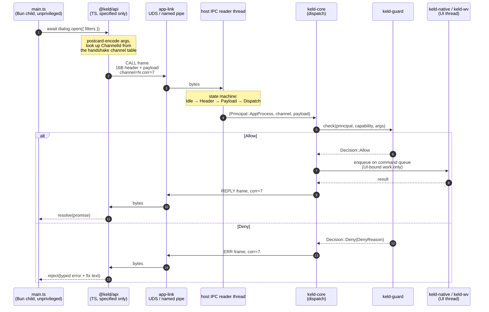
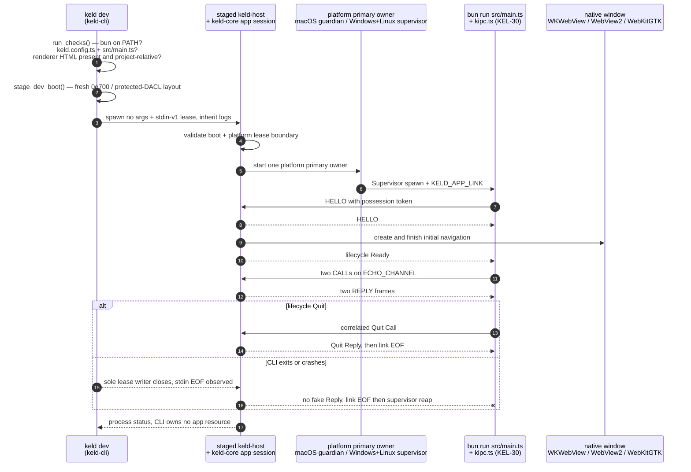
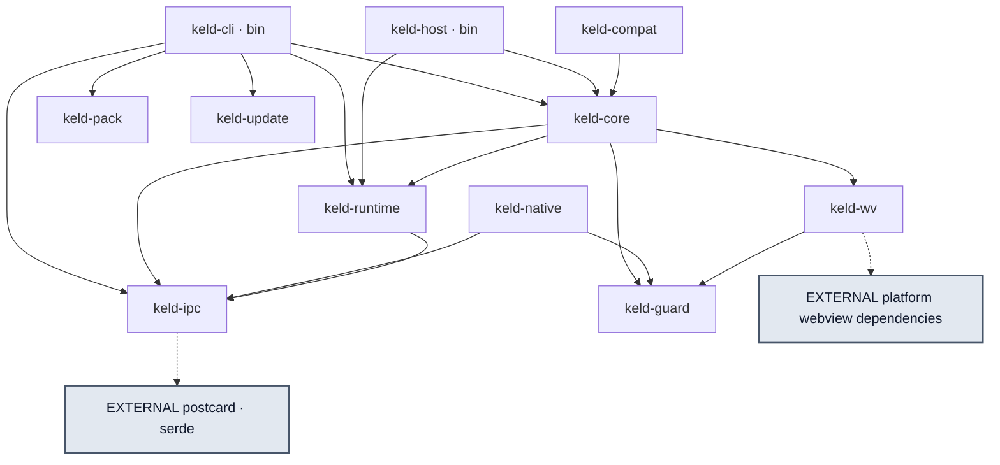

# Keld Architecture — A Guide for New Engineers

This is the readable version of the normative specs in [`docs/architecture/`](../architecture/).
It exists because those seven documents describe the system Keld is *going to be*, and the
code in `crates/` is roughly 2,200 lines of the system Keld *is* — mostly two crates. Both
facts matter, and reading the specs alone will give you a badly calibrated mental model.

**The specs are normative; this document is not.** Where they disagree, the spec wins and the
mismatch is a bug (root [`AGENTS.md`](../../AGENTS.md): "Code/spec mismatch = bug in one; fix
together in same PR or state why"). Where a spec describes something with no code behind it,
this guide says so in the text and marks it in the tables.

This is document 02 of the onboarding set. Its siblings:
[`01 — What Keld Is, and Where It Actually Stands`](./01-project-summary.md),
[`03 — API and CLI surface`](./03-api-and-cli-surface.md),
[`04 — Wire formats and contracts`](./04-wire-formats-and-contracts.md),
[`05 — Development guide`](./05-development-guide.md), and
[`06 — Documentation map`](./06-documentation-map.md). This document covers the shape of the
system and the reasoning behind it; `04` covers the byte-level protocol and the config-file
contracts that this one only summarizes.

## Status vocabulary used throughout

| Marker | Means |
|---|---|
| **Live** | Real behavior in `crates/`, exercised by a passing test |
| **Partial** | Some real behavior; the majority of the spec surface is absent |
| **Skeleton** | Types/constants compile, but nothing calls them and they do no work |
| **Specified, not implemented** | Described in a normative spec. No code. Do not assume it exists |

These labels and their tracked evidence are owned by the generated
[Current/Target/Evidence ledger](../engineering/product-status.md). This guide explains
architecture; it does not maintain a second status snapshot.

---

## 1. The thesis in one paragraph

Electron gives developers a JS "main process" that owns the OS directly — privileged JavaScript
inside the same process as window ownership. That is why Electron apps are large and why their
security posture is a checklist you can forget an item from. Tauri fixes the ownership problem
(Rust owns the OS) but deletes the JS main process, so migrating an Electron app means rewriting
it. Keld's bet is that you can have both: keep Electron's *mental model* (you write a JS/TS main
process, you call `BrowserWindow`, you use npm) while moving all actual OS authority into a
prebuilt Rust host that the developer never compiles. The boundary that makes this secure is the
same boundary that makes Electron compatibility implementable — `@keld/electron` implements
Electron's API surface *on top of* the IPC plane rather than beside it.

That last sentence is the load-bearing one. Read §2 and §7 together; they are the same idea seen
from two directions.

---

## 2. Three principals, three trust levels

Normative source: [`01-overview.md` §1](../architecture/01-overview.md) and
[`03-security.md` §1](../architecture/03-security.md).

| Principal | Process | Trust | Authority |
|---|---|---|---|
| **keld-host** | Rust, prebuilt & signed, one per app | Trusted | Everything. Owns windows, webviews, native APIs, keys, the updater. Enforces all policy |
| **App process** | Bun child, developer's `main.ts` | Semi-trusted | **Zero ambient OS authority.** Only what the capability manifest grants, and only via typed IPC calls into the host |
| **Webview** | Engine content process (per window × per origin) | Untrusted | Only what its window's capability block grants |
| *(Native plugin)* | Rust cdylib loaded into the host | Trusted-by-review | Declared capabilities, checked at registration ([`05` §4](../architecture/05-webview-and-native.md)) |

Three consequences fall out of this table, and they are the reason the architecture is shaped
the way it is:

**No native handle ever crosses into JS.** What the app process holds are capability-scoped ids
(`WebviewId(u32)`, window ids), not pointers, not file descriptors. If the app process is
compromised, the attacker gets the ability to *ask* for things, not the ability to *do* things.

**The app process is crashable.** Because the host owns every window, the Bun child can die and
restart without tearing down the UI. [`06` §1](../architecture/06-runtime-and-tooling.md) calls
this out as a reliability property none of Electron, Electrobun, or Deno Desktop has — in all
three, the JS process owning the native layer means its crash is the app's crash.

**Peers never self-identify.** Principal ids are minted by the host and are unforgeable.
`keld-guard` encodes this directly, and it is the one piece of the security model that exists in
code today:

```rust
// crates/keld-guard/src/lib.rs:16-32
pub enum Principal {
    /// The supervised app process (developer's Bun main).
    AppProcess,
    /// A webview, identified by a host-assigned generation-tagged id.
    Webview {
        id: u32,
        /// Bumped on navigation so stale grants cannot carry over.
        generation: u32,
    },
    /// A native plugin registered at startup.
    Plugin { id: u16 },
}
```

The `generation` field is the interesting detail: navigating a webview to a new document rotates
its principal, so a grant made to `example.com` cannot be replayed by whatever the page navigates
to next.

### Why this is also the Electron-compat seam

Every competitor's failure mode is a different answer to "where does authority live"
([`01` §1](../architecture/01-overview.md), and the teardowns in [`docs/research/`](../research/)):

| Framework | Where authority lives | Failure |
|---|---|---|
| Electron | Privileged JS **in-process** with window ownership | Bloat + checklist security; forget a flag → RCE |
| Tauri | Native side (correct) but no JS main process | Adoption cliff — migration means a rewrite |
| Electrobun / Deno Desktop | JS main process *owns* the native layer / shares the address space | No privilege separation, shared fate |
| **Keld** | Rust host; JS main process is a supervised, unprivileged client | — |

Because Keld's app process reaches the OS only through typed IPC, `@keld/electron` can be a pure
TypeScript library that turns `dialog.showOpenDialog(...)` into a kipc call. There is no
privileged path for it to shortcut through, which means the compat layer *cannot* accidentally be
less safe than the native API — it is the same guarded channel either way. Compat and security
are not in tension here; they are the same mechanism.

---

## 3. Design principles, in priority order

From [`01-overview.md` §2](../architecture/01-overview.md). These are ordered: when two conflict,
the earlier one wins. What each means when you are actually writing code:

1. **Compatibility is the product.** Every design must answer "how does this behave under
   `@keld/electron`?" In practice: if a new API can't be reached by the compat shim, it is
   probably the wrong shape. Concretely, the frame kinds in `keld-ipc` already reserve the
   room `ipcRenderer.send`/`invoke` need (`Event` vs `Call`/`Reply`).
2. **The host owns the OS; JS owns the app.** No native handle crosses into JS; handles are
   capability-scoped ids. In practice: a new API returns an id, never a pointer or an fd.
3. **Default deny, generated, auditable.** One permission manifest, generated by tooling,
   human-diffed in review. In practice: new privileged operations declare a capability and
   there is no "just for now" allow path (`keld-guard`'s crate `AGENTS.md`: "unknown
   cap/channel/scope, missing manifest → `Deny`. No interim allow").
4. **Hot paths are state machines.** Platform event loops with readiness-driven callbacks; no
   Tokio in the message path. Async Rust is allowed only in cold tooling (CLI, packager,
   updater). In practice: if you find yourself writing `async fn` in `keld-ipc`, stop.
5. **No Rust toolchain for app developers.** Prebuilt signed host + npm distribution. Rust is
   the plugin path, never the entry fee.
6. **Per-platform engine policy, not ideology.** System webviews where they are good
   (Windows, macOS), pinned engine where they are not (Linux, opt-in). See §6.
7. **Measured, budgeted, regression-gated.** Perf budgets are in
   [`01` §5](../architecture/01-overview.md) (installer ≤ 20 MB, cold start ≤ 300 ms, IPC RTT
   p99 ≤ 100 µs, bulk ≥ 1 GB/s). "A number without a benchmark is marketing" — and note that
   `bench/` does not exist yet, so none of these are enforced today.
8. **Small public surface, prose-grade code.** Pedantic clippy, minimal `unsafe` behind
   reviewed wrappers.

Principle 8 is enforced mechanically. The workspace denies `unsafe` globally, with a comment
explaining why `deny` and not `forbid`:

```toml
# Cargo.toml:42-48
[workspace.lints.rust]
missing_docs = "warn"
missing_debug_implementations = "warn"
# `deny` rather than `forbid` so sanctioned owners (`keld-wv` platform backends,
# `keld-runtime` Windows modules, `keld-ipc::windows_named_pipe`, and future
# `keld-ipc::shm`) can opt in with an explicit, reviewable module-scope
# `#[allow(unsafe_code)]` + `// SAFETY:` proofs, per AGENTS.md.
unsafe_code = "deny"
```

Every current opt-in is restricted to the sanctioned path owners above and carries local
`// SAFETY:` proofs; `keld-ipc::shm` remains a reserved future owner and does not exist yet.

The release profile is tuned for the same principle — small, fast-starting, no unwinding:

```toml
# Cargo.toml:64-69
[profile.release]
lto = "thin"
codegen-units = 1
strip = "symbols"
panic = "abort"
```

`panic = "abort"` is the one to internalize: a panic in a library crate is not recoverable in
release, which is why root `AGENTS.md` forbids `unwrap`/`expect`/`panic!` in library code and why
every fallible operation in `keld-wv` returns `Result` rather than asserting.

---

## 4. Data flow: one request, end to end

### 4a. The designed flow

This is the target architecture from [`01` §1](../architecture/01-overview.md) and
[`02` §2](../architecture/02-ipc.md), traced as a sequence rather than a box diagram. **Nothing
in this diagram past the "app-link" transport is wired up today** — see §4b for what actually
runs.



Five things to notice, because they are each a deliberate decision rather than an accident:

- **The guard sits between decode and dispatch, not inside the handler.** A handler that forgets
  to check is not a possible bug shape, because handlers are only reached through the checked
  path. This is the "broker pattern" from [`03` §4](../architecture/03-security.md).
- **`corr=7` is what makes the promise resolvable** without allocating per-call bookkeeping on
  the wire. Channel *names* never travel; they were resolved to a `u16` handle at handshake.
- **Only UI-bound work crosses onto the main thread.** Filesystem and dialog work completes on
  I/O/pool threads and marshals back per-OS as needed ([`01` §4](../architecture/01-overview.md)).
- **Denial is a normal frame, not a channel error.** `ERR` carries a structured reason so the
  developer gets "capability `fs.read` denied by scope `$APPDATA/**`" plus the manifest edit that
  would grant it — see §9.
- **Webviews are not on this path at all.** A webview talks to the host over the wv-link; it
  reaches the app process only through host-mediated routed channels, never directly
  ([`02` §1](../architecture/02-ipc.md)).

### 4b. What actually happens today when you run `keld dev`

On macOS, Windows, and the current Ubuntu/Debian x86_64 Linux profile, read
`crates/keld-cli/src/dev.rs` together with `crates/keld-core/src/app_session.rs`.
Linux has native GNOME Wayland product evidence; X11 product and non-Debian
runtime-manifest rows remain unverified.



The honest reading of that diagram:

- **The Bun child is a kipc peer for echo (KEL-30) and `@keld/electron` lifecycle (KEL-72).** `@keld/api` does not exist yet; the hello template speaks kipc from `src/kipc.ts`, and `@keld/electron` speaks `LIFECYCLE_CHANNEL` directly.
- **The macOS, Windows, and Linux windows/IPC sessions are concurrent and host-owned.** One
  authenticated stream carries Ready, two echo calls and Quit while the
  native window is live; a fresh stream replaces it after a recoverable crash
  without changing that window. The CLI retains no listener, token, stream,
  window, or Bun supervisor. Linux runs each generation inside the strict
  empty-root profile and reaps its descendant tree on host death.
- **Echo dispatch has no guard check — deliberately.** `serve_echo_session`
  (`crates/keld-ipc/src/session.rs:16-47`) goes straight from frame decode to handler;
  echo (KEL-30) is an unprivileged demo channel, not routed through the guard. A generic
  guard-before-handler entry point for privileged calls exists
  (`keld_ipc::guard_dispatch::dispatch_privileged`, KEL-69) and now has its first real
  caller: `keld_native::fs::{fs_read, fs_write}` (KEL-71) — a real kipc channel
  (`serve_fs_session`), guard-checked before any OS call, with real temp-file oracles
  proving allow/deny/`..`/non-`AppProcess` cases. Every other `keld-native` module is
  still a name only. MCP `keld_permissions_explain` and the webview media-capture
  handlers (all three OS backends) call `keld-guard::evaluate` directly, independent of
  `dispatch_privileged`.
- **`keld-runtime` now supervises the Bun spawn (KEL-70).** `keld-cli/src/dev.rs`
  `run_dev_echo` spawns through `keld_runtime::Supervisor`, which restarts a crashed
  (non-zero exit) child with exponential backoff up to `RestartPolicy`'s defaults
  (3 crashes / 30 s) before returning a typed `KELD-RUNTIME-002`. Not yet built: Bun
  discovery/pinning, health checks beyond exit code, `--inspect`, Bun watch hot-restart.

None of this is a criticism of the code — it is a Phase 1 vertical slice doing exactly what a
vertical slice should do, and it is test-covered end to end (`crates/keld-cli/tests/bun_echo.rs`
spawns real Bun against a real socket). It is just not the architecture yet.

---

## 5. Crate by crate

Eleven crates are workspace members (`Cargo.toml`). Source counts are deliberately not
frozen here; the status ledger owns classifications and Cargo owns membership.

### Actual dependency graph

Dependencies flow strictly downward; no crate depends "upward"
([`01` §3](../architecture/01-overview.md)). This is the graph as declared in the `Cargo.toml`
files today, which is a subset of the specified one:



The graph is derived from crate manifests and intentionally says nothing about maturity.
For crate/package implementation, absent surfaces, platform scope, and evidence, use the
generated [product-status ledger](../engineering/product-status.md). Architecture 01 §3
continues to own the normative crate and package roles.

---

## 6. Process and thread model

From [`01` §4](../architecture/01-overview.md). Four kinds of execution context:

| Context | Rule | Today |
|---|---|---|
| **Host main thread** | Is the platform UI thread (AppKit and GTK require it; Win32 tolerates it). *All* webview and window mutations happen here, delivered via a lock-free MPSC command queue into the event loop's wakeup primitive — `CFRunLoopSource`, `PostMessage`, `g_idle_add` | All three no-flag paths have a private `mpsc` + platform event-loop wake for Quit/Fatal; the complete multi-window registry remains target work. Partial |
| **IPC I/O threads** | One reader + one writer per app-process link; readiness-driven state machines. Messages hop to the main thread only if they touch UI; everything else finishes on pool threads | The cross-platform app session has one reader and one mutex-serialized writer per current generation; diagnostics retain the blocking echo-session thread. The complete pool/channel router is absent. Partial |
| **App process** | Plain Bun, spawned with the link and shared-memory handles. Supervisor applies exponential-backoff restart, a crash-loop breaker, `--inspect` passthrough in dev | On macOS the staged guardian composes `Supervisor`; Windows uses T8's primary supervisor; Linux uses that same owner through KEL-78's strict profile. All preserve one native window across fresh authenticated generations. Partial |
| **Webview content processes** | Whatever the engine does — WKWebView WebContent, WebView2 helpers, WebKitGTK web process, CEF subprocesses. "We never fight the engine's model" | Inherited from WKWebView via wry on macOS. Live by delegation |

The UI-thread rule is the one that will bite you first. `keld-wv`'s crate `AGENTS.md` states it
as an invariant — "All engine/window mutations on UI thread via command queue. Never platform
handles from I/O/pool threads" — and it is the stated reason the `WebEngine` trait deliberately
omits the `Send` supertrait the spec sketch has. Until the command queue lands, the compiler is
the thing enforcing this: a non-`Send` engine simply cannot be moved to another thread.

One consequence visible in the current code: `WkWebViewEngine::run_until_closed` never returns,
because tao's `EventLoop::run` takes ownership of the thread and exits the process
(`crates/keld-wv/src/wkwebview/mod.rs:79-98`). That is why `keld dev` calls it last, and why
`keld-core` taking ownership of the loop is a prerequisite for almost everything else.

---

## 7. The security model

Normative source: [`03-security.md`](../architecture/03-security.md). Status: **the types exist,
the enforcement does not.** Read this section as a description of what you will be building, not
of what protects users today.

### Default deny

The guard evaluates `(principal, channel, args) → allow | deny(reason)` before any handler runs.
Unknown capability, unknown channel, out-of-scope argument, or missing manifest all produce
`Deny`. The crate's `AGENTS.md` is explicit that there is no interim allow: "Default-deny:
unknown cap/channel/scope, missing manifest → `Deny`. No interim allow."

### The manifest: `keld.permissions.jsonc`

One file, reviewed like a lockfile. Wildcards are permitted but linted loudly — a direct response
to Tauri's observed "wildcard culture" ([`03`](../architecture/03-security.md) opening). It grants
per-principal: filesystem read/write path scopes, network connect hosts, shell open/spawn
allowances, system capabilities (clipboard, notifications, tray, global shortcuts), secrets
namespaces, and per-window channel lists plus CSP policy.

Two implementation details in the spec that are easy to skim past and expensive to get wrong:

- **Path scopes are matched after resolution, not before.** `$VARS` are expanded by the host and
  symlinks and `..` traversal are normalized *first*, then matched. The classic scope-bypass bugs
  (traversal, symlink swap, case folding, wildcard-swallow) are named as permanent test fixtures
  in `crates/keld-guard/AGENTS.md`.
- **Channel grants are derived, not hand-written.** A channel's declared capability set comes
  from its `.k.ts` contract, and must be a subset of the caller's grants. The schema layer and the
  guard read the same source of truth ([`02` §4](../architecture/02-ipc.md)).

### Why "default deny" doesn't mean "hostile DX"

The manifest is *generated*, which is the whole answer to Tauri's DX complaint
([`03` §3](../architecture/03-security.md)):

1. `keld dev` runs a **dev-permissive profile plus a recorder** — a would-be denial is allowed,
   but recorded with a stack.
2. `keld doctor --permissions` and `keld build` diff the recording against the manifest and print
   the exact JSON patch ("your app called `fs.read('~/Library/…')`: add `$APPDATA/**` or change
   the call").
3. `keld migrate` seeds the manifest from static analysis of an app's Electron API usage.
4. `keld build --frozen-permissions` fails CI on any drift.

The recorder is why the dev-permissive profile is not a bypass: `keld-guard`'s crate rules require
that the permissive profile is *composed outside* the engine and refused in release builds — "No
dev-mode special-case inside engine." The engine itself has one behavior.

### Defense in depth beyond the guard

The broker pattern is always on. Layered on top ([`03` §4](../architecture/03-security.md)):
progressive OS sandboxing of the Bun child (macOS `sandbox_init` targeted at v0.3, Windows
restricted token + job object, Linux landlock + seccomp) — possible *because* authority already
lives in the host, so clamping the child breaks nothing; always-on webview hardening (CSP
injection, per-principal `keld://` fetch isolation, `channels: []` for remote content, navigation
allowlists, devtools off in release); and supply-chain measures (24 h `min-release-age` on
template deps, ed25519-signed host binaries and updates, `keld.lock` pinning host/Bun/polyfill
versions).

[`03` §6](../architecture/03-security.md) is titled "the honesty ledger" and is worth reading in
full — it states plainly what Keld does *not* promise: the sandbox protects the user from
supply-chain compromise of the developer's code, not the developer from themselves; webview engine
CVEs belong to the platform (system engines) or to Keld to re-ship (pinned engines); and there are
no DRM or anti-tamper claims.

---

## 8. Webview and Electron-compat strategy

### 8a. Engine policy: system by default, pinned where the system fails

Normative source: [`05` §1](../architecture/05-webview-and-native.md); the evidence behind it is
[`06-webview-reality.md`](../research/library/host-platforms/06-webview-reality.md), which grades the three system
engines honestly:

| Platform | Engine | Grade | Consequence for Keld |
|---|---|---|---|
| Windows | WebView2 (Chromium, evergreen) | A− | System webview is clearly right; CEF adds little. Caveats: still multi-process, string-typed message bridge (binary needs the scheme or shm lane) |
| macOS | WKWebView (WebKit, OS-locked) | B | System default + a published minimum OS baseline (start 12+), polyfill pack for the tail. Out-of-process WebContent gives crash isolation for free. No CDP — DevTools is the Safari inspector |
| Linux | WebKitGTK | D+ | The documented disaster zone: NVIDIA DMABUF crashes, blank windows, crash-on-resize, WebGL silently falling back to software while masking the renderer string, and distro version freezes |

Linux is the reason the abstraction exists at all. The response is three-part: probe the GPU stack
at startup and apply safe mode *programmatically before engine init* — never by telling users to
export environment variables; emit a structured `degraded-rendering` event the app can surface;
and offer a first-class pinned-engine option on Linux only. That is what `EnginePolicy` in
`crates/keld-wv/src/lib.rs:32-40` encodes — `System` (default) or `Pinned` — configurable
globally or per platform (`web.engine.linux = "pinned"`).

**Why not CEF by default**, stated as a v1 non-goal in
[`01` §6](../architecture/01-overview.md): shipping a pinned Chromium everywhere reintroduces
exactly the Electron costs Keld exists to remove — installer size, memory, and an
Electron-style CVE re-ship duty. Pinned engines are opt-in, per-platform, fetched at *build* time
by `keld-pack` and never at user runtime, and `keld doctor` nags on stale pins.

**Why our own layer instead of just using wry** ([`05` §1](../architecture/05-webview-and-native.md)):
Keld needs hooks wry doesn't prioritize — scheme-streaming as the bulk IPC lane, principal identity
per navigation, pre-load script atomicity, engine policy switching, multi-webview composition — and
the compat layer needs `webContents`-grade control (navigation interception, `window.open` handling,
print, zoom, find), which means touching platform APIs directly anyway. What Keld keeps from wry is
its hard-won platform workarounds and its custom-protocol design shape, with wry/tao vendored under
`competitors/` as reference implementations. Today the macOS backend still *uses* tao and wry as
interim scaffolding, to be replaced with direct objc2 bindings; this is recorded both in the module
doc and in `docs/agents/learnings.md`.

The renderer-side contract is `window.keld` — `invoke` / `send` / `on` / `stream` / `meta`,
injected as a pre-load script identically across engines, with `@keld/web` wrapping it in generated
typed clients and `@keld/electron`'s renderer shim implementing `ipcRenderer` and `contextBridge`
over it ([`05` §2](../architecture/05-webview-and-native.md)). Specified, not implemented.

### 8b. Electron compatibility

Normative source: [`04-electron-compat.md`](../architecture/04-electron-compat.md). The falsifiable
promise: *a median Electron app runs on Keld by changing configuration, not code.* "Median" is
defined and measured against a corpus of open-source Electron apps with published per-app scores —
the honesty mechanism, and the same discipline as the perf budgets.

The shim works in five layers:

1. **Module alias.** The app's `require("electron")` resolves to `@keld/electron` — a bundler alias
   in builds. Architecture 04 §2 names `bunfig.toml` as the migrate-edited alias file; v0 Bun 1.3.14
   remaps runtime `import "electron"` via `tsconfig.json` `compilerOptions.paths`, not bunfig
   `[alias]`. `process.versions.electron` and `process.type` are shimmed.
2. **Main-process modules.** `app`, `BrowserWindow`, `ipcMain`, `dialog`, `Menu`, `Tray`, … are TS
   classes over `@keld/api` kipc calls.
3. **Preload and renderer.** A compat user-script implements `ipcRenderer`, `contextBridge`, and a
   `webFrame` subset; preload files run before page scripts, as in Electron.
4. **Host-side emulation** (`keld-compat`) for what JS cannot fake: custom `protocol` schemes wired
   into the engine, `session` cookie/proxy subsets, `webContents` routing identity, window
   parenting and modals, `nativeImage` codecs.
5. **Quirks flags** in `keld.compat.ts` — per-app switches for behaviors that legitimately differ.

Tiers gate the roadmap: **Tier 1** (v0.2) is lifecycle, BrowserWindow core, ipcMain/ipcRenderer/
invoke, contextBridge, dialog, shell, Menu/Tray, clipboard, Notification, screen — exit criterion
is electron-quick-start plus three corpus apps running unmodified. **Tier 2** (v0.4) adds
globalShortcut, powerMonitor, safeStorage, session/protocol subsets, the autoUpdater bridge.
**Tier 3** (v0.6+) covers `<webview>`, BrowserView, desktopCapturer, and the net module, alongside a
published "documented-never" list.

**The conformance suite is the oracle, and it comes first.** `crates/keld-compat/AGENTS.md` states
the rule plainly: "Electron documented behavior = oracle. Conformance entry (citing doc/fixture)
*before* implementation." Event *ordering* is tested as sequences, not just outcomes
(`ready` → `window-all-closed` → `before-quit`). Divergence must be explicit — either a
`keld.compat.ts` quirks flag or a ▲/✘ on the public scoreboard, chosen in the PR. And compat
pressure is quarantined: no Electron-isms are allowed to leak into `keld-core` or `keld-ipc`.

One durable payoff worth knowing: because the host ABI is not Node's, **there is no
electron-rebuild treadmill**. N-API prebuilds load as-is through Bun's Node-API implementation,
pinned per Keld release ([`04` §5](../architecture/04-electron-compat.md)).

---

## 9. Errors are part of the architecture

[`07-agent-experience.md` §2](../architecture/07-agent-experience.md) makes a framework-wide
standard out of error messages, on the premise that agents are a primary user persona and most Keld
apps will be at least partly agent-written. Every developer-facing error carries a stable greppable
code, a message naming the failing value, the cause, an **imperative fix**, and a docs URL.

This is one of the few AX requirements that is genuinely wired in today. `keld-wv` is the reference:

```rust
// crates/keld-wv/src/error.rs:59-63
Self::UnknownWebview { id } => write!(
    f,
    "KELD-WV-007: no webview with id {id}. \
     Create one with `WebEngine::create` and drop stale ids after `destroy`."
),
```

And the fix text is tested — `error.rs:74-118` asserts that all seven variants contain both their
code and a fix hint, so a message that degrades to "not implemented" fails CI. `keld-cli` follows
the same shape (`KELD-CLI-020` through `KELD-CLI-040`). The known gap: `keld-guard`'s `DenyReason`
renders the capability and scope but not yet the manifest edit that would grant it, which
[`07` §2](../architecture/07-agent-experience.md) names as the floor rather than the ceiling.

Full code inventory: [`04-wire-formats-and-contracts.md` §9](./04-wire-formats-and-contracts.md).

---

## 10. What's real today vs. what's on paper

The generated [Current/Target/Evidence ledger](../engineering/product-status.md) is the
summary table. It separates all-platform crate/package/phase facts from platform-scoped
surfaces and pins each row to tracked evidence. This guide does not mirror those rows.

---

## 11. Where to go from here

**Read in this order.** [`01-overview.md`](../architecture/01-overview.md) for the shape,
[`02-ipc.md`](../architecture/02-ipc.md) for the protocol that everything else rides on,
[`03-security.md`](../architecture/03-security.md) for the model the whole design serves, then
whichever of `04`–`07` covers your area. Then read `crates/keld-ipc/src/frame.rs` and
`crates/keld-wv/src/engine.rs` end to end — between them they demonstrate the house style for
protocol code and for documenting deviation from spec.

**Before you write code**, root [`AGENTS.md`](../../AGENTS.md) is mandatory and short. Its
practical demands: read the crate's own `AGENTS.md` first (each of `keld-ipc`, `keld-wv`,
`keld-guard`, `keld-compat` has one with real invariants); run the full gate —
`just ci` — whose mandatory core Rust subset includes fmt, warning-denied clippy, and the
full nextest workspace suite — before calling anything done; no `unwrap`/`expect`/`panic!` in library
code; no `todo!()`/`unimplemented!()`/stubs on main; and append a one-line entry to
[`docs/agents/learnings.md`](../agents/learnings.md) in the same PR whenever you lose more than ten
minutes to a non-obvious gotcha.

**Five things need explicit independent review evidence** under the standing repository-owner
delegation and must be listed under `## Review gates` in the PR (root `AGENTS.md`): new or changed
`unsafe`; public API; permission model; dependency addition; and wire-protocol change. Write
"none" when none apply. `.agents/coordination.md` owns the final merge predicate.

**Phasing** is tracked in the generated
[product-status ledger](../engineering/product-status.md); Linear owns live scheduling,
dependencies, and claims. Phase classification never substitutes for a named product or
real-OS acceptance result.
