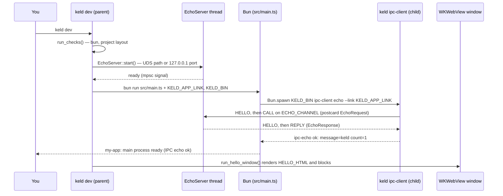

# 03 — API and CLI surface

Keld has no HTTP API and no server. Its "API" is four surfaces, and only three of them
exist as code today:

| Surface | Status | Where it lives |
|---|---|---|
| The `keld` CLI | Real: 7 verbs + `--version` | [`crates/keld-cli/src/`](../../crates/keld-cli/src/) |
| Public Rust crate APIs | Real for `keld-ipc`, `keld-wv`, `keld-core`, `keld-cli`; type-only elsewhere | [`crates/`](../../crates/) |
| The template app contract (what an app developer writes) | Real, one template | [`crates/keld-cli/templates/hello/`](../../crates/keld-cli/templates/hello/) |
| `@keld/*` TypeScript packages | **Does not exist.** [`packages/`](../../packages/) is an empty directory | planned in [`docs/architecture/01-overview.md`](../architecture/01-overview.md) §3 |

Everything below was verified by reading the source and running the commands on macOS
(aarch64, `rustc 1.93.0`, `bun 1.4.0`) in August 2026. Where output is quoted, it is
copied from a real run (long temporary paths shortened to `/tmp/demo/…`); where a
message is quoted from a `Display` impl that this document did not execute, that is
called out.

---

## 1. The `keld` CLI

### 1.1 How to run it today

There is no npm wrapper and no installer. The binary is `keld`, produced by the
`keld-cli` crate ([`crates/keld-cli/Cargo.toml`](../../crates/keld-cli/Cargo.toml)
declares `[[bin]] name = "keld"`):

```bash
# From the repo, either form works:
cargo run -p keld-cli -- <verb> [args]
cargo build -p keld-cli && ./target/debug/keld <verb> [args]
```

`cargo run` keeps your current working directory, which matters for `create`, `dev`, and
`doctor` — all three resolve paths relative to the cwd.

### 1.2 Dispatch, in one place

Every verb is matched by hand in
[`crates/keld-cli/src/main.rs`](../../crates/keld-cli/src/main.rs) — there is no
`clap`, no flag parser, and no subcommand framework. Arguments are read positionally
from `std::env::args()`.

| Invocation | Implemented in | Effect |
|---|---|---|
| `keld --version` / `keld -V` | `main.rs` | prints `keld <CARGO_PKG_VERSION>` |
| `keld` (no args) | `main.rs::print_usage` | usage on **stderr**, exit 0 |
| `keld create <name>` | [`create.rs`](../../crates/keld-cli/src/create.rs) | scaffolds the hello template into `./<name>` |
| `keld dev` | [`dev.rs`](../../crates/keld-cli/src/dev.rs) | checks env, starts echo server, spawns Bun main, opens the window (macOS) |
| `keld doctor` | [`doctor.rs`](../../crates/keld-cli/src/doctor.rs) | prints `[ok]`/`[FAIL]` per check |
| `keld doctor --json` | [`doctor.rs`](../../crates/keld-cli/src/doctor.rs) | emits the findings array used by agents and MCP |
| `keld mcp serve` | [`mcp/`](../../crates/keld-cli/src/mcp/) | serves doctor/docs/permissions tools over stdio |
| `keld hello` | `keld_core::run_hello_window` | opens the WKWebView hello window (macOS) |
| `keld ipc-echo` | `main.rs::run_ipc_echo_demo` | in-process kipc round-trip demo |
| `keld ipc-client echo --link <path>` | [`echo_link.rs`](../../crates/keld-cli/src/echo_link.rs) | one echo call against an existing app-link; used by the template |
| anything else | `main.rs` | ``keld: unknown command `<x>` ``, usage, exit **1** |

### 1.3 `keld --version`

```bash
$ keld --version
keld 0.0.1
```

Exit 0. The version is the workspace version from
[`Cargo.toml`](../../Cargo.toml) (`[workspace.package] version = "0.0.1"`), baked in via
`env!("CARGO_PKG_VERSION")`. `-V` is an alias for the same arm.

### 1.4 `keld` with no arguments — the usage text

```bash
$ keld
keld 0.0.1 (pre-alpha)
commands:
  create <name>   Scaffold the hello-world template
  dev             Run the app (Bun main + IPC echo + window)
  doctor [--json] Check local toolchain and project layout
  mcp serve       Speak MCP over stdio (doctor/docs/permissions)
  hello           Open the macOS WKWebView hello window
  ipc-echo        Run the typed kipc echo round-trip demo
  ipc-client      Internal: kipc client helpers for templates
  --version       Print version
```

Two things worth knowing: the usage block goes to **stderr**, not stdout, and running
with no arguments exits **0**. An unknown verb prints ``keld: unknown command `bogus` ``
first, then the same block, and exits **1**.

### 1.5 `keld create <name>`

Writes the five embedded template files into `./<name>`. Nothing is downloaded and
nothing is installed; the files are compiled into the binary with `include_str!`
([`template.rs`](../../crates/keld-cli/src/template.rs)).

```bash
$ keld create my-app
Created keld project at /tmp/demo/my-app
Next: cd my-app && keld dev

$ find my-app -type f | sort
my-app/.gitignore
my-app/index.html
my-app/keld.config.ts
my-app/package.json
my-app/src/main.ts
```

**Name validation** (`create::validate_name`) rejects a name that is empty, contains
anything outside `[a-z0-9-]`, or starts/ends with a hyphen. Uppercase is a hard reject —
there is no auto-lowercasing:

```bash
$ keld create Bad-Name
KELD-CLI-020: invalid project name — use only lowercase letters, digits, and hyphens. Use lowercase letters, numbers, and hyphens.
# exit 1
```

(The doubled "use lowercase…" is the real message: `CreateError::InvalidName` appends a
generic hint after the specific `reason`.)

An existing directory is refused rather than merged into:

```bash
$ keld create my-app
KELD-CLI-021: directory already exists — /tmp/demo/my-app. Choose another name or remove the folder.
# exit 1
```

`{{name}}` is the only templating construct: `create_project` does a literal
`contents.replace("{{name}}", name)` over every file. There is no template engine, no
conditionals, and no per-file logic.

### 1.6 `keld dev`

The one verb that ties everything together. Sequence, from
[`dev.rs::run_dev`](../../crates/keld-cli/src/dev.rs):

1. **Find the project root.** `main.rs` calls `find_project_root(&cwd)`, which walks up
   from the cwd looking for a `keld.config.ts` file. If none is found anywhere up the
   tree it falls back to the cwd (`unwrap_or(cwd)`) — so step 2 is what produces the
   error message, not the search.
2. **Run the doctor checks.** Any failure aborts with `KELD-CLI-032` and the full check
   list, before any process is spawned.
3. **Start the echo server** on a fresh loopback endpoint, and block until it signals
   ready (an `mpsc` channel, not a sleep). On Unix that endpoint is
   `$TMPDIR/keld-echo-<pid>.sock`; on Windows it is an ephemeral `127.0.0.1` TCP port
   ([`echo_link.rs::EchoEndpoint::ephemeral`](../../crates/keld-cli/src/echo_link.rs)).
   The server accepts exactly **one** connection.
4. **Spawn Bun**: `bun run <root>/src/main.ts`, cwd set to the project root, stdout and
   stderr inherited, with two environment variables set:
   - `KELD_APP_LINK` — the socket path (Unix) or port number (Windows).
   - `KELD_BIN` — `std::env::current_exe()`, i.e. the same `keld` binary, so the child
     can call back into `keld ipc-client`.
5. **Open the window** (macOS only) via `keld_core::run_hello_window()`.

Real output from a session in a freshly scaffolded `my-app` (a native window opens at
the same time; these are the lines the Bun child prints):

```bash
$ keld dev
ipc-echo ok: message="keld" count=1
my-app: main process ready (IPC echo ok)
```

The doctor-failure path, verified in a directory holding a `keld.config.ts` but no
`src/main.ts`:

```bash
$ keld dev
KELD-CLI-032: environment checks failed:
  [ok] bun — found bun 1.4.0
  [FAIL] project — missing keld.config.ts or src/main.ts — run `keld create <name>` first
  [ok] webview — macOS WKWebView hello window available via `keld dev`

# exit 1
```

Three behaviors that will surprise you if you only read the ROADMAP:

- **The window does not render your `index.html`.** It renders
  `keld_wv::HELLO_HTML`, a constant compiled into the crate
  ([`crates/keld-wv/src/hello/mod.rs`](../../crates/keld-wv/src/hello/mod.rs)). Nothing
  in the Rust tree reads the project's `index.html` — grep it and you will find only the
  template writer and its test.
- **Closing the window ends the process.** The macOS backend hands the thread to tao's
  `EventLoop::run`, which never returns and exits the process itself
  ([`wkwebview/mod.rs::run_until_closed`](../../crates/keld-wv/src/wkwebview/mod.rs)).
  The Bun exit-code check after the window call in `run_dev` is therefore unreachable on
  macOS.
- **Off macOS there is no window at all.** `run_dev` prints
  `keld dev: webview window not available on this OS yet; waiting for Bun…` and blocks
  on the Bun child instead, propagating its exit code as `KELD-CLI-031`.

### 1.7 `keld doctor`

Runs the checks in [`doctor.rs::run_checks`](../../crates/keld-cli/src/doctor.rs) and
prints one line each, format `[ok|FAIL] <label> — <detail>`. Exit is **1** if any check
failed, **0** otherwise. There are two checks on every platform and a third on macOS:

| Label | Passes when | Detail on failure |
|---|---|---|
| `bun` | `bun --version` runs and exits 0 | ``install Bun from https://bun.sh and ensure `bun` is on PATH`` |
| `project` | no project root found **or** the root has both `keld.config.ts` and `src/main.ts` | ``missing keld.config.ts or src/main.ts — run `keld create <name>` first`` |
| `webview` (macOS only) | always | n/a — informational, never fails |

Outside a project:

```bash
$ keld doctor
[ok] bun — found bun 1.4.0
[ok] project — no project directory (run inside a scaffolded app for layout checks)
[ok] webview — macOS WKWebView hello window available via `keld dev`
```

Inside a scaffolded project:

```bash
$ cd my-app && keld doctor
[ok] bun — found bun 1.4.0
[ok] project — keld project at /tmp/demo/my-app
[ok] webview — macOS WKWebView hello window available via `keld dev`
```

A half-scaffolded project (config present, `src/main.ts` missing) — exit 1:

```bash
$ keld doctor
[ok] bun — found bun 1.4.0
[FAIL] project — missing keld.config.ts or src/main.ts — run `keld create <name>` first
[ok] webview — macOS WKWebView hello window available via `keld dev`
```

`--json` emits the same top-level findings array returned by the MCP `keld_doctor`
tool. The other doctor flags in the specs (`--permissions`, `--web-compat`, `--attack`)
are not implemented.

### 1.8 `keld hello`

Calls `keld_core::run_hello_window()`, which opens a 960×640 window titled "Keld"
rendering `HELLO_HTML`, and blocks until you close it. Equivalent to
`just hello` / `cargo run -p keld-host -- --hello`, which goes through the host binary
instead of the CLI.

This document did not run it (it blocks on a window). Off macOS the call returns
`WvError::UnsupportedPlatform`, whose `Display` impl in
[`crates/keld-wv/src/error.rs`](../../crates/keld-wv/src/error.rs) renders as:

```
KELD-WV-001: no webview backend for `linux` yet. Track KEL-27 (Windows) / KEL-28 (Linux) or run on macOS.
```

(with the runtime `std::env::consts::OS` substituted), and `main.rs` exits 1.

### 1.9 `keld ipc-echo`

A self-contained kipc demo: starts an `EchoServer` on a loopback endpoint in a worker
thread, performs one `echo_call` from the main thread, joins, prints the response. No
Bun, no window, no project needed.

```bash
$ keld ipc-echo
ipc-echo ok: message="keld" count=1
```

The request is hardcoded in `main.rs`: `EchoRequest { message: "keld", count: 1 }`.

### 1.10 `keld ipc-client echo --link <path>`

The client half, split out so the Bun template can invoke it as a child process. It is
listed in the usage text as "Internal", and the only flag it understands is `--link`
(parsed by a hand-rolled loop over the argument slice — `--link=<path>` is *not*
supported, it must be two arguments).

```bash
$ keld ipc-client
usage: keld ipc-client echo --link <path>
# exit 1

$ keld ipc-client echo
KELD-CLI-040: missing --link (set KELD_APP_LINK from `keld dev`)
# exit 1
```

On success it prints the same `ipc-echo ok: message=… count=…` line. The message is
again hardcoded (`"keld"`, count 1) — this verb takes no payload arguments.

### 1.11 `keld mcp serve`

Runs the official, read-only MCP server over stdio. It exposes `keld_doctor`,
`keld_docs_search`, and `keld_permissions_explain` in fixed order. Registration,
tool-ordering guidance, and request examples are in
[`07-mcp-server.md`](07-mcp-server.md).

An unknown or missing `mcp` subcommand prints `usage: keld mcp serve` to stderr and
exits **2**. The server opens no network listener.

### 1.12 Exit codes and machine-readable output

| Today (verified) | Specified target |
|---|---|
| `0` success, `1` general failure, `2` for `keld mcp` misuse | `0` ok · `1` failure · `2` misuse · `3` environment ([`docs/architecture/07-agent-experience.md`](../architecture/07-agent-experience.md) §7) |
| `keld doctor --json` emits a findings array | `--json` on anything with parseable output (same section) |

The full target exit-code and machine-readable-output contract is not implemented yet.

### 1.13 Error codes you will see

Codes are `KELD-<AREA>-<NNN>`, and by convention every message states the fix
([`AGENTS.md`](../../AGENTS.md) → `docs/architecture/07-agent-experience.md` §2).

| Code | Raised by | Meaning |
|---|---|---|
| `KELD-CLI-010` | the template's `src/main.ts` | `KELD_APP_LINK` unset — the app was run with `bun` directly instead of `keld dev` |
| `KELD-CLI-020/021/022` | `create.rs` | invalid name / directory exists / template write failed |
| `KELD-CLI-030/031/032` | `dev.rs` | dev I/O error / dev session failed / environment checks failed |
| `KELD-CLI-040` | `main.rs` | `ipc-client echo` called without `--link` |
| `KELD-IPC-001..005` | [`keld-ipc/src/lib.rs`](../../crates/keld-ipc/src/lib.rs) | I/O · bad frame header · codec · payload too large · protocol error |
| `KELD-WV-001..007` | [`keld-wv/src/error.rs`](../../crates/keld-wv/src/error.rs) | unsupported platform · window · webview · event loop · navigate · script · unknown webview id |

The `KELD-WV-*` messages are covered by a test that asserts both the code and the fix
hint are present (`error::tests::display_messages_carry_error_codes_and_fix_guidance`) —
if you change that wording, the test is the contract.

---

## 2. What the README advertises that does not exist yet

[`README.md`](../../README.md) opens with a three-line pitch:

```bash
cd my-electron-app
bunx keld migrate   # analyzes your app, generates config, aliases electron → @keld/electron
bunx keld dev       # your app runs — no Chromium bundle, no Node, no rewrite
bunx keld build     # signed installers + kilobyte-scale delta updates
```

Only one of those three verbs exists, and none of them are reachable via `bunx`. This is
the honest mapping:

| README claim | Reality in this repo | Where it is planned |
|---|---|---|
| `keld migrate` | No `migrate` arm in `main.rs`; no analyzer code anywhere | ROADMAP **Phase 2** exit criterion ("electron-quick-start runs unmodified via `keld migrate && keld dev`"); spec [`04-electron-compat.md`](../architecture/04-electron-compat.md), [`06-runtime-and-tooling.md`](../architecture/06-runtime-and-tooling.md) §2 |
| `keld build` | No `build` arm; `keld-pack` is an enum of installer formats with no code behind it | ROADMAP **Phase 3** (`keld-pack` + `keld-update`); spec `06-runtime-and-tooling.md` §2–3 |
| `bunx keld …` | No npm package resolves a `keld` binary. `packages/` is empty | `@keld/cli` with per-platform `optionalDependencies`; spec `06-runtime-and-tooling.md` §2, ROADMAP **Phase 1** exit ("runs on macOS+Windows from `bunx keld dev`") |
| `@keld/electron` aliasing | `keld-compat` contains a single `Tier` enum; no shim | ROADMAP **Phase 2** (Tier 1) / **Phase 4** (Tier 2) |
| Delta updates, signed installers | `keld-update` is a `Channel` enum; `keld-pack` is a `Format` enum | ROADMAP **Phase 3** |
| `keld dev` | **Exists**, but as described in §1.6: Bun child + echo round-trip + a fixed hello window, not your renderer | Phase 1 in progress |
| `keld gen`, `keld ext` | Not implemented | `06-runtime-and-tooling.md` §2 |

The README's workspace-layout block does label the npm packages `(upcoming)`; the
three-line pitch does not carry the same caveat. Treat the pitch as the product
statement, not as documentation of the current binary.

---

## 3. Public Rust crate APIs

Workspace version `0.0.1`, edition 2024, MSRV/toolchain 1.93.0. Every public item is
documented (`missing_docs` is a workspace lint) and `cargo doc --workspace --no-deps`
builds clean, so `cargo doc --open` is a legitimate way to browse this.

### 3.1 `keld_ipc` — the kipc wire protocol (the most complete crate)

Spec: [`docs/architecture/02-ipc.md`](../architecture/02-ipc.md). Crate rules:
[`crates/keld-ipc/AGENTS.md`](../../crates/keld-ipc/AGENTS.md). Any change to the items
below is a **wire-protocol review gate**.

Constants ([`lib.rs`](../../crates/keld-ipc/src/lib.rs)):

| Item | Value | Note |
|---|---|---|
| `MAGIC: u16` | `u16::from_le_bytes(*b"KI")` | first two header bytes |
| `PROTOCOL_VERSION: u8` | `1` | mismatch → `HeaderError::BadVersion` |
| `HEADER_LEN: usize` | `16` | asserted as a protocol fact, independent of struct layout |

Framing ([`frame.rs`](../../crates/keld-ipc/src/frame.rs)) — 16 bytes, little-endian:

```text
magic:u16 | ver:u8 | kind:u8 | flags:u16 | channel:u16 | corr:u32 | len:u32
```

- `FrameHeader { kind, flags, channel, corr, len }` with `encode() -> [u8; 16]` and
  `decode(&[u8; 16]) -> Result<Self, HeaderError>`.
- `FrameKind` (`#[repr(u8)]`): `Hello=0`, `Call=1`, `Reply=2`, `Err=3`, `Event=4`,
  `StreamOpen=5`, `StreamChunk=6`, `StreamClose=7`, `Cancel=8`, `Grant=9`, `Ping=10`,
  plus `from_u8`. All eleven round-trip through the header; only `Hello`, `Call`,
  `Reply`, and `Ping` are *handled* by any session code today.
- `ChannelId(pub u16)`, `CorrelationId(pub u32)` — newtypes, both `Copy`.
- `FLAG_RAW: u16 = 1 << 0` — payload is raw bytes rather than codec-encoded.
- `HeaderError::{BadMagic, BadVersion, BadKind}`.

Transport and session:

| Function | Module | Signature shape |
|---|---|---|
| `read_frame` | [`link`](../../crates/keld-ipc/src/link.rs) | `<S: Read>(&mut S) -> Result<(FrameHeader, Vec<u8>), IpcError>` |
| `write_frame` | `link` | `<S: Write>(&mut S, kind, flags, channel, corr, payload) -> Result<(), IpcError>` |
| `handshake` | `link` | `<S: Read + Write>(&mut S) -> Result<(), IpcError>` — writes `Hello`, expects `Hello` |
| `encode` / `decode` | [`codec`](../../crates/keld-ipc/src/codec.rs) | postcard, over `serde::Serialize` / `DeserializeOwned` |
| `serve_echo_session` | [`session`](../../crates/keld-ipc/src/session.rs) | `<S: Read + Write>(&mut S) -> Result<(), IpcError>` — handshake, then loop until EOF |
| `echo_call` | `session` | `<S: Read + Write>(&mut S, &EchoRequest) -> Result<EchoResponse, IpcError>` |

The echo vertical slice ([`echo.rs`](../../crates/keld-ipc/src/echo.rs)):
`ECHO_CHANNEL: ChannelId = ChannelId(1)`, `EchoRequest { message: String, count: u32 }`,
`EchoResponse { message: String, count: u32 }`, and `handle_echo(&[u8]) -> Result<Vec<u8>, IpcError>`.

`IpcError`: `Io`, `Header`, `Codec`, `PayloadTooLarge`, `Protocol { detail }` — codes
`KELD-IPC-001..005`. Note this crate hand-writes `Display`/`Error` rather than deriving
`thiserror`, and has exactly two dependencies (`postcard`, `serde`).

Not built yet, despite being named all over the specs: channel-name resolution at
handshake, the shm bulk lane, credit-window backpressure, cancellation, streaming, and
`.k.ts` schema codegen.

### 3.2 `keld_wv` — the webview engine layer

Spec: [`docs/architecture/05-webview-and-native.md`](../architecture/05-webview-and-native.md).
Crate rules: [`crates/keld-wv/AGENTS.md`](../../crates/keld-wv/AGENTS.md). Trait changes
are a **public API review gate** *and* a design review.

The contract is one trait with six methods
([`engine.rs`](../../crates/keld-wv/src/engine.rs)); every method returns
`Result<_, WvError>` because a stale id must be a typed error, never a panic:

| Method | Signature |
|---|---|
| `create` | `(&mut self, spec: &WebviewSpec) -> Result<WebviewId, WvError>` |
| `navigate` | `(&mut self, id: WebviewId, target: NavTarget) -> Result<(), WvError>` |
| `eval` | `(&mut self, id: WebviewId, script: &str) -> Result<(), WvError>` |
| `set_bounds` | `(&mut self, id: WebviewId, rect: Rect) -> Result<(), WvError>` |
| `devtools` | `(&mut self, id: WebviewId, action: DevtoolsAction) -> Result<(), WvError>` |
| `destroy` | `(&mut self, id: WebviewId) -> Result<(), WvError>` |

The module docs at the top of `engine.rs` are worth reading in full: they list, with
reasons, every deviation from the normative trait sketch in spec 05 §1 — `post` and
`register_scheme` omitted, `eval` simplified, no `HostHooks`/`Anchor`, no `Send`
supertrait. That file is the model for how this repo documents a deliberate gap.

Supporting types:

- `WebviewSpec { title: String, size: LogicalSize, initial: NavTarget }`. `Default` is
  the hello geometry: title `"Keld"`, 960×640, `NavTarget::Html("")` — asserted by
  `engine::tests::webview_spec_default_matches_hello_slice`.
- `NavTarget::{ Html(String), Url(String) }`
- `LogicalSize { width: f64, height: f64 }`, `Rect { x, y, width, height }` (logical points)
- `DevtoolsAction::{ Open, Close }`
- `WebviewId(pub u32)`, `EnginePolicy::{ System (default), Pinned }` (declared in
  [`lib.rs`](../../crates/keld-wv/src/lib.rs); nothing reads `EnginePolicy` yet)
- `WvError` — seven variants, codes `KELD-WV-001..007`

Three platform extension traits are declared, all **marker-level** (`: WebEngine`, zero
methods), and all compiled on every platform so workspace clippy keeps the layout honest:
`WkWebViewEngineExt`, `WebView2EngineExt`, `WebKitGtkEngineExt`. They exist to fix the
shape the real backends will grow into, mirroring wry's per-platform extension traits.

Backends:

| Module | Platform | State |
|---|---|---|
| `wkwebview` (`#[cfg(target_os = "macos")]`) | macOS | **Live.** `WkWebViewEngine::new()` / `run_until_closed()` / `run_hello(title, html)`; the only `WebEngine` impl in the tree. Built on tao 0.35 + wry 0.55 as interim scaffolding, to be replaced by direct objc2 bindings |
| [`webview2`](../../crates/keld-wv/src/webview2/mod.rs) | Windows | **Stub.** One function, `unavailable() -> WvError`, pointing at KEL-27 |
| [`webkitgtk`](../../crates/keld-wv/src/webkitgtk/mod.rs) | Linux | **Stub.** Same shape, pointing at KEL-28 |

Hello-window entry points, re-exported at crate root: `HELLO_HTML` (the dark-background
"Hello from WKWebView" document) and `run_hello_window(title: &str, html: &str)`.

`unsafe_code` is `deny` workspace-wide; `wkwebview/mod.rs` carries a module-scope
`#![allow(unsafe_code)]` with a SAFETY comment explaining the UI-thread invariant. That
is one of the two sanctioned locations in the whole repo.

### 3.3 `keld_core` — the host runtime (two public items)

```rust
pub fn run_hello_window() -> Result<(), keld_wv::WvError>  // delegates to keld_wv::run_hello_window("Keld", HELLO_HTML)
pub const VERSION: &str                                    // = CARGO_PKG_VERSION
```

That is the entire public surface today
([`crates/keld-core/src/lib.rs`](../../crates/keld-core/src/lib.rs)). The event loop,
window registry, lifecycle, and kipc↔native dispatch described in spec 01 do not exist
yet.

### 3.4 `keld_cli` — a library, not just a binary

`keld-cli` builds both the `keld` binary and a `keld_cli` lib
([`lib.rs`](../../crates/keld-cli/src/lib.rs)) so integration tests and future
subcommands can call in. Five modules:

| Module | Public items |
|---|---|
| `create` | `CreateError::{InvalidName, Exists, Io}`, `validate_name(&str)`, `create_project(parent: &Path, name: &str) -> Result<PathBuf, CreateError>` |
| `dev` | `DevError::{Doctor, Io, Runtime}`, `find_project_root(&Path) -> Option<PathBuf>`, `run_dev(&Path) -> Result<(), DevError>` |
| `doctor` | `Check { label, ok, detail }`, `run_checks(Option<&Path>) -> Vec<Check>`, `all_ok(&[Check]) -> bool` |
| `echo_link` | `EchoEndpoint` (`Unix(PathBuf)` on unix, `Tcp(u16)` on windows), `EchoServer::{start, link, join}`, `echo_roundtrip(link: &str, &EchoRequest) -> Result<EchoResponse, IpcError>` |
| `template` | `TemplateFile { path, contents }`, `HELLO_TEMPLATE: &[TemplateFile]` |

`EchoServer` is single-shot by design: it binds, signals ready over an `mpsc::Sender<()>`,
accepts one connection, serves it, and removes the Unix socket on `join()` or `Drop`.

### 3.5 Placeholder crates — types only, no behavior

These compile, are documented, and have no functions. Do not mistake them for working
subsystems:

| Crate | Everything it exposes |
|---|---|
| `keld_guard` | `Principal::{AppProcess, Webview{id,generation}, Plugin{id}}`, `Decision::{Allow, Deny(DenyReason)}`, `DenyReason::{NotGranted, OutOfScope, ChannelForbidden}`. **There is no `check()` function** — the capability engine does not exist yet |
| `keld_native` | `MODULES: &[&str]` — the 15 planned module names (`window`, `menu`, `tray`, `dialog`, …) |
| `keld_runtime` | `RestartPolicy { max_crashes: 3, window_secs: 30 }` (via `Default`). No supervisor |
| `keld_update` | `Channel::{Stable, Beta, Canary}` |
| `keld_pack` | `Format::{App, Dmg, Nsis, Msi, Deb, Rpm, AppImage}` |
| `keld_compat` | `Tier::{One, Two, Three}` |
| `keld_host` | Binary crate. Prints a pre-alpha banner; `--hello` opens the window |

`keld-guard`'s `DenyReason` text is nonetheless treated as API: its crate `AGENTS.md`
says "Deny text is API — test it", and it is tested.

---

## 4. The planned `@keld/*` TypeScript packages

**None of these exist.** [`packages/`](../../packages/) is an empty directory; there is
no `package.json`, no `bun.lock`, and no TypeScript anywhere in the repo except the two
template files. Listed here so you recognize the names when the specs use them
([`docs/architecture/01-overview.md`](../architecture/01-overview.md) §3):

| Package | Intended role | Earliest phase (ROADMAP) |
|---|---|---|
| `@keld/api` | The real typed SDK for the app process — windows, native APIs, channels | Phase 1 (minimal: `createWindow`, `invoke`/`on`) |
| `@keld/electron` | Electron compat shim implementing `electron`'s module surface on top of `@keld/api`; never imports Electron at runtime | Phase 2 (Tier 1) |
| `@keld/web` | Renderer-side bridge (`window.keld`) and polyfill-pack loader | Phase 2 |
| `@keld/cli` | npm wrapper resolving the per-platform `keld` binary via `optionalDependencies` — what makes `bunx keld` work | Phase 1 |
| `@keld/schema` | Channel/contract definitions and TS↔Rust codegen; generated output is never hand-edited | Phase 2 |
| `create-keld` | `bun create keld` / `npm create keld` scaffolding, richer than today's single embedded template | Phase 3 |

When they land they inherit the TypeScript rules already written down in
[`AGENTS.md`](../../AGENTS.md): strict mode, no `any` in public API, generated code never
hand-edited.

---

## 5. The template app contract — what an app developer actually writes

`keld create <name>` produces exactly five files. This is, today, the whole "app
developer API".

```
my-app/
├─ .gitignore        node_modules/ and .keld/
├─ index.html        renderer document (see caveat below)
├─ keld.config.ts    app config (see caveat below)
├─ package.json      name, private, type: module, start script
└─ src/main.ts       the app main process — the only file with behavior
```

### 5.1 `src/main.ts` — the main process

Source: [`crates/keld-cli/templates/hello/src/main.ts`](../../crates/keld-cli/templates/hello/src/main.ts).

```ts
const link = process.env.KELD_APP_LINK;
if (!link) {
  console.error(
    "KELD-CLI-010: KELD_APP_LINK is unset — run the app with `keld dev`, not `bun` directly.",
  );
  process.exit(1);
}

const keld = process.env.KELD_BIN ?? "keld";
const proc = Bun.spawn([keld, "ipc-client", "echo", "--link", link], {
  stdout: "inherit",
  stderr: "inherit",
  env: process.env,
});

const code = await proc.exited;
if (code !== 0) {
  process.exit(code);
}

console.log("{{name}}: main process ready (IPC echo ok)");
```

Read it as a contract statement in four parts:

1. **The host hands the app process its link through the environment.** `KELD_APP_LINK`
   (socket path or port) and `KELD_BIN` (path to the `keld` binary) are the entire
   handshake surface today. The file guards on `KELD_APP_LINK` and fails with a
   code-carrying message rather than crashing — the framework's error convention applied
   inside a template.
2. **The app process is Bun-specific**, not Node-compatible: it uses `Bun.spawn` and
   top-level `await`.
3. **There is no TypeScript SDK.** The template speaks kipc by shelling out to
   `keld ipc-client echo`. The file's own comment says so: "Full typed bridge codegen
   lands in `@keld/api`; this slice uses the CLI client." Expect this whole file to be
   replaced by `import { … } from "@keld/api"` once that package exists.
4. **`{{name}}` is substituted at scaffold time**, so a project called `my-app` prints
   `my-app: main process ready (IPC echo ok)`.

Verified failure mode — running the file outside `keld dev`:

```bash
$ bun run src/main.ts
KELD-CLI-010: KELD_APP_LINK is unset — run the app with `keld dev`, not `bun` directly.
# exit 1
```

### 5.2 `keld.config.ts` — declared, not yet parsed

```ts
/** Keld app config — compiled by the CLI at dev/build time. */
export default {
  name: "my-app",
  entry: "src/main.ts",
  renderer: "index.html",
} as const;
```

Be precise about what this does today: **nothing reads its contents.** Grep the crates
and the only uses are `root.join("keld.config.ts").is_file()` in
[`dev.rs`](../../crates/keld-cli/src/dev.rs) and
[`doctor.rs`](../../crates/keld-cli/src/doctor.rs). The file is a *project-root marker*.
`entry` is ignored — `run_dev` hardcodes `src/main.ts`. `renderer` is ignored — the
window renders `keld_wv::HELLO_HTML`. Changing the values changes no behavior.

`keld.config.ts` is nonetheless one of only four config filenames the project permits
(`keld.config.ts`, `keld.permissions.jsonc`, `keld.build.ts`, `keld.compat.ts` — see
`AGENTS.md` § Naming); introducing a fifth requires a spec change.

### 5.3 `index.html` and `package.json`

`index.html` is a plain document titled `{{name}}`; it is written to disk and never
loaded by anything. `package.json` declares `type: "module"` and a `start` script
(`bun run src/main.ts`) — which, run directly, hits the `KELD-CLI-010` guard above. There
are no dependencies to install, so `bun install` is not part of the flow yet.

### 5.4 The full loop, end to end



The integration test [`crates/keld-cli/tests/bun_echo.rs`](../../crates/keld-cli/tests/bun_echo.rs)
exercises everything in that diagram except the window, and is the fastest way to see
the contract asserted in code.

---

## 6. Where to go next

| You want | Read |
|---|---|
| What Keld is and how far along it is | [`01-project-summary.md`](./01-project-summary.md) |
| How the pieces fit together | [`02-architecture-guide.md`](./02-architecture-guide.md) |
| The kipc frame layout and on-disk/on-wire contracts in depth | [`04-wire-formats-and-contracts.md`](./04-wire-formats-and-contracts.md) |
| How to build, test, and get a PR merged | [`05-development-guide.md`](./05-development-guide.md) |
| Which document binds you, and in what order to read them | [`06-documentation-map.md`](./06-documentation-map.md) |
| The normative specs behind everything marked "planned" here | [`docs/architecture/`](../architecture/) |
| Engineering rules and review gates | [`AGENTS.md`](../../AGENTS.md) plus the per-crate `AGENTS.md` files |
| Phase ordering for what does not exist yet | [`ROADMAP.md`](../../ROADMAP.md) |

Note that `docs/`, `ROADMAP.md`, `competitors/`, `llms.txt`, and `.github/` are all
excluded by [`.gitignore`](../../.gitignore) as maintainer-local material — see
[`05-development-guide.md`](./05-development-guide.md) §11.
