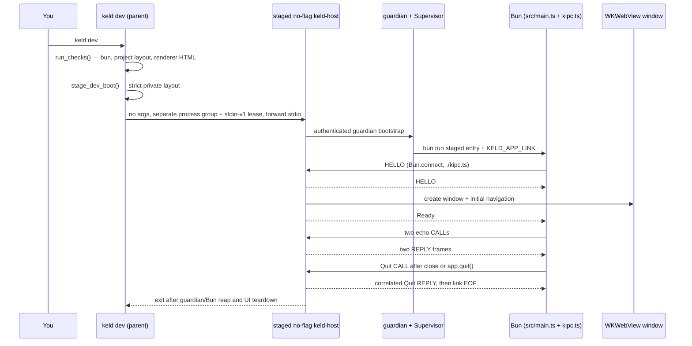

# 03 — API and CLI surface

Keld has no HTTP API and no server. Its "API" is four surfaces:

| Surface | Status | Where it lives |
|---|---|---|
| The `keld` CLI | Real: 7 verbs + `--version` | [`crates/keld-cli/src/`](../../crates/keld-cli/src/) |
| Public Rust crate APIs | Real for `keld-ipc`, `keld-wv`, `keld-core`, `keld-cli`; type-only elsewhere | [`crates/`](../../crates/) |
| The template app contract (what an app developer writes) | Real, one template | [`crates/keld-cli/templates/hello/`](../../crates/keld-cli/templates/hello/) |
| `@keld/*` TypeScript packages | **Partial (KEL-72).** [`packages/@keld/electron`](../../packages/@keld/electron/) implements `app.whenReady` / `app.quit` / `window-all-closed` over `LIFECYCLE_CHANNEL`; the rest of `@keld/*` is unbuilt | [`docs/architecture/01-overview.md`](../architecture/01-overview.md) §3 |

Everything below was verified by reading the source and running the commands on macOS
(aarch64, `rustc 1.93.0`, `bun 1.4.0`) in August 2026. Where output is quoted, it is
copied from a real run (long temporary paths shortened to `/tmp/demo/…`); where a
message is quoted from a `Display` impl that this document did not execute, that is
called out.

---

## 1. The `keld` CLI

### 1.1 How to run it today

There is no npm wrapper and no installer. The binary is `keld`, produced by the
`keld-cli` crate ([`crates/keld-cli/Cargo.toml`](../../crates/keld-cli/Cargo.toml)
declares `[[bin]] name = "keld"`):

```bash
# From the repo, either form works:
cargo run -p keld-cli -- <verb> [args]
cargo build -p keld-cli && ./target/debug/keld <verb> [args]
```

`cargo run` keeps your current working directory, which matters for `create`, `dev`, and
`doctor` — all three resolve paths relative to the cwd.

### 1.2 Dispatch, in one place

Every verb is matched by hand in
[`crates/keld-cli/src/main.rs`](../../crates/keld-cli/src/main.rs) — there is no
`clap`, no flag parser, and no subcommand framework. Arguments are read positionally
from `std::env::args()`.

| Invocation | Implemented in | Effect |
|---|---|---|
| `keld --version` / `keld -V` | `main.rs` | prints `keld <CARGO_PKG_VERSION>` |
| `keld` (no args) | `main.rs::print_usage` | usage on **stderr**, exit 0 |
| `keld create <name>` | [`create.rs`](../../crates/keld-cli/src/create.rs) | scaffolds the hello template into `./<name>` |
| `keld dev` | [`dev.rs`](../../crates/keld-cli/src/dev.rs) | checks env; on macOS and Windows stages and launches the no-flag host with a private liveness lease; Linux fails closed until its KEL-96/T4 no-flag row |
| `keld doctor` | [`doctor.rs`](../../crates/keld-cli/src/doctor.rs) | prints `[ok]`/`[FAIL]` per check |
| `keld doctor --json` | [`doctor.rs`](../../crates/keld-cli/src/doctor.rs) | emits the findings array used by agents and MCP |
| `keld mcp serve` | [`mcp/`](../../crates/keld-cli/src/mcp/) | serves doctor/docs/permissions tools over stdio |
| `keld hello` | `keld_core::run_hello_window` | opens the WKWebView hello window (macOS) |
| `keld ipc-echo` | `main.rs::run_ipc_echo_demo` | in-process kipc round-trip demo |
| `keld ipc-client echo --link <path>` | [`echo_link.rs`](../../crates/keld-core/src/echo_link.rs) | one-shot echo against an existing app-link; the hello template speaks kipc via `AppLinkSession` instead |
| `keld build` / `migrate` / `gen` / `ext` | [`verb.rs`](../../crates/keld-cli/src/verb.rs) | **`KELD-CLI-045`**, usage, exit **2** — reserved, not live |
| anything else | [`verb.rs`](../../crates/keld-cli/src/verb.rs) | **`KELD-CLI-046`**, usage, exit **2** |

### 1.3 `keld --version`

```bash
$ keld --version
keld 0.0.1
```

Exit 0. The version is the workspace version from
[`Cargo.toml`](../../Cargo.toml) (`[workspace.package] version = "0.0.1"`), baked in via
`env!("CARGO_PKG_VERSION")`. `-V` is an alias for the same arm.

### 1.4 `keld` with no arguments — the usage text

```bash
$ keld
keld 0.0.1 (pre-alpha)
commands:
  create <name>   Scaffold the hello-world template
  dev             Run the app (Bun main + IPC echo + window)
  doctor [--json] Check local toolchain and project layout
  mcp serve       Speak MCP over stdio (doctor/docs/permissions)
  hello           Open the macOS WKWebView hello window
  ipc-echo        Run the typed kipc echo round-trip demo
  ipc-client      Internal: kipc client helpers for templates
  --version       Print version
reserved (not live): build, migrate, gen, ext
```

Two things worth knowing: the usage block goes to **stderr**, not stdout, and running
with no arguments exits **0**. A reserved verb (`migrate`, `build`, `gen`, `ext`)
prints **`KELD-CLI-045`** first, then the same block, and exits **2**. A garbage verb
prints **`KELD-CLI-046`** first, then the same block, and exits **2**.

### 1.5 `keld create <name>`

Writes the five embedded template files into `./<name>`. Nothing is downloaded and
nothing is installed; the files are compiled into the binary with `include_str!`
([`template.rs`](../../crates/keld-cli/src/template.rs)).

```bash
$ keld create my-app
Created keld project at /tmp/demo/my-app
Next: cd my-app && keld dev

$ find my-app -type f | sort
my-app/.gitignore
my-app/index.html
my-app/keld.config.ts
my-app/package.json
my-app/src/main.ts
```

**Name validation** (`create::validate_name`) rejects a name that is empty, contains
anything outside `[a-z0-9-]`, or starts/ends with a hyphen. Uppercase is a hard reject —
there is no auto-lowercasing:

```bash
$ keld create Bad-Name
KELD-CLI-020: invalid project name — use only lowercase letters, digits, and hyphens. Use lowercase letters, numbers, and hyphens.
# exit 1
```

(The doubled "use lowercase…" is the real message: `CreateError::InvalidName` appends a
generic hint after the specific `reason`.)

Extra tokens — including `--template`, a second name, or `--yes` — are
**`KELD-CLI-044`**, exit **2**, and must not scaffold. `keld create --template`
must not be treated as an invalid project name (`KELD-CLI-020`). Template
selection is not live; the binary writes the vanilla-ts hello only.

An existing directory is refused rather than merged into:

```bash
$ keld create my-app
KELD-CLI-021: directory already exists — /tmp/demo/my-app. Choose another name or remove the folder.
# exit 1
```

`{{name}}` is the only templating construct: `create_project` does a literal
`contents.replace("{{name}}", name)` over every file. There is no template engine, no
conditionals, and no per-file logic.

### 1.6 `keld dev`

The one verb that ties everything together. Sequence, from
[`dev.rs::run_dev`](../../crates/keld-cli/src/dev.rs):

1. **Find the project root.** `main.rs` calls `find_project_root(&cwd)`, which walks up
   from the cwd looking for a `keld.config.ts` file. If none is found anywhere up the
   tree it falls back to the cwd (`unwrap_or(cwd)`) — so step 2 is what produces the
   error message, not the search.
2. **Run the doctor checks.** Any failure aborts with `KELD-CLI-032` and the full check
   list, before any process is spawned.
3. **On macOS and Windows, compile one fresh stage.** `stage_dev_boot` reads the reviewed
   project fields, copies the sibling developer `keld-host`,
   writes the strict boot descriptor and explicit permissions fixture, and
   returns the owner-private launch root. macOS verifies exact `0o700`; Windows
   installs and reads back one protected current-TokenUser full-control DACL.
4. **Launch the staged host with no Keld argument.** The CLI inherits its
   stdout/stderr and retains the child handle plus the write end of a private
   stdin-v1 lease. The host validates its sibling descriptor and owns the app
   link, platform supervisor, Bun, and native window. macOS uses the guardian
   process group; Windows consumes T8's primary supervisor. Bun receives only
   `KELD_APP_LINK`; it receives null stdin and no lease variable.
5. **Wait for the host.** Lifecycle Ready follows initial navigation, and the
   same authenticated session remains live for multiple calls and Quit. If the
   CLI exits, EOF on the sole lease writer makes the host quiesce, close the
   link, reap Bun, close the window, and exit. Linux fails closed before this
   sequence until its no-flag owner lands. macOS removes its validated nonce stage on normal Quit
   and CLI loss. On Windows the approved private
   `keld.windows-dev-stage-cleanup/v1` sentinel survives terminal-CLI death,
   waits the exact staged-host process object, and owns nonce deletion. Windows
   installs KEL-78/T3's non-breakaway kill-on-close Job before Bun spawn, so
   host death reaps the enrolled descendants. Linux product implementation and
   real-desktop evidence remain separate open rows.

Representative Bun output from a session in a freshly scaffolded `my-app`
(forwarded through the host/CLI stdio chain):

```bash
$ keld dev
ipc-echo ok: message="keld" count=1
my-app: main process ready (IPC echo ok)
```

Extra tokens — including spec-named `--watch` and `--inspect-ipc` — are
**`KELD-CLI-044`**, exit **2**, before doctor / Bun / the tao event loop. Watch
mode and IPC inspect dumps are not live.

The doctor-failure path, verified in a directory holding a `keld.config.ts` but no
`src/main.ts`:

```bash
$ keld dev
KELD-CLI-032: environment checks failed:
  [ok] bun — found bun 1.4.0
  [FAIL] project — missing keld.config.ts or src/main.ts — run `keld create <name>` first
  [FAIL] renderer — KELD-CLI-035: cannot load renderer `index.html` — file is missing. Set `renderer` in keld.config.ts to a project-relative HTML file (no `..` or absolute paths) and create it.
  [ok] webview — macOS WKWebView hello window available via `keld dev`

# exit 1
```

Three behaviors that will surprise you if you only read the ROADMAP:

- **The window renders the project's renderer file, not `HELLO_HTML`.** `keld dev`
  reads `renderer` from `keld.config.ts` (default `index.html`), rejects `..` /
  absolute paths (`KELD-CLI-035`), and passes the file contents as
  `NavTarget::Html`. Linked local assets are not this slice. `keld hello` and
  `keld-host --hello` still render compiled `keld_wv::HELLO_HTML`.
- **On macOS and Windows the host, not the CLI, owns close and Quit.** The live
  WKWebView/WebView2 paths use event-loop wake commands; `LastWindowClosed`
  stays on the same link, and the correlated Quit reply precedes link close
  and supervisor reap. The Linux hello backend remains its T4 input, but
  shipping Linux `keld dev` fails closed until that host-owned path lands.
- **Linux has a live backend too, as of KEL-28.** `run_hello_window_html` is the
  same cross-platform call on every OS, and Linux (`WebKitGTK` via wry,
  `build_gtk` for Wayland+X11 both, GTK3 + `libwebkit2gtk-4.1-dev`) now
  dispatches to a real backend instead of an `unavailable()` stub. Compiled,
  clippy-clean, and test-green on real Ubuntu; `Xvfb` + `xdotool` confirms a
  real, correctly titled X11 window opens (a plain WSL sandbox has no display
  at all — `gtk::init()` fails outright there). Not yet watched on a real
  desktop with eyes on the screen. `WvError::UnsupportedPlatform` remains the
  fallback for any other target.

### 1.7 `keld doctor`

Runs the checks in [`doctor.rs::run_checks`](../../crates/keld-cli/src/doctor.rs) and
prints one line each, format `[ok|FAIL] <label> — <detail>`. Exit is **1** if any check
failed, **0** otherwise. Bun and project run everywhere; renderer runs when a project
root is present; webview runs on macOS, Windows, and Linux (all three live
`WebEngine` backends as of KEL-28):

| Label | Passes when | Detail on failure |
|---|---|---|
| `bun` | `bun --version` runs and exits 0 | ``install Bun from https://bun.sh and ensure `bun` is on PATH`` |
| `project` | no project root found **or** the root has both `keld.config.ts` and `src/main.ts` | ``missing keld.config.ts or src/main.ts — run `keld create <name>` first`` |
| `renderer` (project root only) | configured `renderer` (default `index.html`) is a project-relative file that exists | `KELD-CLI-035` — set `renderer` to a project-relative HTML file and create it |
| `webview` (macOS/Windows/Linux) | always | n/a — informational, never fails |

Outside a project:

```bash
$ keld doctor
[ok] bun — found bun 1.4.0
[ok] project — no project directory (run inside a scaffolded app for layout checks)
[ok] webview — macOS WKWebView hello window available via `keld dev`
```

Inside a scaffolded project:

```bash
$ cd my-app && keld doctor
[ok] bun — found bun 1.4.0
[ok] project — keld project at /tmp/demo/my-app
[ok] renderer — renderer `index.html` readable
[ok] webview — macOS WKWebView hello window available via `keld dev`
```

A half-scaffolded project (config present, `src/main.ts` missing) — exit 1:

```bash
$ keld doctor
[ok] bun — found bun 1.4.0
[FAIL] project — missing keld.config.ts or src/main.ts — run `keld create <name>` first
[FAIL] renderer — KELD-CLI-035: cannot load renderer `index.html` — file is missing. Set `renderer` in keld.config.ts to a project-relative HTML file (no `..` or absolute paths) and create it.
[ok] webview — macOS WKWebView hello window available via `keld dev`
```

Config + `src/main.ts` without the renderer HTML also exits 1 (`[ok] project`,
`[FAIL] renderer`, `KELD-CLI-035`). `keld dev` uses the same checks, so a missing
renderer fails as `KELD-CLI-032` *before* Bun echo, not after.

`--json` emits the same top-level findings array returned by the MCP `keld_doctor`
tool. Any other flag — including the planned `--permissions`, `--web-compat`, and
`--attack` — is `KELD-CLI-044` on stderr and exit **2**. Those verbs are not live;
`keld doctor --permissions` must not succeed as a no-op.

### 1.8 `keld hello`

Calls `keld_core::run_hello_window()`, which opens a 960×640 window titled "Keld"
rendering `HELLO_HTML`, and blocks until you close it. Equivalent to
`just hello` / `cargo run -p keld-host -- --hello`, which goes through the host binary
instead of the CLI. Extra arguments are `KELD-CLI-044` (exit 2) so a typo cannot
open the tao event loop. `keld-host --hello` accepts optional `--title <name>` /
`--title=<name>` and rejects anything else the same way.

This document did not run it (it blocks on a window). Off macOS/Windows/Linux the call
returns `WvError::UnsupportedPlatform`, whose `Display` impl in
[`crates/keld-wv/src/error.rs`](../../crates/keld-wv/src/error.rs) renders as:

```
KELD-WV-001: no webview backend for `freebsd` yet. Track architecture spec 05 §1 (no backend planned) or run on macOS, Windows, or Linux.
```

(with the runtime `std::env::consts::OS` substituted), and `main.rs` exits 1.

### 1.9 `keld ipc-echo`

A self-contained kipc demo: starts an `EchoServer` on the platform app-link endpoint in a worker
thread, performs one `echo_call` from the main thread, joins, prints the response. No
Bun, no window, no project needed.

```bash
$ keld ipc-echo
ipc-echo ok: message="keld" count=1
```

The request is hardcoded in `main.rs`: `EchoRequest { message: "keld", count: 1 }`.

### 1.10 `keld ipc-client echo --link <path>`

The client half, split out so the Bun template can invoke it as a child process. It is
listed in the usage text as "Internal". Flags are `--link` (required), `--message`,
and `--count` (parsed by a hand-rolled loop over the argument slice — `--link=<path>` is *not*
supported, it must be two arguments).

```bash
$ keld ipc-client
usage: keld ipc-client echo --link <path> [--message TEXT] [--count N]
# exit 1

$ keld ipc-client echo
KELD-CLI-040: missing --link (set KELD_APP_LINK from `keld dev`)
# exit 1

$ keld ipc-client echo --link
KELD-CLI-040: --link requires a value. Pass `--link <path>`.
# exit 1
```

On success it prints the same `ipc-echo ok: message=… count=…` line. Defaults are
`message="keld"` and `count=1` when those flags are omitted.

### 1.11 `keld mcp serve`

Runs the official, read-only MCP server over stdio. It exposes `keld_doctor`,
`keld_docs_search`, and `keld_permissions_explain` in fixed order. Registration,
tool-ordering guidance, and request examples are in
[`07-mcp-server.md`](07-mcp-server.md).

An unknown or missing `mcp` subcommand prints `usage: keld mcp serve` to stderr and
exits **2**. The server opens no network listener.

### 1.12 Exit codes and machine-readable output

| Today (verified) | Specified target |
|---|---|
| `0` success, `1` general failure, `2` for `keld mcp` misuse, unknown `create`/`dev`/`doctor`/`hello` flags (`KELD-CLI-044`), reserved verbs (`KELD-CLI-045`), and unknown verbs (`KELD-CLI-046`) | `0` ok · `1` failure · `2` misuse · `3` environment ([`docs/architecture/07-agent-experience.md`](../architecture/07-agent-experience.md) §7) |
| `keld doctor --json` emits a findings array | `--json` on anything with parseable output (same section) |

The full target exit-code and machine-readable-output contract is not implemented yet.

### 1.13 Error codes you will see

Codes are `KELD-<AREA>-<NNN>`, and by convention every message states the fix
([`AGENTS.md`](../../AGENTS.md) → `docs/architecture/07-agent-experience.md` §2).

| Code | Raised by | Meaning |
|---|---|---|
| `KELD-CLI-010` | the template's `src/main.ts` | `KELD_APP_LINK` unset — the app was run with `bun` directly instead of `keld dev` |
| `KELD-CLI-020/021/022` | `create.rs` | invalid name / directory exists / template write failed |
| `KELD-CLI-030/031/032` | `dev.rs` | dev I/O error / dev session failed / environment checks failed |
| `KELD-CLI-040` | `main.rs` | `ipc-client echo` called without `--link` |
| `KELD-CLI-044` | `flags.rs` | unknown `create` / `dev` / `doctor` / `hello` flag (exit 2); `--template` / `--watch` / `--permissions` are not live |
| `KELD-CLI-045` | `verb.rs` | reserved verb `build` / `migrate` / `gen` / `ext` is not implemented (exit 2) |
| `KELD-CLI-046` | `verb.rs` | unknown command (exit 2) |
| `KELD-IPC-001..007` | [`keld-ipc/src/lib.rs`](../../crates/keld-ipc/src/lib.rs) | I/O · bad frame header · codec · payload too large · protocol error · I/O deadline · HELLO session token |
| `KELD-WV-001..007` | [`keld-wv/src/error.rs`](../../crates/keld-wv/src/error.rs) | unsupported platform · window · webview · event loop · navigate · script · unknown webview id |
| `KELD-MCP010..014` | `keld mcp` `keld_permissions_explain` | manifest missing · parse · unknown principal · unreadable · `channel` not evaluated in v0 |

The `KELD-WV-*` messages are covered by a test that asserts both the code and the fix
hint are present (`error::tests::display_messages_carry_error_codes_and_fix_guidance`) —
if you change that wording, the test is the contract.

---

## 2. What the README advertises that does not exist yet

[`README.md`](../../README.md) opens with a three-line pitch:

```bash
cd my-electron-app
bunx keld migrate   # analyzes your app, generates config, aliases electron → @keld/electron
bunx keld dev       # target: no bundled Chromium/Node executable; exact gaps reported
bunx keld build     # signed installers + kilobyte-scale delta updates
```

Only one of those three verbs exists, and none of them are reachable via `bunx`. This is
the honest mapping:

| README claim | Reality in this repo | Where it is planned |
|---|---|---|
| `keld migrate` | **`KELD-CLI-045`** (exit 2) — reserved, names KEL-17; no analyzer code | ROADMAP **Phase 2** exit criterion ("electron-quick-start runs unmodified via `keld migrate && keld dev`"); spec [`04-electron-compat.md`](../architecture/04-electron-compat.md), [`06-runtime-and-tooling.md`](../architecture/06-runtime-and-tooling.md) §2 |
| `keld build` | **`KELD-CLI-045`** (exit 2) — reserved, names KEL-19; `keld-pack` is an enum of installer formats with no code behind it | ROADMAP **Phase 3** (`keld-pack` + `keld-update`); spec `06-runtime-and-tooling.md` §2–3 |
| `bunx keld …` | No npm package resolves a `keld` binary. `@keld/cli` does not exist; only `@keld/electron` is under [`packages/`](../../packages/) | `@keld/cli` with per-platform `optionalDependencies`; spec `06-runtime-and-tooling.md` §2, ROADMAP **Phase 1** exit ("runs on macOS+Windows from `bunx keld dev`") |
| `@keld/electron` aliasing | **Partial (KEL-72):** `packages/@keld/electron` (`app.whenReady` / `app.quit` / `window-all-closed` over `LIFECYCLE_CHANNEL`). Other Tier 1 APIs and `keld migrate` are later. Bun 1.3.14 remaps `electron` via `tsconfig.json` paths, not bunfig `[alias]`. `keld-compat` is still a `Tier` enum | ROADMAP **Phase 2** (Tier 1) / **Phase 4** (Tier 2) |
| Delta updates, signed installers | `keld-update` is a `Channel` enum; `keld-pack` is a `Format` enum | ROADMAP **Phase 3** |
| `keld dev` | **Exists**: Bun echo round-trip, then the project renderer HTML (`index.html` or `renderer` in `keld.config.ts`) in the hello window. `--watch` / `--inspect-ipc` are `KELD-CLI-044`. | Phase 1 in progress |
| `keld gen`, `keld ext` | **`KELD-CLI-045`** (exit 2) — reserved, not live | `06-runtime-and-tooling.md` §2 |

The README's workspace-layout block does label the npm packages `(upcoming)`; the
three-line pitch does not carry the same caveat. Treat the pitch as the product
statement, not as documentation of the current binary.

---

## 3. Public Rust crate APIs

Workspace version `0.0.1`, edition 2024, MSRV 1.97; pinned toolchain 1.97.1. Every public item is
documented (`missing_docs` is a workspace lint) and `cargo doc --workspace --no-deps`
builds clean, so `cargo doc --open` is a legitimate way to browse this.

### 3.1 `keld_ipc` — the kipc wire protocol (the most complete crate)

Spec: [`docs/architecture/02-ipc.md`](../architecture/02-ipc.md). Crate rules:
[`crates/keld-ipc/AGENTS.md`](../../crates/keld-ipc/AGENTS.md). Any change to the items
below is a **wire-protocol review gate**.

Constants ([`lib.rs`](../../crates/keld-ipc/src/lib.rs)):

| Item | Value | Note |
|---|---|---|
| `MAGIC: u16` | `u16::from_le_bytes(*b"KI")` | first two header bytes |
| `PROTOCOL_VERSION: u8` | `2` | mismatch → `HeaderError::BadVersion`; v2 HELLO carries a 32-byte session token |
| `HEADER_LEN: usize` | `16` | asserted as a protocol fact, independent of struct layout |

Framing ([`frame.rs`](../../crates/keld-ipc/src/frame.rs)) — 16 bytes, little-endian:

```text
magic:u16 | ver:u8 | kind:u8 | flags:u16 | channel:u16 | corr:u32 | len:u32
```

- `FrameHeader { kind, flags, channel, corr, len }` with `encode() -> [u8; 16]` and
  `decode(&[u8; 16]) -> Result<Self, HeaderError>`.
- `FrameKind` (`#[repr(u8)]`): `Hello=0`, `Call=1`, `Reply=2`, `Err=3`, `Event=4`,
  `StreamOpen=5`, `StreamChunk=6`, `StreamClose=7`, `Cancel=8`, `Grant=9`, `Ping=10`,
  plus `from_u8`. All eleven round-trip through the header; only `Hello`, `Call`,
  `Reply`, and `Ping` are *handled* by any session code today.
- `ChannelId(pub u16)`, `CorrelationId(pub u32)` — newtypes, both `Copy`.
- `FLAG_RAW: u16 = 1 << 0` — payload is raw bytes rather than codec-encoded.
- `HeaderError::{BadMagic, BadVersion, BadKind}`.

Transport and session:

| Function | Module | Signature shape |
|---|---|---|
| `read_frame` | [`link`](../../crates/keld-ipc/src/link.rs) | `<S: Read>(&mut S) -> Result<(FrameHeader, Vec<u8>), IpcError>` |
| `write_frame` | `link` | `<S: Write>(&mut S, kind, flags, channel, corr, payload) -> Result<(), IpcError>` |
| `handshake_client` | `link` | `<S: Read + Write>(&mut S, &SessionToken) -> Result<(), IpcError>` — writes `Hello` with the 32-byte token, then verifies the server's `Hello` |
| `handshake_server` | `link` | `<S: Read + Write>(&mut S, &SessionToken) -> Result<(), IpcError>` — verifies the client's `Hello` **before** writing the token |
| `AppLinkDeadlines` | `link` | `set_app_link_deadlines(&self, Option<Duration>)` on `UnixStream`, diagnostic `TcpStream`, and `WindowsNamedPipeBootstrapStream`; the Windows implementation applies the same optional read/write timeout to the pipe handle |
| `encode` / `decode` | [`codec`](../../crates/keld-ipc/src/codec.rs) | postcard, over `serde::Serialize` / `DeserializeOwned` |
| `serve_echo_session` | [`session`](../../crates/keld-ipc/src/session.rs) | `<S: Read + Write + AppLinkDeadlines>(&mut S, &SessionToken) -> Result<(), IpcError>` — 5s deadline, handshake, then loop until EOF |
| `echo_call` | `session` | `<S: Read + Write + AppLinkDeadlines>(&mut S, &EchoRequest, &SessionToken) -> Result<EchoResponse, IpcError>` |

The echo vertical slice ([`echo.rs`](../../crates/keld-ipc/src/echo.rs)):
`ECHO_CHANNEL: ChannelId = ChannelId(1)`, `EchoRequest { message: String, count: u32 }`,
`EchoResponse { message: String, count: u32 }`, and `handle_echo(&[u8]) -> Result<Vec<u8>, IpcError>`.

`IpcError`: `Io`, `Header`, `Codec`, `PayloadTooLarge`, `Protocol { detail }`, `HelloAuth { detail }`, `Timeout` — codes
`KELD-IPC-001..007`. This crate hand-writes `Display`/`Error` rather than deriving
`thiserror`; inspect its current manifest instead of freezing a dependency count here.
The HELLO token is minted in `keld-cli` via `getrandom` (cold path).

Not built yet, despite being named all over the specs: channel-name resolution at
handshake, the shm bulk lane, credit-window backpressure, cancellation, streaming, and
`.k.ts` schema codegen.

### 3.2 `keld_wv` — the webview engine layer

Spec: [`docs/architecture/05-webview-and-native.md`](../architecture/05-webview-and-native.md).
Crate rules: [`crates/keld-wv/AGENTS.md`](../../crates/keld-wv/AGENTS.md). Trait changes
are a **public API review gate** *and* a design review.

The contract is one trait with six methods
([`engine.rs`](../../crates/keld-wv/src/engine.rs)); every method returns
`Result<_, WvError>` because a stale id must be a typed error, never a panic:

| Method | Signature |
|---|---|
| `create` | `(&mut self, spec: &WebviewSpec) -> Result<WebviewId, WvError>` |
| `navigate` | `(&mut self, id: WebviewId, target: NavTarget) -> Result<(), WvError>` |
| `eval` | `(&mut self, id: WebviewId, script: &str) -> Result<(), WvError>` |
| `set_bounds` | `(&mut self, id: WebviewId, rect: Rect) -> Result<(), WvError>` |
| `devtools` | `(&mut self, id: WebviewId, action: DevtoolsAction) -> Result<(), WvError>` |
| `destroy` | `(&mut self, id: WebviewId) -> Result<(), WvError>` |

The module docs at the top of `engine.rs` are worth reading in full: they list, with
reasons, every deviation from the normative trait sketch in spec 05 §1 — `post` and
`register_scheme` omitted, `eval` simplified, no `HostHooks`/`Anchor`, no `Send`
supertrait. That file is the model for how this repo documents a deliberate gap.

Supporting types:

- `WebviewSpec { title: String, size: LogicalSize, initial: NavTarget }`. `Default` is
  the hello geometry: title `"Keld"`, 960×640, `NavTarget::Html("")` — asserted by
  `engine::tests::webview_spec_default_matches_hello_slice`.
- `NavTarget::{ Html(String), Url(String) }`
- `LogicalSize { width: f64, height: f64 }`, `Rect { x, y, width, height }` (logical points)
- `DevtoolsAction::{ Open, Close }`
- `MediaPermission::{ Camera, Microphone, Other }`, `WEB_CAMERA` / `WEB_MICROPHONE` /
  `WEB_MEDIA_ORIGIN`, `media_permission_allowed(manifest, principal, kind)` — default-deny
  camera/mic policy (KEL-59, KEL-73). Evaluates as the requesting `Principal::Webview`
  when the host has minted that id. Missing identity and `AppProcess` are
  `KELD-GUARD007`. v0 requested resource is `*` because neither platform callback
  passes an origin (wry's handler on macOS, `PermissionRequested` args on Windows).
- `WebviewId(pub u32)`, `EnginePolicy::{ System (default), Pinned }` (declared in
  [`lib.rs`](../../crates/keld-wv/src/lib.rs); nothing reads `EnginePolicy` yet)
- `WvError` — seven variants, codes `KELD-WV-001..007`

Three platform extension traits are declared, all **marker-level** (`: WebEngine`, zero
methods), and all compiled on every platform so workspace clippy keeps the layout honest:
`WkWebViewEngineExt`, `WebView2EngineExt`, `WebKitGtkEngineExt`. They exist to fix the
shape the real backends will grow into, mirroring wry's per-platform extension traits.

Backends:

| Module | Platform | State |
|---|---|---|
| `wkwebview` (`#[cfg(target_os = "macos")]`) | macOS | **Live.** `WkWebViewEngine::new()` / `run_until_closed()` / `run_hello(title, html)`. Built on tao 0.35 + wry 0.56 as interim scaffolding, to be replaced by direct objc2 bindings. Camera/mic go through `with_permission_handler` → `keld-guard` (`web.camera` / `web.microphone`, default-deny). |
| [`webview2`](../../crates/keld-wv/src/webview2/mod.rs) | Windows | **Live (KEL-27, direct COM since KEL-65).** `WebView2Engine::new()` / `run_until_closed()` / `run_hello`; drives `webview2-com` directly (environment, controller, navigation) with tao for window + event loop — wry is not linked on Windows. Runtime probe fails closed as `KELD-WV-008`. Camera/mic go through `add_PermissionRequested` → `keld-guard`, registered before the first navigation (compile-enforced). |
| [`webkitgtk`](../../crates/keld-wv/src/webkitgtk/mod.rs) | Linux | **Live (KEL-28), wry interim** — GTK3 + `libwebkit2gtk-4.1-dev`, same "wry now, direct webkit6/gtk4 later" policy as macOS/Windows started with; `build_gtk` (not plain `build`) so Wayland works, not just X11. `probe_gpu_stack()` applies NVIDIA+Wayland safe-mode before any GTK/WebKit call — split from the pure `detect_gpu_safe_mode()` so `keld doctor` can read it side-effect-free. Compiled/tested on real Ubuntu; `Xvfb` + `xdotool` confirms a real X11 window opens with the right title — not yet watched on a real desktop. Camera/mic go through the shared wry `with_guarded_media_permissions` → `keld-guard`. |

Hello-window entry points, re-exported at crate root: `HELLO_HTML` (the dark-background
"Hello from Keld" document — engine-neutral on purpose, one const backs both live
backends) and `run_hello_window(title: &str, html: &str)`.

`unsafe_code` is `deny` workspace-wide; `wkwebview/mod.rs` and `webview2/mod.rs` carry
module-scope `#![allow(unsafe_code)]` with SAFETY comments citing the platform threading
contracts. keld-wv platform backends are one of the two sanctioned locations in the
whole repo (the other is `keld-ipc` shm).

### 3.3 `keld_core` — the host runtime

```rust
pub fn run_hello_window() -> Result<(), keld_wv::WvError>  // "Keld" + HELLO_HTML
pub fn run_hello_window_titled(title: &str) -> Result<(), keld_wv::WvError>  // title + HELLO_HTML
pub fn run_hello_window_html(title: &str, html: &str) -> Result<(), keld_wv::WvError>  // legacy hello path
pub struct ValidatedBootSelection { /* private */ }  // keld_core::app_session
pub fn run_unprivileged(boot: ValidatedBootSelection) -> Result<(), HostAppError>  // app_session
pub fn run_guarded(boot: ValidatedBootSelection) -> Result<(), HostAppError>  // shipping macOS/Windows app_session
pub const VERSION: &str                                    // = CARGO_PKG_VERSION
```

Hello-window and config-title helpers live in
[`crates/keld-core/src/lib.rs`](../../crates/keld-core/src/lib.rs). The public
`app_session` module keeps its session implementation private and owns strict
macOS/Windows boot validation, the one echo/lifecycle router,
platform supervision, CLI-lease loss and ordered UI exit. Its shipping no-flag
caller uses `run_guarded`: before any app resource it transfers KEL-96's retained
handle and digest for the owner-private staged `keld.permissions.jsonc` copy to
`keld_guard::verified_manifest`, then retains the
opaque immutable pair until ordered session cleanup completes. `run_unprivileged`
remains an explicit diagnostic/test path and is not a fallback. A complete
cross-platform window registry and privileged kipc↔native dispatch remain target
work.

### 3.4 `keld_cli` — a library, not just a binary

`keld-cli` builds both the `keld` binary and a `keld_cli` lib
([`lib.rs`](../../crates/keld-cli/src/lib.rs)) so integration tests and future
subcommands can call in. Selected modules:

| Module | Public items |
|---|---|
| `create` | `CreateError::{InvalidName, Exists, Io}`, `validate_name(&str)`, `create_project(parent: &Path, name: &str) -> Result<PathBuf, CreateError>` |
| `boot` | `stage_dev_boot(project, developer_host) -> Result<DevBootStage, BootCompileError>`; the sole owner-private stage producer |
| `dev` | `DevError::{Doctor, Io, Runtime, WindowPhase, Renderer}`, `find_project_root(&Path) -> Option<PathBuf>`, `run_dev(&Path) -> Result<(), DevError>`; macOS/Windows `run_dev` delegates to the staged no-flag host |
| `doctor` | `Check { label, ok, detail }`, `run_checks(Option<&Path>) -> Vec<Check>`, `all_ok(&[Check]) -> bool` |
| `echo_link` | `EchoServer::{start -> io::Result, link, join, shutdown}` uses the shared platform listener; Windows retains client-only decimal diagnostic compatibility as `EchoEndpoint::Tcp(u16)`; `echo_roundtrip(link: &str, &EchoRequest) -> Result<EchoResponse, IpcError>` |
| `template` | `TemplateFile { path, contents }`, `HELLO_TEMPLATE: &[TemplateFile]` |

`EchoServer` serves one authenticated session by design: it binds the shared platform
`keld_ipc::BootstrapListener`, signals ready over an `mpsc::Sender<()>`, rejects and
continues after invalid pre-authentication peers, consumes the locator after valid
`HELLO`, and on `shutdown()` or `Drop` closes the listener, interrupts an outstanding
accept, joins the worker, then removes the Unix socket when applicable. `join()` only
waits for a session that is already completing; it does not close the listener or
interrupt `accept`. `start` returns `io::Result` (bind failure is not a process
invariant).

### 3.5 Foundational and partial crates — current exposed behavior

These compile and are documented, but none is a complete subsystem. The table names
the behavior that exists today so target contracts are not mistaken for shipped paths:

| Crate | Everything it exposes |
|---|---|
| `keld_guard` | `Principal::{AppProcess, Webview{id,generation}, Plugin{id}}`, `Decision::{Allow, Deny(DenyReason)}`, `DenyReason::{NotGranted, OutOfScope, ChannelForbidden, NotAppProcess, MediaPrincipalRequired}`, `parse_manifest` / `load_manifest` / `evaluate`, plus `verified_manifest::{VerifiedManifest, load_verified_manifest}` for the shipping no-flag startup snapshot. MCP `keld_permissions_explain`, all three webview media-capture handlers, and `keld_ipc::guard_dispatch::dispatch_privileged` (KEL-69) call the evaluator; reachable privileged host routing remains KEL-102/T3. |
| `keld_runtime` | `primary::{PrimaryRoleSupervisor, PrimaryRoleConfig, BoundPrimaryGeneration, PrimaryRecoveryGate}` over the one shared generation/restart owner. The gated start surface pauses the first crash successor until the host arms recovery after initial Ready; dropping/denying the gate prevents provisioning. |
| `keld_native` | `MODULES: &[&str]` — the 15 planned module names (`window`, `menu`, `tray`, `dialog`, …) |
| `keld_update` | `Channel::{Stable, Beta, Canary}` |
| `keld_pack` | `Format::{App, Dmg, Nsis, Msi, Deb, Rpm, AppImage}` |
| `keld_compat` | `Tier::{One, Two, Three}` |
| `keld_host` | Binary crate. On macOS and Windows, no arguments consume the owner-private KEL-96 stage and own the app window/session; `--hello` remains an unprivileged diagnostic |

`keld-guard`'s `DenyReason` text is nonetheless treated as API: its crate `AGENTS.md`
says "Deny text is API — test it", and it is tested.

---

## 4. The `@keld/*` TypeScript packages

`packages/@keld/electron` exists (KEL-72): `app.whenReady` / `app.quit` /
`window-all-closed` over `LIFECYCLE_CHANNEL`. **None** of `@keld/api`, `@keld/web`,
`@keld/cli`, `@keld/schema`, or `create-keld` has any code. Spec passages that
name those remaining packages are still forward references
([`docs/architecture/01-overview.md`](../architecture/01-overview.md) §3):

| Package | Intended role | Earliest phase (ROADMAP) |
|---|---|---|
| `@keld/api` | The real typed SDK for the app process — windows, native APIs, channels | Phase 1 (minimal: `createWindow`, `invoke`/`on`) |
| `@keld/electron` | Electron compat shim implementing `electron`'s module surface on top of `@keld/api`; never imports Electron at runtime | **Partial (KEL-72)** — lifecycle only; remaining Tier 1 is Phase 2 |
| `@keld/web` | Renderer-side bridge (`window.keld`) and polyfill-pack loader | Phase 2 |
| `@keld/cli` | npm wrapper resolving the per-platform `keld` binary via `optionalDependencies` — what makes `bunx keld` work | Phase 1 |
| `@keld/schema` | Channel/contract definitions and TS↔Rust codegen; generated output is never hand-edited | Phase 2 |
| `create-keld` | `bun create keld` / `npm create keld` scaffolding, richer than today's single embedded template | Phase 3 |

When the remaining packages land they inherit the TypeScript rules already written down in
[`AGENTS.md`](../../AGENTS.md): strict mode, no `any` in public API, generated code never
hand-edited. `@keld/electron` already follows those rules.

---

## 5. The template app contract — what an app developer actually writes

`keld create <name>` produces exactly six files. This is, today, the whole "app
developer API".

```
my-app/
├─ .gitignore        node_modules/ and .keld/
├─ index.html        renderer document loaded by `keld dev`
├─ keld.config.ts    app config (see caveat below)
├─ package.json      name, private, type: module, start script
└─ src/
   ├─ main.ts        the app main process
   └─ kipc.ts        hand-written kipc v2 client (KEL-30) — main.ts's only import
```

`src/kipc.test.ts` (golden-vector tests for `kipc.ts`, run with `bun test`) lives beside it in the
repo but is **not** one of the six: `HELLO_TEMPLATE` in `template.rs` is an explicit allow-list, not
a directory glob, so test files can sit next to what they test without shipping to end users.

### 5.1 `src/main.ts` — the main process

Source: [`crates/keld-cli/templates/hello/src/main.ts`](../../crates/keld-cli/templates/hello/src/main.ts).

```ts
import { AppLinkSession } from "./kipc";

const link = process.env.KELD_APP_LINK;
if (!link) {
  console.error(
    "KELD-CLI-010: KELD_APP_LINK is unset — run the app with `keld dev`, not `bun` directly.",
  );
  process.exit(1);
}

const session = await AppLinkSession.connect(link);
try {
  const response = await session.echo({ message: "keld", count: 1 });
  console.log(`ipc-echo ok: message=${JSON.stringify(response.message)} count=${response.count}`);
} finally {
  session.close();
}

console.log("{{name}}: main process ready (IPC echo ok)");
```

Read it as a contract statement in four parts:

1. **The host hands the app process its link through the environment.** `KELD_APP_LINK`
   (`<endpoint>#<64 hex chars>` — Unix path or Windows port plus the v2 HELLO token) is
   the entire handshake surface today. A link without `#<64 hex>` fails closed with
   `KELD-IPC-007`. The file guards on `KELD_APP_LINK` and fails with a code-carrying
   message rather than crashing — the framework's error convention applied inside a
   template.
2. **The app process is Bun-specific**, not Node-compatible: it uses `Bun.connect`
   (via `./kipc`) and top-level `await`.
3. **There is still no schema-driven TypeScript SDK** (`@keld/api`, `keld gen`, KEL-13
   remain unbuilt), but as of KEL-30 the template no longer shells out to a second
   process to fake one. `./kipc.ts` is a hand-written client speaking the real kipc v2
   wire format — frame header, postcard `EchoRequest`/`EchoResponse`, one `HELLO`
   per connection then N `CALL`/`REPLY` via `AppLinkSession` — pinned byte-for-byte
   against `keld-ipc`'s own Rust tests. It is the
   actual "Bun to Rust and back" vertical slice, not a placeholder for one. Expect it to
   be replaced by generated code once `@keld/api` exists; until then it is real, tested
   transport, not a stub.
4. **`{{name}}` is substituted at scaffold time**, so a project called `my-app` prints
   `my-app: main process ready (IPC echo ok)`.

Verified failure mode — running the file outside `keld dev`:

```bash
$ bun run src/main.ts
KELD-CLI-010: KELD_APP_LINK is unset — run the app with `keld dev`, not `bun` directly.
# exit 1
```

### 5.2 `keld.config.ts` — name and renderer are parsed

```ts
/** Keld app config — compiled by the CLI at dev/build time. */
export default {
  name: "my-app",
  entry: "src/main.ts",
  renderer: "index.html",
} as const;
```

Be precise about what this does today:

- `name` is the window title (`title_from_config_ts` / `hello_title_for_project`).
- `renderer` is the HTML `keld dev` loads (`renderer_from_config_ts` /
  `load_dev_window_html`). Default is `index.html` when the field is omitted.
- `entry` is **not** consulted — `run_dev` still hardcodes `src/main.ts`.
- `find_project_root` walks up looking for the file; `keld doctor` confirms it is
  present (plus `src/main.ts`). This is not the arch/04 §2 `defineConfig` schema
  (`@keld/cli` does not exist; only `@keld/electron` exists under `packages/`).

`keld.config.ts` is nonetheless one of only four config filenames the project permits
(`keld.config.ts`, `keld.permissions.jsonc`, `keld.build.ts`, `keld.compat.ts` — see
`AGENTS.md` § Rust, TypeScript, and naming); introducing a fifth requires a spec change.

### 5.3 `index.html` and `package.json`

`index.html` is a plain document titled `{{name}}`. `keld dev` reads it (or whatever
`renderer` names) and shows it in the hello window. `package.json` declares `type: "module"`
and a `start` script (`bun run src/main.ts`) — which, run directly, hits the
`KELD-CLI-010` guard above. There are no dependencies to install, so `bun install` is
not part of the flow yet.

### 5.4 The full loop, end to end



The real-macOS integration test
[`crates/keld-host/tests/no_flag_macos.rs`](../../crates/keld-host/tests/no_flag_macos.rs)
exercises the shipping CLI-to-host chain, exact renderer, two calls, descriptor
ownership, CLI-only death cleanup, and a fresh orderly relaunch against the real
TypeScript client. `crates/keld-cli/tests/bun_echo.rs` remains the faster
windowless diagnostic contract.

---

## 6. Where to go next

| You want | Read |
|---|---|
| What Keld is and how far along it is | [`01-project-summary.md`](./01-project-summary.md) |
| How the pieces fit together | [`02-architecture-guide.md`](./02-architecture-guide.md) |
| The kipc frame layout and on-disk/on-wire contracts in depth | [`04-wire-formats-and-contracts.md`](./04-wire-formats-and-contracts.md) |
| How to build, test, and get a PR merged | [`05-development-guide.md`](./05-development-guide.md) |
| Which document binds you, and in what order to read them | [`06-documentation-map.md`](./06-documentation-map.md) |
| The normative specs behind everything marked "planned" here | [`docs/architecture/`](../architecture/) |
| Engineering rules and review gates | [`AGENTS.md`](../../AGENTS.md) plus the per-crate `AGENTS.md` files |
| Phase ordering for what does not exist yet | [`ROADMAP.md`](../../ROADMAP.md) |

Tracked documentation includes `docs/`, `llms.txt`, and `llms-full.txt`. The generated
files contain only the authoritative allowlist defined by `tools/llms_docs.rs`;
`ROADMAP.md`, `competitors/`, and `.claude/` remain local-only under
[`.gitignore`](../../.gitignore). `.github/` is tracked (KEL-39).
