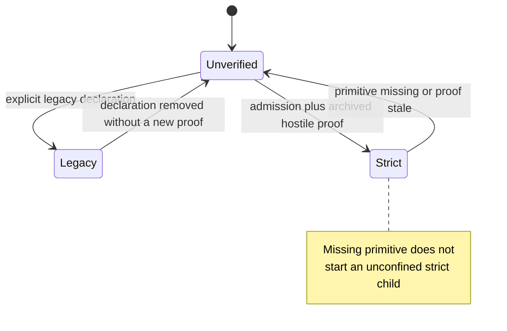

# Spec: strict-profile OS sandbox and native-addon-worker proof

Status: draft
Linear: KEL-78 · Owner: GYLDLAB · Updated: 2026-08-19

Primary sources: [`kel78-primary-sources.md`](kel78-primary-sources.md)
Written against `origin/main` `67f39cdc898254f1e0c9cd50800f242ae7a4c493`

## 1. Goal & non-goals

Keld's strict profile claims **zero ambient OS authority** for every supervised
Bun role. A JavaScript permission shim cannot mediate native code already
running inside Bun: that code can open files and sockets, spawn, `dlopen`, and
use inherited handles. This specification turns that claim into a per-OS,
fail-closed, hostile-testable contract. A platform is **contained** only after
an archived proof names the shipped artifact, token/profile, remaining
handles/FDs, and hostile-probe output. Documentary availability of a primitive
is not containment.

Non-goals:

- No permissive profile whose purpose is to make Bun or a native addon start.
- No package-specific exception (including VS Code).
- No platform claim based on mocks, stubs, or prose.
- No claim that arbitrary unchanged addons work under denied authority.
- No syscall-interposition, container-runtime, or VM work without a proven
  corpus need.
- No rewrite of `docs/architecture/02-ipc.md` or `03-security.md` in this
  draft PR. Architecture 03 §4.2 remains the progressive sketch; this file is
  the implementation contract once approved (see §2).
- First implementation does not use opaque third-party addons.

## 2. Spec refs

- `docs/architecture/01-overview.md` §§1–2 (host owns OS resources; roles
  receive transport handles that cannot authorize another operation)
- `docs/architecture/03-security.md` §§1, 2, 4, 6 — **evidence only**. §4.2's
  progressive `sandbox_init` / restricted-token / landlock+seccomp list is
  weaker than this contract and names a deprecated macOS API (ledger M1).
  Updating §4.2 is a follow-up PR after this spec is approved, not this change.
- `docs/architecture/06-runtime-and-tooling.md` §1 (KEL-70 supervisor; KEL-75
  role spawn; KEL-78 owns real-OS sandbox admission)
- `docs/specs/kel75-principalized-bun-child-roles.md` AC6 and T6
- `crates/keld-runtime/src/lib.rs` (live supervisor; no sandbox)
- `crates/keld-guard/src/lib.rs` (`Principal` has no addon-worker variant)
- `crates/keld-guard/AGENTS.md` (default-deny; no engine special case)
- Ledger: [`kel78-primary-sources.md`](kel78-primary-sources.md)

This spec does not change kipc frame layout. It does not silently weaken
default-deny.

## 3. Acceptance criteria (binary, each becomes a test)

1. Given any supervised Bun role on an OS with no archived hostile proof, when
   a caller asks whether that OS is contained, then the only legal answers are
   `unverified` or `legacy` — never `strict` / "best effort secure".
2. Given a request to start a role in the `strict` state, when a required OS
   primitive is missing or admission fails, then the host does not start an
   unconfined child. It returns a typed error that names the missing primitive
   and the fix (install/enable the primitive, or declare `legacy` explicitly).
3. Given a role declared `legacy` (`appSandbox` / profile off), when it starts,
   then it remains authenticated and `keld-guard`-checked, and every
   build/doctor/scoreboard/release metadata surface forfeits the zero-authority
   claim.
4. Given a successful `strict` spawn, when a process listing is taken, then the
   child has no raw host privilege handles: no inherited host filesystem,
   network, process-control, or update-staging handle. The only allowed extras
   are the authenticated app-link transport and supervisor log sinks. Those
   handles cannot authorize another operation.
5. Given the per-OS candidate in §4, when the named hostile probes in §7 run
   against the shipped artifact, then each probe is denied or killed by the OS
   (not by a JS shim), and the artifact/token/handles/output are archived. An
   OS with no such archive stays `unverified`.
6. Given a native addon, when the decision tree in §4 is applied, then the
   outcome is exactly one of: reuse in an addon-worker process, replace behind
   a guarded Rust host service, wait for an upstream Bun fix, or reject/exclude.
   There is no "run in-process under the app principal" option for untrusted
   native code.
7. Given an in-host Rust plugin, when it runs, then it is in the host TCB: the
   manifest constrains registered channels, not native syscalls. Untrusted
   native code requires a process boundary.
8. Given renderer sandbox status and Bun-role containment, when either is
   reported, then they are separate fields. A contained webview does not imply
   a contained Bun role.
9. Given host death, crash, abort, or hang of a strict child or addon worker,
   when cleanup finishes, then descendants are reaped by the platform mechanism
   in §4, leftover grants/links are revoked, and the next legitimate spawn
   still works.
10. Given the update staging directory, signing keys, and relaunch helper, when
    a strict child or addon worker tries to read or write them, then the OS
    denies the attempt. The updater stays a host-owned TCB path (KEL-53).

## 4. Design

### First-principles and reuse decision

- **Ownership:** `keld-host` remains the only general privileged process.
  `keld-runtime::Supervisor` already owns spawn, pipes, restart, and reap of
  one child (`crates/keld-runtime/src/lib.rs`) and does **not** apply an OS
  sandbox. This spec adds an admission gate *in front of* that supervisor. It
  does not replace KEL-70.
- **Trust:** A JS grant is not OS authority. `keld-guard` evaluates
  `(principal, channel, args)` for host-brokered calls. Native code inside Bun
  bypasses that path. Containment is therefore an OS profile on the child
  process, plus a separate process for untrusted native addons.
- **Lifecycle:** KEL-75 owns principal generation, link bind, and revocation.
  This spec owns whether a generation is allowed to start as `strict`,
  `legacy`, or stay `unverified`.
- **I/O:** The child receives `KELD_APP_LINK` and fixed-direction log sinks
  only. Live `spawn_piped` currently inherits everything else; that is a
  defect relative to this contract, not a granted exception.
- **Failure:** Missing primitives fail closed. There is no "best effort"
  sandbox.
- **Reuse:** Reuse KEL-70 `Supervisor` and KEL-75 role identity. Reuse
  `keld-guard` for brokered calls. Do not invent a fifth unique (the four
  uniques stay: prebuilt host, supervised Bun family, kipc, default-deny).
  Rejected alternatives: architecture 03 §4.2 `sandbox_init` (deprecated,
  ledger M1); ordinary AppContainer / Low IL / restricted token (ledger W2);
  seccomp or Landlock alone (ledger L5, L8).
- **Compatibility fallback:** `legacy` is the only fallback. It is explicit
  and forfeits the claim.
- **Performance:** No speed claim. No rewrite justified by language choice.
- **Boundary change:** yes — permission model and later `unsafe` platform
  spawn. Public `Principal` gains an addon-worker variant in an
  implementation PR, not in this docs pass.

### Profile states

Three states. They are not a confidence slider.

| State | Who chooses it | Zero-authority claim | Child starts? |
|---|---|---|---|
| `unverified` | Default until an archived per-OS proof exists | Forbidden | Only if the caller did not request `strict`. Reporting must say `unverified`. |
| `legacy` | Explicit app/build declaration | Forfeited, and the forfeit is printed | Yes: authenticated + guarded, unsandboxed |
| `strict` | Admission + archived hostile proof for that OS/artifact | Allowed | Yes, only after admission |



Rules:

- `unverified` is the live state of macOS, Windows, and Linux on this SHA.
  No hostile test has been run.
- `strict` cannot be reported from documentation.
- Renderer sandbox status is a separate field (AC8).
- Electron-compat apps do not silently start `legacy`. If they need it, they
  declare it.

### Authority surface the profile must cover

Every row is in scope for the threat model. "Denied" means the OS rejects the
direct attempt; the host broker may still perform the operation after
`keld-guard` allows it.

| Resource | Strict child / addon worker |
|---|---|
| Files outside a reviewed role-private container | deny |
| Secrets / keychain / credential tokens | deny (cannot impersonate the user) |
| Network | deny unless a later reviewed grant is both entitled *and* proven |
| Devices (camera, mic, USB, GPS, …) | deny |
| Process / IPC control of host or siblings | deny |
| Inherited objects | none beyond app-link + log sinks |
| Code loading (`dlopen`, unsigned libraries, JIT) | deny except the recorded Bun JIT minimum on that OS |
| Brokers | only authenticated kipc to the host; no raw host object |
| Persistence / update staging / signing keys | deny |
| Descendants | same profile, or immediately killed; no breakaway |

### Addon-worker principal

Untrusted native code does not join `Principal::AppProcess` or
`Principal::Plugin`.

Destination shape (implementation PR, not this docs pass):

```text
Principal::AddonWorker { id: u32, generation: u32 }
```

Facts:

- Separate process, host-minted generation, private authenticated app-link.
- Bounded broker calls only; never a host privilege handle.
- Crash, OOM, abort, and hang have resource limits and do not take down the
  host or webviews.
- In-host Rust plugins stay `Principal::Plugin` and join the host TCB
  (architecture 03 §1). Their manifest constrains channels, not syscalls.

Decision tree for a native addon (exactly one outcome):

1. **Reuse in worker** — the addon is loaded only inside the sandboxed
   addon-worker process; JS talks to it through host-mediated calls.
2. **Replace behind a guarded Rust service** — the capability moves into
   `keld-native` / a reviewed plugin and is guard-checked.
3. **Upstream Bun fix** — parked; the addon is not shipped as `strict`.
4. **Reject / exclude** — default when 1–3 do not apply.

There is no fifth outcome that loads the addon into the primary Bun role
under `strict`.

### macOS candidate

Required:

- App Sandbox on the launched Bun/helper binary (`com.apple.security.app-sandbox`).
  Ledger M2–M3.
- Hardened Runtime may be required for notarization; it is **not** sufficient
  for `strict` (ledger M8).
- Child that inherits the host sandbox uses *exactly*
  `com.apple.security.app-sandbox` + `com.apple.security.inherit`. Any other
  App Sandbox entitlement aborts the child (ledger M5).
- Privilege-separated helpers, if any, are XPC services with their own
  sandbox, private to the host bundle, not root (ledger M6). The host enumerates
  every XPC service, Powerbox path, and security-scoped bookmark it uses.
  Default enumeration for a Bun role is empty.
- Powerbox / user-selected files / security-scoped bookmarks stay on the host
  (ledger M4, M7). A Bun role does not get
  `com.apple.security.files.user-selected.*` or bookmark entitlements.
- Network, device, and personal-information entitlements are absent unless a
  recorded experiment proves Bun cannot start without a named entitlement.
  Each such entitlement is a permission-model review gate.
- JIT: `com.apple.security.cs.allow-jit` is allowed only if a recorded
  Bun-start failure proves it is required. `allow-unsigned-executable-memory`
  and `disable-library-validation` stay denied until the same bar is met.

Fail closed when: the binary is not App Sandboxed; inherit keys are wrong;
an unexpected entitlement is present; or XPC/Powerbox grants cannot be
enumerated.

Packaging: signed `.app` with the reviewed entitlements embedded in the
signature. Unsigned or ad-hoc signed children are `unverified`, never `strict`.

`sandbox_init(3)` is deprecated (ledger M1) and is not the candidate.

### Windows candidate

Required:

- Explicitly constructed **zero-capability LPAC**: package SID +
  `SECURITY_CAPABILITIES` with `CapabilityCount = 0` +
  `PROCESS_CREATION_ALL_APPLICATION_PACKAGES_OPT_OUT`
  (`PROC_THREAD_ATTRIBUTE_ALL_APPLICATION_PACKAGES_POLICY`). Ledger W2–W3.
- Reviewed ACLs on runtime, profile, and data objects: access is the
  intersection of user SID and package SID (ledger W4). Capability SIDs
  (`registryRead`, `lpacCom`, network, …) are absent unless a recorded
  experiment proves them required.
- Handle allowlist via `PROC_THREAD_ATTRIBUTE_HANDLE_LIST`. Default
  `bInheritHandles = FALSE` (ledger W6).
- Job object for descendants: no `BREAKAWAY_OK` / `SILENT_BREAKAWAY_OK`;
  `JOB_OBJECT_LIMIT_KILL_ON_JOB_CLOSE` for host-death cleanup (ledger W5).
  The job is **not** the authority sandbox.

Insufficient alone (do not admit `strict`): ordinary AppContainer, MSIX
packaging, Low integrity level, `CreateRestrictedToken` without LPAC.

Fail closed when: LPAC opt-out is missing; any capability SID is present
without a recorded experiment; a host handle leaks; a child breaks away from
the job.

### Linux candidate

Required, together:

1. User, mount, PID, and network namespaces (`CLONE_NEWUSER`, `CLONE_NEWNS`,
   `CLONE_NEWPID`, `CLONE_NEWNET`). Ledger L1–L4.
2. `prctl(PR_SET_NO_NEW_PRIVS, 1, 0, 0, 0)` before seccomp. Ledger L5.
3. Empty capability sets and dropped bounding set (`PR_CAPBSET_DROP`).
   Ledger L6.
4. Seccomp-BPF that denies direct fs/net/spawn/ptrace/mount not needed for
   the authenticated link, inherited by descendants (ledger L7).
5. Landlock filesystem/network rules when the kernel supports them (ledger L8).
   Preferred additional layer; not a substitute for 1–4.

Unavailable user namespace: `clone`/`unshare` with `CLONE_NEWUSER` fails
(`EPERM`, `EACCES`, `EUSERS`, `ENOSPC`, or LSM deny). Admission then
**refuses** a `strict` start. A privileged launcher that creates namespaces
on the child's behalf is a TCB addition and needs its own human review; it
is not implied by this spec (see §10).

Seccomp alone or Landlock alone cannot admit `strict`.

Fail closed when: any of 1–4 is missing; a capability remains; a descendant
escapes the PID namespace or the seccomp filter; SCM_RIGHTS delivers a host
FD (ledger L5).

### Types and channels (sketch; not implemented on this SHA)

```text
enum ProfileState { Unverified, Legacy, Strict }

struct AdmissionRequest {
    role: RoleInstance,          // KEL-75 generation
    requested: ProfileState,     // never inferred from package name
}

enum AdmissionError {
    // KELD-RUNTIME-0xx in the implementation PR
    PrimitiveUnavailable { os, primitive, fix },
    UnexpectedGrant { os, grant, fix },
    HandleLeak { description, fix },
    ProofMissing { os, fix },    // requested Strict, archive empty
}

fn admit(req: AdmissionRequest) -> Result<ProfileState, AdmissionError>
```

Capabilities / manifest: a future `keld.permissions.jsonc` / `keld.config.ts`
key may declare `profile: "strict" | "legacy"`. The key does not exist today.
Adding it is a permission-model + public-API review gate. No VS Code or
package-name branch.

Wire/protocol: none. `KELD_APP_LINK` stays `<endpoint>#<64 hex chars>`.

### Packaging and reporting

| Surface | `strict` | `legacy` | `unverified` |
|---|---|---|---|
| `keld build` output | printed only after proof archive exists | printed "zero-authority claim forfeited" | printed "unverified — no OS proof" |
| `keld doctor` | same | same | same |
| Scoreboard / release metadata | same | same | same |

Renderer sandbox is a different column.

## 5. Boundaries

- Implement in later slices: `keld-runtime` (admission + handle stripping),
  `keld-guard` (addon-worker principal), `keld-pack` (entitlements / LPAC
  profile), `keld-cli` (doctor/build text), optional `keld-native` (synthetic
  addon fixture).
- This PR must not touch: `docs/architecture/02-ipc.md`,
  `docs/architecture/03-security.md`, `docs/research/`, KEL-74 branches,
  PR #21 scoreboard/llms files, PR #30 updater architecture files,
  workspace `Cargo.toml`, kipc frame layout.
- Must not add a permissive default to make Bun start.

## 6. Tasks (each ≈ one PR; ordered; no placeholders — vertical slices only)

- [x] T0: Draft this spec + primary-source ledger. All OS proofs unverified.
- [ ] T1: Admission API + profile-state reporting. Synthetic in-process
      *probe binary* (not a third-party addon). Default state `unverified`.
      Fail closed when `strict` is requested. No OS containment claim.
- [ ] T2: macOS App Sandbox admission + hostile archive for the synthetic
      fixture. JIT entitlements only if a recorded Bun-start failure
      requires them.
- [ ] T3: Windows zero-capability LPAC + ACL + handle allowlist + job
      descendant proof.
- [ ] T4: Linux namespace + `no_new_privs` + cap drop + seccomp (+ Landlock
      when present) and unavailable-userns fail-closed proof.
- [ ] T5: Crash/hang/OOM cleanup and updater-boundary probes on each OS
      that passed T2–T4.
- [ ] T6: Doctor / build / release metadata surfaces. Then KEL-75 T6 may
      permit a `strict` release claim for those OSes only.
- [ ] T7: Synthetic native-addon worker process (still not opaque
      third-party code) exercising the decision tree.

## 7. Test plan

No test in this docs pass is an OS proof. Future fixtures must hit the real
OS. Mocks may test the admission state machine only.

| AC | Future fixture | Independent oracle |
|---|---|---|
| 1 | doctor/build metadata unit | printed state string is `unverified`/`legacy`/`strict` |
| 2 | admission on a machine with the primitive removed | typed error; no child PID |
| 3 | explicit legacy spawn | child runs; metadata forfeits the claim |
| 4 | `/proc/pid/fd`, `lsof`, or `GetProcessHandleCount` + handle dump | only app-link + log sinks |
| 5 | hostile catalog below | OS deny/kill, archived stdout + profile dump |
| 6 | synthetic addon matrix | one of the four outcomes; in-process load fails closed under `strict` |
| 7 | plugin vs worker | plugin has no OS sandbox; worker does (once T7 exists) |
| 8 | doctor JSON | two distinct fields |
| 9 | kill host / abort child / hang | no leftover descendants; next spawn works |
| 10 | open update staging / key path from child | OS deny |

Hostile catalog (each is a real syscall/API from the child or addon worker):

| Probe | Must observe |
|---|---|
| Direct filesystem | create/read outside the role container fails |
| Direct network | `connect`/`bind`/`socket` fails without a reviewed grant |
| Direct shell / spawn | `exec`/`CreateProcess`/`posix_spawn` of a helper fails or is job/PID-contained and equally sandboxed |
| Inherited handles | leftover host FD/HANDLE cannot open host files, the update dir, or sibling links |
| Descendants | grandchild has the same profile or is killed; no job breakaway; no new user namespace |
| Broker bypass | raw use of a host object the broker would have checked is denied |
| Token theft | cannot impersonate the interactive user (macOS keychain / Windows user token / Linux host UID 0) |
| Addon escape | synthetic native code cannot `dlopen` unsigned host code or join the host address space |
| Crash cleanup | abort/OOM/hang leaves no descendant and revokes the generation |
| Updater boundary | cannot read/write staging, signatures, or the relaunch helper |
| Protocol confusion | foreign `HELLO`, stale token, or confused deputy on the app-link is `KELD-IPC-007` / typed deny |
| Resource | intentional hang and allocator blow-up hit the worker limits, not the host |

Anti-flake: bind port 0; use temp dirs; await supervisor events (no sleep-sync);
run crash cases out of process. Platform-only tests report other OSes as
`unverified` rather than skip-and-claim.

Negative control: temporarily remove the LPAC opt-out, the App Sandbox
entitlement, or `CLONE_NEWUSER` and confirm the `strict` tests fail.

## 8. Review gates triggered

- unsafe: **yes, in later implementation PRs** (platform spawn / namespace /
  token construction). None in this docs PR.
- public API: **yes, later** (`Principal::AddonWorker`, profile declaration).
  None in this docs PR.
- permission model: **yes** — this spec is the strict-profile permission
  contract. Human sign-off required before implementation.
- dependency: none in this spec.
- wire protocol: none in this spec.

Removal / rollback: delete the admission gate and keep KEL-70 unsandboxed
supervision; every surface returns to `unverified`. Do not keep a half-applied
profile.

## 9. Perf impact

none for this documentation pass. Later sandbox spawn is a cold path.
Architecture 01 §5 budgets are not claimed to move until an attributed
end-to-end measurement exists.

## 10. Open questions

1. If unprivileged user namespaces are unavailable, may a reviewed privileged
   launcher join the TCB, or is `legacy` / refuse the only option?
2. What is the minimum experimentally required Bun JIT entitlement set on
   each OS? Recorded Bun-start failures decide; do not pre-grant.
3. After approval, who updates architecture 03 §4.2 to replace the
   `sandbox_init` / restricted-token / landlock+seccomp sketch with this
   contract? (This PR does not.)
4. KEL-75 still asks this spec to name the per-OS host-death reaping
   mechanism. Tentative answers: macOS process group / XPC `SIGKILL` by
   `launchd`; Windows `JOB_OBJECT_LIMIT_KILL_ON_JOB_CLOSE`; Linux PID
   namespace + PR_SET_PDEATHSIG. Confirm in T2–T4, do not claim them now.
